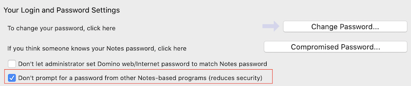

## Limitations to client use

- Use is for evaluation only, don't use for production.
- You can't run the Notes client while you are running the Domino REST API against your local Notes install.
- The Notes client must have the **Don't prompt for a password from other Notes-based programs** option set. This option is in the **Security**&rarr;**User Security** menu.

    

- If your organization has a policy to disable the **Don't prompt for a password from other Notes-based programs**, you may need to go into Notes, disable and immediately quit Notes. Next time you go into Notes, this setting will be again disabled.
- On the first time run of `runrestapi`, even with **Don't prompt for a password from other Notes-based programs** set, you may be prompted to enter your Notes password in the java window that the Domino REST API is running in. Even if the message prompt has scrolled, you can type in your password and Enter. Notes is prompting because Domino REST API is creating 2 databases needed to run the API.
