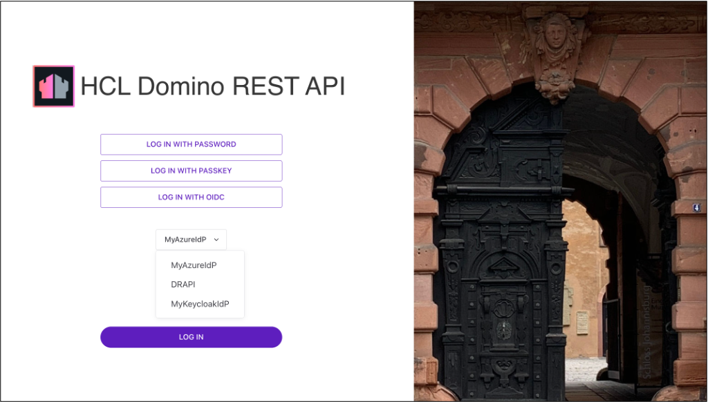

# Set up external IdP for Admin UI IdP

## About this task

You can add your own IdP to use for Admin UI login. This uses a PKCE login flow.

## Configuration

### Set up external IdP

Configure your external IdP in the configuration file. For more information, see [configuring external IdP](../IdP/index.md) for configuring an external IdP of your choice.

!!! note

    When configuring your external IdP, make sure to set `{{origin}}/admin/ui/callback` as one of your redirect URIs.

### Set up Admin UI external IdP login configuration

Configure the `adminui` property in your chosen external IdP. For more information, see [JWT parameters](../../references/parameters.md#jwt-parameters).

## Admin UI external IdP login

!!! note

    The Admin UI shows the OIDC logins and the Domino REST API login, which uses the Domino REST API IdP. To prevent the Admin UI from showing all IdP logins, set the value of the `AdminUIOIDCLogin` parameter to `false`. To disable the login with password button, set the `AdminUIKeepLogin` parameter to `false`. For more information on how to modify the configuration, see [Modify configuration parameters](../production/configparam.md). 

Once configured, the Admin UI login should look like the following example image. In the example image, *Keycloak* is used as the external IdP.



Clicking **Sign in with {external_idp_name}** commences the authorization code flow.

!!! note

    Admin UI external IdP login uses authorization code flow with PKCE.

## Examples

### Azure

The following is an example configuration for Azure IdP:

```json
{
  "jwt": {
    "AzureIdP": {
      "active": true,
      "providerUrl": "https://login.microsoftonline.com/{tenant_id}/v2.0/.well-known/openid-configuration",
      "aud": "{client_id}",
      "iss": "https://login.microsoftonline.com/{tenant_id}/v2.0",
      "algorithm": "RS256",
      "adminui": {
        "active": true,
        "client_id": "{client_id}",
        "application_id_uri": "api://dominorest/"
      }
    }
  }
}
```

### Keycloak

The following is an example configuration for Keycloak IdP:

```json
{
  "jwt": {
    "KeycloakIdP": {
      "active": true,
      "providerUrl": "https://{keycloak_host}/realms/{realm_name}",
      "adminui": {
        "active": true,
        "client_id": "{client_id}"
      }
    }
  }
}
```
