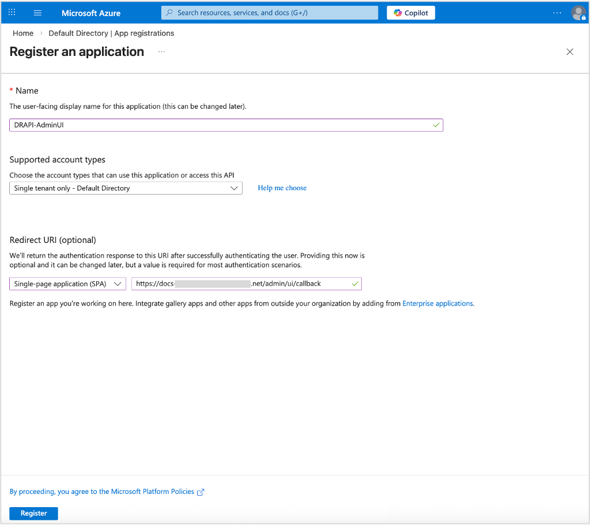
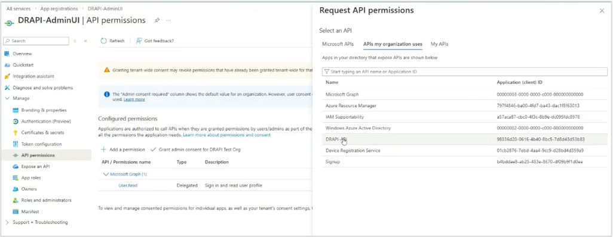
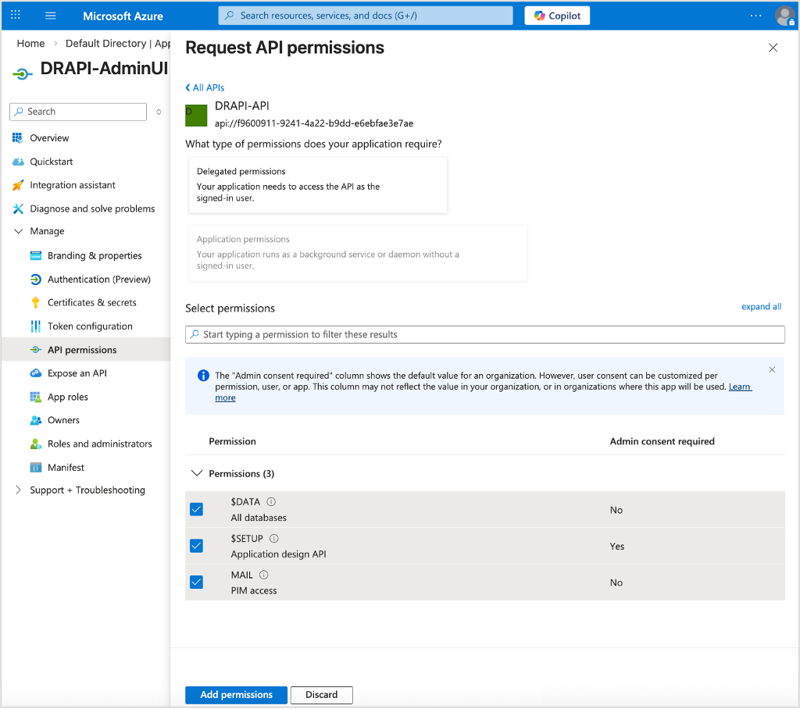
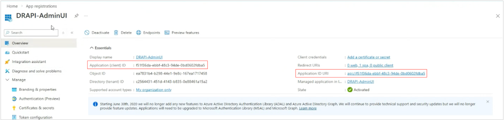
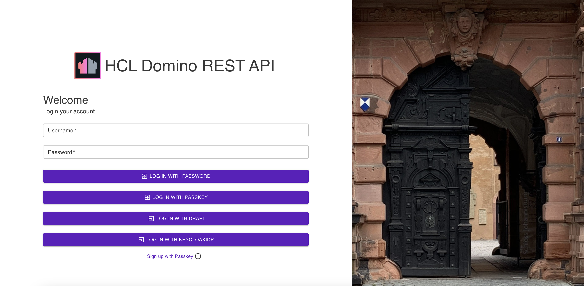

# Set up an external IdP for Admin UI login

## About this task

The task guides you in setting up an external IdP to use for logging in to the **Admin UI**. This uses a PKCE login flow.

--8<-- "onclientids.md"

## Before you begin

If you are going to use Microsoft Entra ID as your external IdP:

- Make sure you have already registered an application in the Azure portal for use by the Domino REST API server. For more information, see [Configure Microsoft Entra ID as IdP](../IdP/configuringAD.md).
- Make sure the that scope `$SETUP` is added to the registered application for use by the Domino REST API server.

## Set up an external IdP

Configure an external IdP of your choice. For more information, see [configuring external IdP](../IdP/index.md).

!!! warning "Important"

    When configuring your external IdP, make sure to set `{{origin}}/admin/ui/callback` as one of your redirect URIs.

### Setup Microsoft Entra ID as external IdP for Admin UI login

1. Register an application.

    1. Go to the [Azure portal)](https://portal.azure.com){: target="\_blank"} and sign in.

        !!! tip

            Make sure you’re in the correct directory. Select your profile icon in the upper-right corner of the Azure portal, then select **Switch directory**. Use an account in the same directory where you plan to register the application.

    2. In **Microsoft Entra ID**, select **App registrations**, then select **New registration**.
    3. On the **App registrations** page, enter the application registration details described in the following table.

        |Form input name|Description|
        |:---|:---|
        |Name|Enter a descriptive name for the application.|
        |Supported account types|Choose who can sign in.|
        |Redirect URI|Specify where authentication responses should be sent.<br/><br/>Select **Single-page application (SPA)** as the platform and use `{{origin}}/admin/ui/callback` as the Redirect URI.<br/><br/>where: `{{origin}}` is a template placeholder for the base URL where the Domino REST API server is hosted.|

        [{: style="height:70%;width:70%"}](../../assets/images/entraID16.png){: target="_blank" rel="noopener noreferrer"}

    4. Click **Register**.

    After the registration, you will see the **Overview** page. Take note of the value of the **Application (client) ID**.

2. Add client credentials.

    1. Under **Manage**, select **Certificates &amp; secrets** &rarr; **Client secrets** &rarr; **New client secret**.
    2. Add a description for your client secret, and select an expiration for the secret or specify a custom lifetime.
    3. Click **Add**.
    4. Record the client secret Value. This secret value is never displayed again after you leave the page.

3. Add the Application ID URI.

    1. Under **Manage**, select **Expose an API**.
    2. At the top of the page, select **Add** next to **Application ID URI**.

      This defaults to `api://<application-client-id>`. Take note of this value as it is needed in the configuration in the Domino REST API.

4. Configure API permissions.

    1. Under **Manage**, select **API permissions**. The **API permissions** page opens with the `User.Read` permission already configured.
    2. Click **Add a permission**. The **Request API permissions** pane opens.
    3. Select the **APIs my organization uses** tab, and then select the application you configured for use by the Domino REST API server from the list. See the [Before you begin](#before-you-begin) section for details.

        [{: style="height:70%;width:70%"}](../../assets/images/entraID17.png){: target="_blank" rel="noopener noreferrer"}

    4. Under **Select permissions**, select the required scopes and click **Add permissions**. Make sure that the scopes `$SETUP` and `$DATA` are selected.

        [{: style="height:70%;width:70%"}](../../assets/images/entraID18.png){: target="_blank" rel="noopener noreferrer"}

        After adding permissions, you should see the selected permissions under **Configured permissions** on the **API permissions** page.

    5. Click **Grant admin consent for {your tenant}** to grant admin consent to the permissions configured for the application.
    6. In the **Grant admin consent confirmation** dialog, click **Yes**. After granting consent, the permissions that required admin consent are shown as having consent granted.

5. Assign an owner.

    1. Under **Manage**, select **Owners**, and then select **Add owners**. The **Owners** pane opens.
    2. Search for and select the user account that you want to be an owner of the application.
    3. Click **Select** to add the user account that you chose as an owner of the application.

6. Check authentication.

    1. Under **Manage**, select **Authentication**.
    2. On the **Redirect URI configuration** tab, make sure that the selected and entered values are correct.
    3. On the **Supported accounts** tab, make sure the correct supported account type is selected.
    4. On the **Settings** tab, make sure **Access token** is selected.
    5. Click **Save** if you make any changes.

7. Adjust app manifest.

    1. Under **Manage**, select **Manifest**. A web-based manifest editor opens, allowing you to edit the manifest.
    2. Change the value of `accessTokenAcceptedVersion` from `null` to `2`.

        === "Before changing"

            {: style="height:60%;width:60%"}

        === "After changing"

            {: style="height:60%;width:60%"}

    3. Click **Save**.

8. Check application endpoints.

    Select **Endpoints** in the top menu to open the **Endpoints** page, which shows the authentication endpoints for the application. Take note of the following endpoints:

    - `OpenID Connect metadata document`
    - `OAuth 2.0 authorization endpoint (v2)`
    - `OAuth 2.0 token endpoint (v2)`

## Set up Admin UI configuration

To use the configured external IdP for Admin UI login, you need to include the `adminui` property in the configuration file of external IdP saved in `keepconfig.d`. For more information about the `adminui` property, see [JWT parameters](../../references/configuration/parameters.md#jwt-parameters).

### Set up Admin UI configuration to use Microsoft Entra ID as external IdP

1. Open the JSON file you used in configuring Domino REST API to use Microsoft Entra ID as an external IdP that is saved in the `[notesdata]/keepconfig.d` directory.

2. Add the following JSON object to the Microsoft Entra ID configuration in the JSON file.

    ```json
        "adminui": {
            "active": true,
            "client_id": "[value of Application (client) ID]",
            "application_id_uri": "[value of the Application ID URI]"
      }
    ```

    where:

    - The `client_id` parameter should have the value of the **Application (client) ID** of the registered application in Azure portal.
    - The `application_id_uri` parameter should have the value of the **Application ID URI** of the registered application in Azure portal. It should end with `/`.

    Check the **Overview** page of the application in the Azure portal. Refer to the following example image:

    [{: style="height:70%;width:70%"}](../../assets/images/entraID19.png){: target="_blank" rel="noopener noreferrer"}

    After adding the JSON object, the configuration should be similar to the following:

      ```json
      {
            "jwt": {
                  "AzureIdP": {
                        "active": true,
                        "providerUrl": "[value of the OpenID Connect metadata document endpoint of the app used by the Domino REST API server]",
                        "aud": "[value of the Application (client) ID of the app used by the Domino REST API server]",
                        "iss": "[issuer value]",
                        "algorithm": "RS256",
                        "adminui": {
                              "active": true,
                              "client_id": "[value of Application (client) ID]",
                              "application_id_uri": "[value of the Application ID URI]"
                        }
                  }
            }
      }
      ```

    For more information on the definitions and values of the `providerUrl`, `aud`, and `iss` keys, see [Configuration in Domino REST API](../IdP/configuringAD.md#configuration-in-domino-rest-api) for details of the Microsoft Entra ID configuration.

3. Save the changes and restart Domino REST API.

## Additional information

### Admin UI external IdP login

The Admin UI shows the OIDC logins and the Domino REST API login, which uses the Domino REST API IdP. To prevent the Admin UI from showing all IdP logins, set the value of the `AdminUIOIDCLogin` parameter to `false`. To disable the login with password button, set the `AdminUIKeepLogin` parameter to `false`. For more information on how to modify the configuration, see [Modify configuration parameters](../install/configparam.md).

!!! note

    Admin UI external IdP login uses authorization code flow with PKCE.

### Example Admin UI configuration to use Keycloak as external IdP

The following is an example configuration for Keycloak IdP:

```json
{
  "jwt": {
    "KeycloakIdP": {
      "active": true,
      "providerUrl": "https://{keycloak_host}/realms/{realm_name}",
      "adminui": {
        "active": true,
        "client_id": "{client_id}"
      }
    }
  }
}
```

<!--
## About this task

You can add your own IdP to use for Admin UI login. This uses a PKCE login flow.

## Configuration

### Set up external IdP

Configure your external IdP in the configuration file. For more information, see [configuring external IdP](../IdP/index.md) for configuring an external IdP of your choice.

!!! note

    When configuring your external IdP, make sure to set `{{origin}}/admin/ui/callback` as one of your redirect URIs.

### Set up Admin UI external IdP login configuration

Configure the `adminui` property in your chosen external IdP. For more information, see [JWT parameters](../../references/configuration/parameters.md#jwt-parameters).

## Admin UI external IdP login

!!! note

    The Admin UI shows the OIDC logins and the Domino REST API login, which uses the Domino REST API IdP. To prevent the Admin UI from showing all IdP logins, set the value of the `AdminUIOIDCLogin` parameter to `false`. To disable the login with password button, set the `AdminUIKeepLogin` parameter to `false`. For more information on how to modify the configuration, see [Modify configuration parameters](../install/configparam.md).

Once configured, the Admin UI login should look like the following example image. In the example image, _Keycloak_ is used as the external IdP.

!!! note

    Make sure to add `{DRAPI_HOST}/admin/ui/callback` as a redirect URI in your chosen IdP.



Clicking **Sign in with {external_idp_name}** commences the authorization code flow.

!!! note

    Admin UI external IdP login uses authorization code flow with PKCE.

## Examples

### Azure

The following is an example configuration for Azure IdP:

```json
{
  "jwt": {
    "AzureIdP": {
      "active": true,
      "providerUrl": "https://login.microsoftonline.com/{tenant_id}/v2.0/.well-known/openid-configuration",
      "aud": "{client_id}",
      "iss": "https://login.microsoftonline.com/{tenant_id}/v2.0",
      "algorithm": "RS256",
      "adminui": {
        "active": true,
        "client_id": "{client_id}",
        "application_id_uri": "api://dominorest/"
      }
    }
  }
}
```

### Keycloak

The following is an example configuration for Keycloak IdP:

```json
{
  "jwt": {
    "KeycloakIdP": {
      "active": true,
      "providerUrl": "https://{keycloak_host}/realms/{realm_name}",
      "adminui": {
        "active": true,
        "client_id": "{client_id}"
      }
    }
  }
}
```
-->