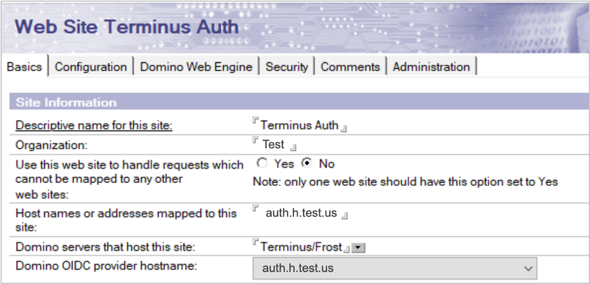
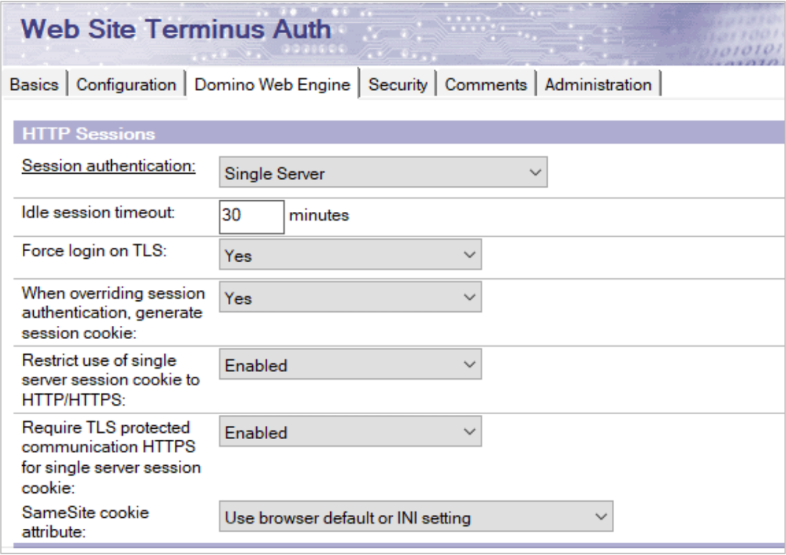
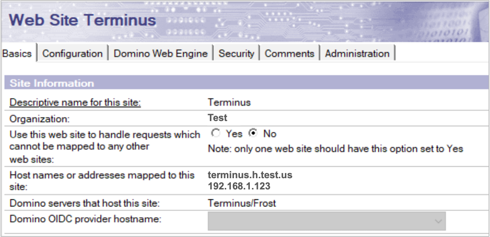
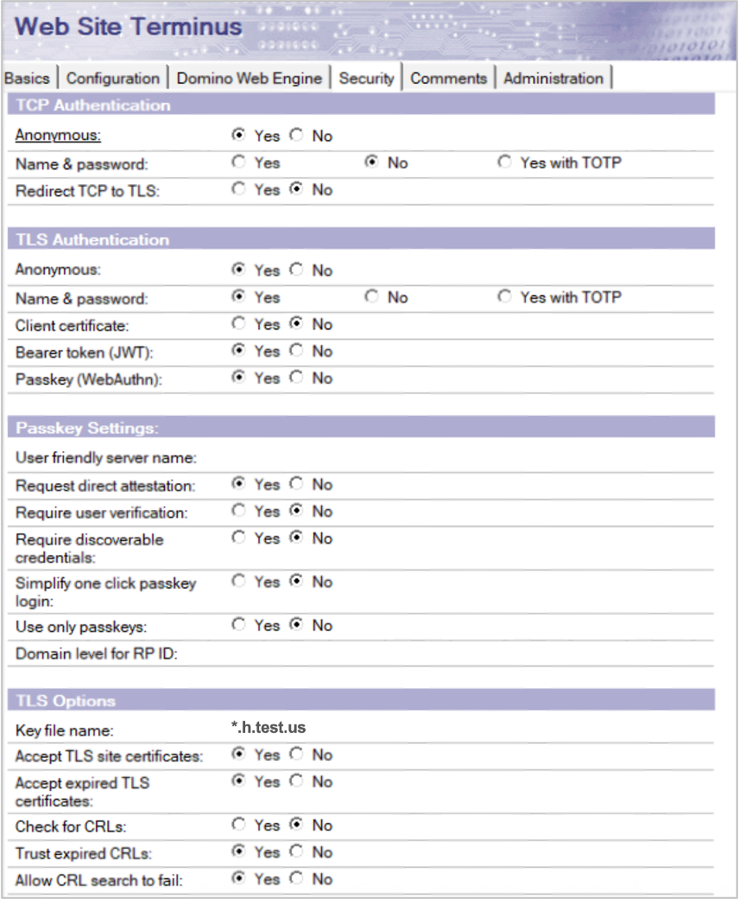
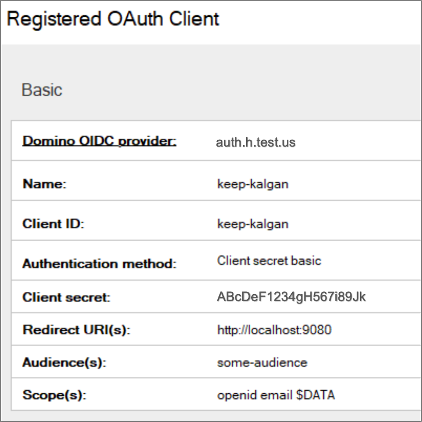
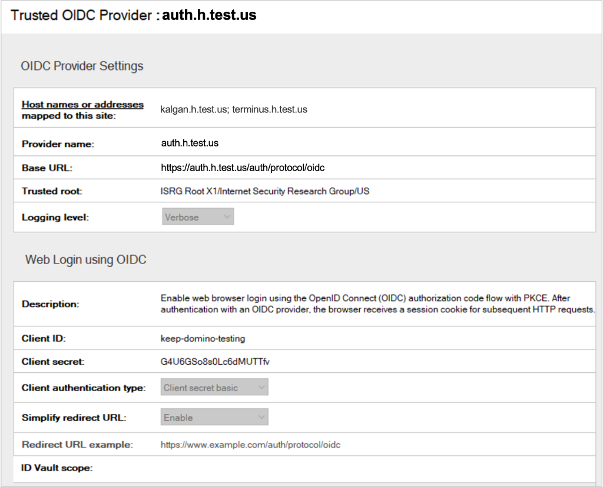

# Configure Domino REST API to use Domino 14.5 as OIDC provider

## About this task

This guide walks you through configuring HCL Domino 14.5 as an OIDC provider and setting up the Domino REST API to trust it on a single Domino server.

## Before you begin

- Ensure that Domino 14.5 is installed.
- Ensure that Domino REST API v1.1.4 or later is installed.

## Procedure

!!! note

    Make sure Internet site documents are enabled in the server document.

1. Create two Internet site documents in the Domino Directory (`names.nsf`), one for the OIDC provider and another one as a placeholder website to trust it.

    Domino requires at least one Internet site document mapped to the server to be configured for it to trust. The Internet site document for the OIDC provider cannot serve this role, so you need a second one.

    The configured host names in the Internet site documents must point to the same server and also have usable TLS certificates in `certstore.nsf`.

    For details on creating Internet site documents, see [Preparing the OIDC provider's Internet Site document](https://help.hcl-software.com/domino/14.5.0/admin/secu_configure_domino_as_oidc_provider.html?scLang=en#secu_configure_domino_as_oidc_provider__section_hll_1t5_ncc "Opens a new tab"){: target="_blank" rel="noopener noreferrer"}&nbsp;{: style="height:15px;width:15px"} topic in the Domino documentation.

    Expand the sections and use the following images as references when creating the Internet site documents.

    ??? example "Example: Internet site document for OIDC Provider"

        

        

        

    ??? example "Example: Internet site document for placeholder client site"

        

        

2. Create a Domino OIDC provider.

    Refer to the procedure for [creating a Domino OIDC provider](https://help.hcl-software.com/domino/14.5.0/admin/secu_configure_domino_as_oidc_provider.html?scLang=en#secu_configure_domino_as_oidc_provider__section_mf1_1t5_ncc "Opens a new tab"){: target="_blank" rel="noopener noreferrer"}&nbsp;{: style="height:15px;width:15px"} in the Domino documentation for specific details.

    You can use the following example image as reference when creating the Domino OIDC provider.

    {: style="height:60%;width:60%"}

3. Register an OAuth client.

    Refer to the procedure for [registering a new OAuth client](https://help.hcl-software.com/domino/14.5.0/admin/secu_register_oauth_client.html "Opens a new tab"){: target="_blank" rel="noopener noreferrer"}&nbsp;{: style="height:15px;width:15px"} in the Domino documentation for specific details.

    You can use the following example image as reference when registering an OAuth client.

    {: style="height:60%;width:60%"}

    !!! tip

        - For **Audience(s)**, you can set the value to any value as long as you use the same value later when configuring Domino REST API as shown in the example configuration below. 
        - For **Scope(s)**, `$DATA` is useful for the Domino REST API as it allows you to access everything you have access rights to. You can also narrow it down to give per-app access.
        - For **Redirect URI(s)**, you can set them to your actual login flow destination. 

4. Configure a trusted OIDC provider.

    Refer to the procedure for [configuring trusted OIDC providers](https://help.hcl-software.com/domino/14.5.0/admin/secu_config_http_bearer_auth_t.html?hl=configuring%2Ctrusted%2Coidc%2Cproviders "Opens a new tab"){: target="_blank" rel="noopener noreferrer"}&nbsp;{: style="height:15px;width:15px"} in the Domino documentation for specific details.

    You can use the following example image as reference when configuring the trusted OIDC provider.

    

5. Configure Domino REST API to use the configured trusted OIDC provider.

    1. Create a JSON file using a text editor.
    2. Copy the JSON object to the JSON file and set the values. Refer to the table for details.

        ```json
        {
            "oidc-idpcat": {
                "domino-oidc-idpcat": {
                    "active": true,
                    "providerUrl": "https://auth.h.test.us/auth/protocol/oidc",
                    "scope": "$DATA",
                    "aud": "some-audience"
                }
            }
        }
        ```

        | Items | Description |
        | :--- | :--- |
        | `active` | **Optional** - Can be useful for setting to `false` to temporarily disable something without deleting the config entirely. |
        | `providerUrl` | The base URL that includes the name of the OIDC Domino server.<br/><br/>Example: `https://auth.h.test.us/auth/protocol/oidc`<br/>The provided example is based on the details in the example configuration shown in the example images.|
        | `scope` | A scope that is expected to be included in the token from the OIDC provider. For example, `$DATA`,`email`, etc.|
        | `aud` | A string or array of strings of audiences expected to be included in the token. Make sure to use the same value as set in the registered OAuth Client.|

    3. Save the JSON file in the `keepconfig.d` directory.

        !!! tip

            Use a filename for the JSON file that reveals its purpose. To learn more on how JSON files in `keepconfig.d` are processed, see [Configuration management and overlay hierarchy](../../references/configuration/understandingconfig.md).

6. Restart Domino and Domino REST API.

## Additional information

After completing the configuration, you can obtain a token from the Domino OIDC provider and use it to access Domino REST API endpoints. You can use the `/api/v1/userinfo` endpoint as a test endpoint since it does not require additional setup and has the benefit of showing you log in details.

You can add `DEBUG_OIDCLogin=1` to `notes.ini` for basic logging that includes token validation details.
