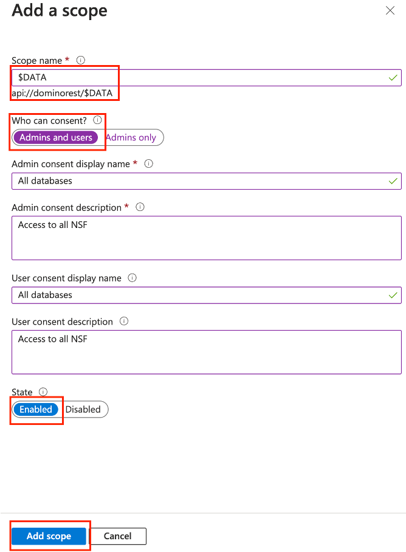

# Configure Azure Active Directory as IdP

Azure Active Directory has its own ideas about JWT compatibility:

- The `aud` property is fixed to the ID of the application, not as commonly, the URL of the target system.
- There is no `scope` property, but instead `scp` to describe the requested scopes.

## Configuration in Azure

### Register an application

1. Navigate to the [Azure Portal](https://portal.azure.com){: target="_blank"} to login, and then select **App registrations**.

    

2. Select **New registration**.

    

3. Enter a **Name**, select a supported account type (in most cases **Single tenant** will do), enter local redirect URL (so you can develop your app), and then click **Register**. 

    !!!tip
        If you aren't sure about the redirect URL, use `http://localhost:8080/redirect`. You can change this later on in **Authentication** in the application page.

    

### Add credentials

The next step is to add the client credentials. Your application will need the **Application (client) ID** and **Client credentials**.


1. Select **Certificates & secrets** &rarr; **Client secrets** &rarr; **New client secret**.

    

2. Add a description, select an expiration for your client secret, and then click **Add**.

    

3. Copy the secret's value for use in your client application code. 

    !!!note
        The secret value is only shown once and never displayed again after you leave this page.

    

### API definition

1. Select **Expose an API**.
2. Select **Add** next to the **Application ID URI**. The URI must start with `api://`. You can overwrite the UUID with some clear text name.

    

3. Select **Add a scope**.

    Add the scopes, one by one. Ensure admins and users can consent and that the scope is set to active. For more information about scopes in Domino REST API, see [scopes reference](../../references/usingdominorestapi/scopes.md) and [scope topic guide](../../topicguides/understanding.md#databases-schemas-and-scopes).




### Configure API permissions

You start at the API permission screen, which has `User.Read` preconfigured. Click on `Add a permission` and select "APIs my organization uses", Start typing the name of your application and select it.


Select the scopes you have created earlier to get the following results.


### Update the application owners


### Adjusting authentication

In Authentication ensure you have loclahost for local development as well as the https based urls of your test, staging and/or production systems specified. Check only access token. Ensure redirect ends with `/`


### Adjusting the manifest

The manifest needs an update. Change `accessTokenAcceptedVersion` from `null` to `2`

Old:


New:


### URLs to note


All URLs can be retrived by accessing the "OpenID Connect metadata document", colloquially refered to as `.well-known`. These are the ones involved:

- OpenID Connect metadata document
- OAuth 2.0 authorization endpoint (v2)
- OAuth 2.0 token endpoint (v2)

## Configuration in the Domino REST API

Create a [json](https://www.json.org/json-en.html) file in the directory `[notesdata]/keepconfig.d`. You can choose the filename freely as long as you limit yourself to numbers and ASCII letters (`[0-9a-zA-Z]+`). We suggest `AzureAD01.json`, the same value you use in the json data below.

You need the following content:

```json
{
  "jwt": {
    "AzureAD01": {
      "active": true,
      "providerUrl": "https://login.microsoftonline.com/[your-tennantid-here]/v2.0/.well-known/openid-configuration",
      "aud": "api://dominorest",
      "iss": "https://sts.windows.net/[your-tennantid-here]/",
      "algorithm": "RS256"
    }
  }
}
```

Remarks:

- the `AzureAD01` isn't a fixed value. Pick anything that makes it clear for you. We strongly suggest to use the value as file name too
- the `aud` parameter is the Application ID URI configured in "Expose an API"
- The `iss` parameter is different from what the `openid-configuration` reports. The URL changed from `https://login.microsoftonline.com/[your-tennantid-here]/v2.0` to `https://sts.windows.net/[your-tennantid-here]/`, so you need to specify it here
- Currently Azure AD doesn't return the `alg` claim in the `jwks_uri`, you have to specify it here

Restart the Domino REST API

## Testing the application

Head over to the [downloads](../../references/downloads.md) and download the `AzureTester.zip`. It contains a small [expressJS](https://expressjs.com/) application and related static files (HTML/CSS/JS).

Unpack the zip, navigate to the directory and to run the web server. You need a current [NodeJS](https://nodejs.org/en) version installed. Run:

```bash
npm install
node server.js
```

Do **NOT** use this code in production.

Open the URL [http://localhost:8080/](http://localhost:8080/) and fill in the form details. You will find most of the values in the overview page of the Azure applicationn registration. You should see a page like this:


!!! note "Include the Application ID URI"

    When you specify the scopes, you need to include the "Include the Application ID URI" in the test form. The URI will be stripped from the resulting JWT token.
    So to get `scp : "$DATA MAIL demo"` in the JWT, you must specify `api://dominorest/$DATA api://dominorest/MAIL api://dominorest/demo` where `api://dominorest` is whatever you specified as "Application ID URI"

Azure will redirect you to the `/redirect` URL. Typically this page would auto-process, but you want to marvel at the authorization code. When you click "Exchange token", the ExpressJS server will exchange the code for a JWT and return the list of configured endpoints as example. You can't do this with the browser alone, [CORS](https://developer.mozilla.org/en-US/docs/Web/HTTP/CORS) will prevent it.


## Let's connect

--8<-- "feedback.md"
