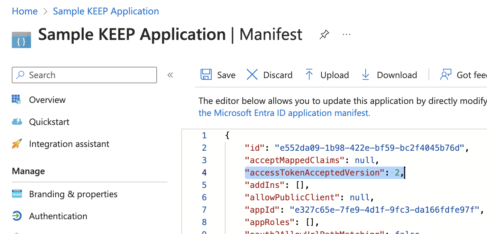

# Configure Microsoft Entra ID as IdP

## About this task

The procedures guide you on configuring Microsoft Entra ID, formerly Azure Active Directory, as an IdP. Microsoft Entra ID has its own ideas about JWT compatibility:

- The `aud` property is fixed to the ID of the application, not as commonly, the URL of the target system.
- There is no `scope` property, but instead `scp` to describe the requested scopes.

--8<-- "onclientids.md"

## Configuration in Azure

### Register an application

1. Navigate to the [Azure Portal](https://portal.azure.com){: target="\_blank"} to login, and then select **App registrations**.

      

2. Select **New registration**.

      

3. Enter a **Name**, select a supported account type (in most cases **Single tenant** will do), enter local redirect URL (so you can develop your app), and then click **Register**.

      {: style="height:90%;width:90%"}

!!! tip

    If you aren't sure about the redirect URL, use `http://localhost:8080/redirect`. You can change this later on in **Authentication** in the application page.

### Add credentials

The next step is to add the client credentials. Your application will need the **Application (client) ID** and **Client credentials**.

{: style="height:90%;width:90%"}

1. Select **Certificates & secrets** &rarr; **Client secrets** &rarr; **New client secret**.

      {: style="height:90%;width:90%"}

2. Add a description, select an expiration for your client secret, and then click **Add**.

      {: style="height:90%;width:90%"}

3. Copy the secret's value for use in your client application code.

      {: style="height:90%;width:90%"}

!!! note

    The secret value is only shown once and never displayed again after you leave this page.

### API definition

1. Select **Expose an API**.
2. Select **Add** next to the **Application ID URI**. The URI must start with `api://`. You can overwrite the UUID with some clear text name.

      {: style="height:90%;width:90%"}

3. Select **Add a scope**.
4. Specify the scope's attributes in the **Add a scope** pane.

      Ensure admins and users can consent and that the scope is set to **Enabled**. For more information about scopes in Domino REST API, see [scopes reference](../../references/usingdominorestapi/scopes.md) and [scope topic guide](../../topicguides/understanding.md#databases-schemas-and-scopes).

      {: style="height:70%;width:70%"}

5. Click **Add scope**.
6. Repeat the steps for adding a scope for each scope that your need to add.

      {: style="height:90%;width:90%"}

### Configure API permissions

1. Select **API permissions**. The **API permissions** screen, which has `User.Read` preconfigured, opens.
2. Click **Add a permission**.

      {: style="height:90%;width:90%"}

3. Select **APIs my organization uses**.
4. Start typing the name of your application, and then select it.

      {: style="height:90%;width:90%"}

5. Under **Select permissions**, select the scopes you have created earlier and the click **Add permissions**.

      {: style="height:90%;width:90%"}

After adding permissions, you should see the selected permissions under **Configured permissions**.

{: style="height:90%;width:90%"}

### Update the application owners

1. Under **Manage**, select **Owners** and then select **Add owners**.

      {: style="width:90%"}

2. Search for and select the user account that you want to be an owner of the application, and then click **Select**.

### Adjust authentication

In **Authentication**, make sure you have localhost for local development and https-based URLs for your test, staging, and/or production systems specified. Select only **Access token** and make sure redirect ends with `/`.

{: style="height:90%;width:90%"}

### Adjust app manifest

1. Under **Manage** page, select **Manifest**. A web-based manifest editor opens, allowing you to edit the manifest within the portal.
2. Change the value of `accessTokenAcceptedVersion` from `null` to `2`.

Before change:

{: style="height:80%;width:80%"}

After change:

{: style="height:80%;width:80%"}

### URLs to note

1. From the app's **Overview** page, select **Endpoints**.

      {: style="height:90%;width:90%"}

2. Take note of the following URLs.

      {: style="height:90%;width:90%"}

All URLs are retrievable by accessing the _OpenID Connect_ metadata document, colloquially referred to as `.well-known`. These are the ones involved:

- OpenID Connect metadata document
- OAuth 2.0 authorization endpoint (v2)
- OAuth 2.0 token endpoint (v2)

## Configuration in Domino REST API

1. Create a [json](https://www.json.org/json-en.html) file in the directory `[notesdata]/keepconfig.d`.

      You can choose the filename as long as you limit yourself to numbers and ASCII letters (`[0-9a-zA-Z]+`). We suggest `AzureAD01.json`, the same value you use in the json data below.

2. Add the following content to the json file.

      ```json
      {
      "jwt": {
         "AzureAD01": {
            "active": true,
            "providerUrl": "https://login.microsoftonline.com/[your-tennantid-here]/v2.0/.well-known/openid-configuration",
            "aud": "[your application id-here]",
            "iss": "https://sts.windows.net/[your-tennantid-here]/",
            "algorithm": "RS256"
         }
      }
      }
      ```

      Remarks:

      - The `AzureAD01` isn't a fixed value. Pick anything that makes it clear for you. Use the value as the filename too.

      - The `aud` parameter is the Application ID in [Expose an API](#api-definition) (the `id` parameter in the manifest, **not** the Application ID URI).

      - The `iss` parameter might be different from what the `openid-configuration` reports. Compare the values. It has been noticed that the URL changed from `https://login.microsoftonline.com/[your-tennantid-here]/v2.0` to `https://sts.windows.net/[your-tennantid-here]/`, if that's so you need to specify it here.
      - Currently, Azure AD doesn't return the `alg` claim in the `jwks_uri`. Uou have to specify it here.

3. Restart Domino REST API.

!!! danger "Azure AD / Entra ID is a moving target"

    Depending on your configuration, you will need to adjust the `aud` and `iss` values in the configuration file. To determine the correct values, use the test application below to inspect what values are actually sent with the Azure access token. For `aud`, you might get the application ID and something different for `iss`. Also, the algorithm might be included somewhere. Use the test application below!

## Test the application

1. Go to [Downloads](../../references/downloads.md#microsoft-entra-id-formerly-azure-active-directory), and then download the `AzureTester.zip` file.

    The file contains an [expressJS](https://expressjs.com/) application and related static files (HTML/CSS/JS).

2. Extract the zip file.
3. Navigate to the directory and run the web server using the following command:

    !!! note "NodeJS required"

        You need a current [NodeJS](https://nodejs.org/en) version installed.

    ```bash
    npm install
    node server.js
    ```

    !!! warning "No production use of the code"

        Do **NOT** use this code in production.

4. Open the URL [http://localhost:8080/](http://localhost:8080/) and fill in the form details. You will find most of the values in the overview page of the Azure application registration. You should see a page like this:

    {: style="height:70%;width:70%"}

!!! note "Include the Application ID URI"

    When you specify the scopes, you need to include the "Include the Application ID URI" in the test form. The URI will be stripped from the resulting JWT token.
    So to get `scp : "$DATA MAIL demo"` in the JWT, you must specify `api://dominorest/$DATA api://dominorest/MAIL api://dominorest/demo` where `api://dominorest` is whatever you specified as **Application ID URI**.

Azure redirects you to the `/redirect` URL. Typically, this page would auto process, but you want to marvel at the authorization code. When you click **Exchange token**, the ExpressJS server exchanges the code for a JWT and returns the list of configured endpoints as example. You can't do this with the browser alone, [CORS](https://developer.mozilla.org/en-US/docs/Web/HTTP/CORS) prevents it.

{: style="height:70%;width:70%"}

Check the results:

{: style="height:70%;width:70%"}

## Troubleshooting

A few tips to troubleshoot the setup when the goalpost has been moved:

- Grab the JWT token and paste it at the [JWT.io](https://jwt.io) website to decode the JSON payload.

- If your corporate policy prohibits that, then extract the string between the two `.` from your JWT token and send it through a Base64 decoder: `echo [the string] | base64 --decode | jq`. Kindly note that `| jq` is optional.
- Compare the `iss` value from the JWT token with the `issuer` value from the `openid-configuration` endpoint. If they don't match, you need to add the `iss` to the JSON configuration file you created or edited in `keepconfig.d`.
- Compare the `aud` value from the JWT token with the `aud` value of the configuration file. Adjust the configuration file if different.
- Check the `scp`, which is Microsoft's "alternative" to `scope`, and make sure it has the expected values matching the settings in the application configuration in the Admin UI. Adjust the scope in the DRAPI application (AdminUI) or your AzureAD IdP settings.

## Rinse and repeat

- [Set up External IdP for Office Round Trip Experience](roundtripidp.md)

- [Set up External IdP for Admin UI login](adminuiidp.md)

## Let's connect

--8<-- "feedback.md"
