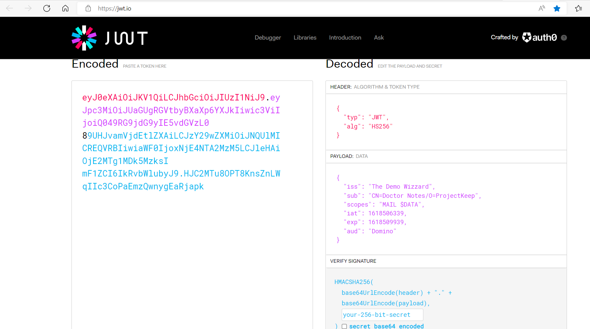

# Configure an identity provider

In its default configuration, Domino REST API uses itself as its identity provider (IdP), so it is client and IdP at the same time.
This allows you to start evaluating and testing out of the box. To enable this, you need to have an HTTP password configured in Domino and good enough for internal use.

However, for an actual deployment, you might want to configure your own IdP and authentication flow. The only IdP requirements are use of a supported algorithm for signing and a token with the expected format.

## About this task

The provided information guides you of configuring your own IdP and authentication flow for use in an actual deployment.

## Identity providers

Domino REST API supports identity providers that can produce JWT access tokens. Some examples are:

- Microsoft Active Directory
- Redhat [Keycloak](https://keycloak.org/)

- Tivoli Federate Identity Manager
- Okta
- Auth0

- [Roll your own](../../references/security/customIdp.md)

<!-- prettier-ignore -->
!!! tip
    Check out the [Keycloak](configuringKeycloak.md) example configuration.

## Example For Encode JWT

You can use the [official JWT site](https://jwt.io/) to decode and inspect the encoded token.



```bash
eyJ0eXAiOiJKV1QiLCJhbGciOiJIUzI1NiJ9.eyJpc3MiOiJUaGUgRGVtbyBXaXp6YXJkIiwic3ViIjoiQ049RG9jdG9yIE5vdGVzL0
89UHJvamVjdEtlZXAiLCJzY29wZXMiOiJNQUlMICREQVRBIiwiaWF0IjoxNjE4NTA2MzM5LCJleHAiOjE2MTg1MDk5MzksI
mF1ZCI6IkRvbWlubyJ9.HJC2MTu8OPT8KnsZnLWqIIc3CoPaEmzQwnygEaRjapk
```

When decoded, this translates to:

HEADER: ALGORITHM & TOKEN TYPE

```json
{
  "typ": "JWT",
  "alg": "HS256"
}
```

PAYLOAD: DATA

```json
{
  "iss": "The Demo Wizzard",
  "sub": "CN=Doctor Notes/O=ProjectKeep",
  "scope": "MAIL $DATA",
  "iat": 1618506339,
  "exp": 1618509939,
  "aud": "Domino"
}
```

wherein:

- `iss` stands for _Issuer_ and refers to the name of the IdP providing the claim.
- `sub` stands for _Subject_ and refers to the full qualified X500 expanded Notes name, which starts with `CN=`.
- `scope` refers to the databases and services that the user accesses. For more information, see [Scopes](../../references/usingdominorestapi/scopes.md).

- `iat` stands for _Issued at_ and refers to the epoch time of creation.
- `exp` stands for _Expiry_ and refers to the epoch time of expiration. It must fit into `maxJwtDuration` number of minutes.
- `aud` stands for _Audience_ and **MUST** have a value of `Domino` (case-sensitive).

VERIFY SIGNATURE

```json
HMACSHA256(
  base64UrlEncode(header) + "." +
  base64UrlEncode(payload),

your-256-bit-secret

) secret base64 encoded
```

## Add your own IdP

To add an IdP:

1. Create a JSON file in the `keepconfig.d` directory.
2. Allow access to the public key from your IdP.

The JSON file looks like this:

```json
{
  "disableJwtExpiryCheck": false,
  "jwt": {
    "my-idp": {
      "active": true,
      "algorithm": "RS256",
      "keyFile": "10-jwt.pubkey"
    }
  }
}
```

wherein:

- `disableJwtExpiryCheck`: By setting the value to `true`, the enforcement of JWT expiration can be disabled. **DO NOT** do this on a production system (default is `false`).
- `jwt`: Entry is related to JWT authorization.
- `my-idp`: The name you give your IdP. It could be `Rumpelstielzchen` but needs to be unique on your server.
- `active`: True/false.
- `algorithm`: Currently supported: `RS256`.
- `keyFile`: Path to public key file (PEM format), either relative to `keepconfig.d`or an absolute path.

Domino REST API supports more than one IdP, distinguished by the name `my-idp` in the example. Access checking takes longer the more identity providers you configure since Domino REST API checks every provider's key until it finds a match.

## Obtaining the public key directly from the IdP

TO ease configuration and simplify key rollover, the public key for JWT verification can be directly obtained from the key server. You are responsible to only use trusted connections.

```json
{
  "disableJwtExpiryCheck": false,
  "jwt": {
    "somother": {
      "active": true,
      "providerUrl": "https://someidp.your.domain"
    }
  }
```

The Domino REST API will extend this URL to `https://someidp.your.domain/.well-known/openid-configuration` and check for a JSON return containing the `jwks_uri` key. When your IdP doesn't use the `.well-known` approach (e.g. [Keycloak](./configuringKeycloak.md)), you need to directly point to they key URL.

!!! note

    Keycloak's `providerUrl` is different from the general IdP practise to use `/.well-known/openid-configuration`, mainly since Keycloak can handle multiple realms, the well-known approach can't handle. Hence you need ro use `/auth/realms/[RealmName]`
