# Configure Keycloak

--8<-- "keepmngtURLcaution1.md"

[Keycloak](https://www.keycloak.org/) is an Open Source Identity and Access Management sponsored by [RedHat](https://www.redhat.com/en).

Keycloak can be used to produce JWT Access Token for Domino REST API. Keycloak has many features like in its default configuration, Use Federation, Identity Brokering or Social Login. Those are topics not covered here, you want to consult a [Keycloak Tutorial](https://duckduckgo.com/?q=keycloak+tutorial&ia=web) or the [Keycloak documentation](https://www.keycloak.org/documentation) to learn more. This page focuses on the settings required for Domino REST API.

## About this task

This section describes key concepts and provides the steps required to configure Keycloak successfully for Domino REST API (it can be used for classic Domino SAML as well).

## Keycloak concepts

Listing only relevant concepts:


- **Realm**: The starting point for Keycloak identity management, contains all other elements.
- **Client**: Each accessing application, client app, Single Page App or server app will have a client entry. The client entry contains application Id and, if required, the application secret.
- **Client Scopes**: Attributes and properties available and/or assigned to client entries.
- **Mapper**: Configuration entry to determine what information is available in a client scope.

Not listed: Users

We will create a realm, an user, two clients (one for a SPA, one for a server based app), a client scope for shared settings and a few mappers.

## Procedure

Login to Keycloak. Click on the down angle next to the `Master`, add a new realm. In our example _Trantor_.

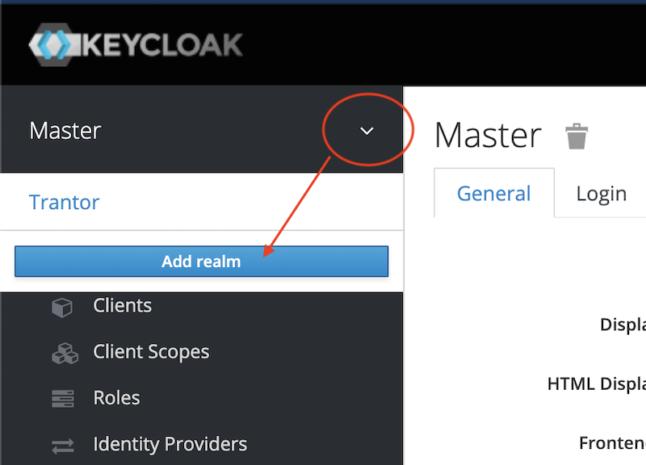{: style="height:70%;width:70%"}

Fill in the minimum information.

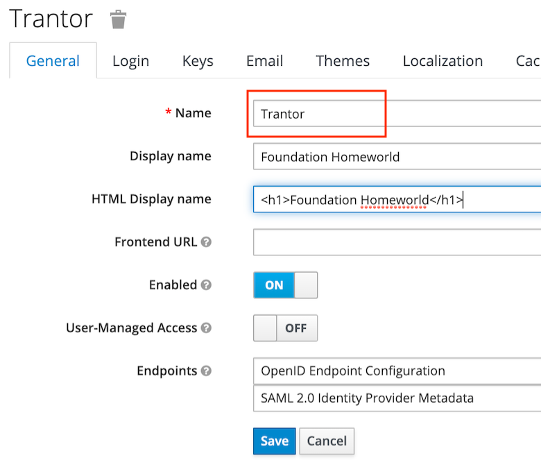{: style="height:70%;width:70%"}

Now create a user. In a production environment you probably would connect to an existing LDAP or Active Directory server. Check the documentation for details about that.

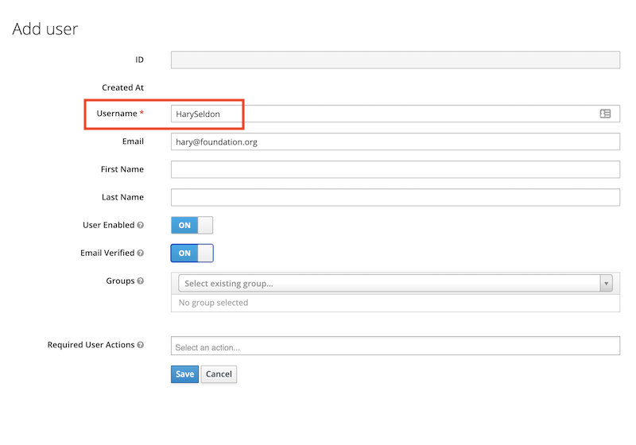{: style="height:80%;width:80%"}

To make it compatible with Domino and Domino REST API, we need the X500 style **distinguished name** of the user. This name can be in either "LDAP" format (comma-delimited) or "Domino" format (slash-delimited). We maintain that as the attribute `dominoDN`. In your environment it might have a different name, which you later need to use in the mapper.

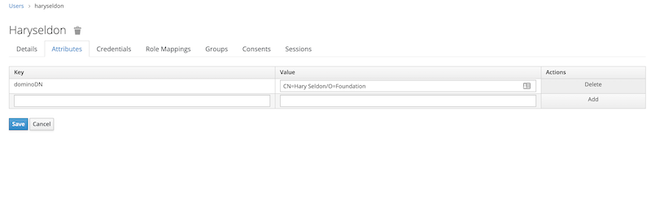

Next step is to create a client scope named `keep-common` which will contain the settings that are common to all clients (a.k.a apps) accessing Domino REST API.

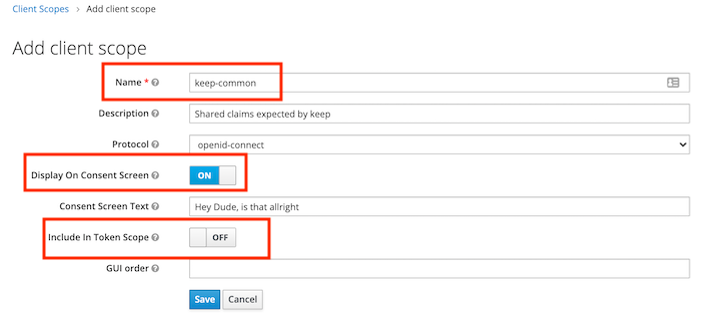

Next step is to add two mappers for `aud` and for the distinguished name. Here, the name is mapped to the standard claim `sub`, but it can be mapped to a different name if desired.

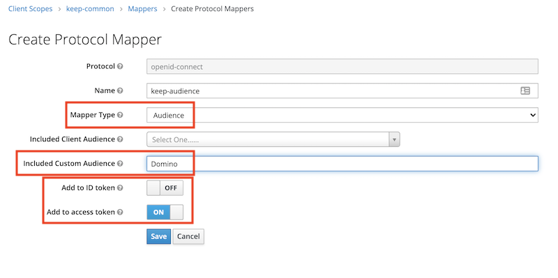
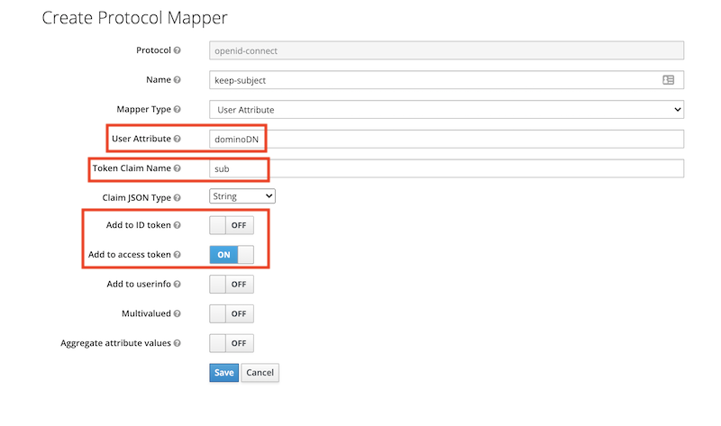

Next create a client. The example below is for an application server that can present a client id and a client secret. An example for a SPA (that can't keep a secret) follows further down.

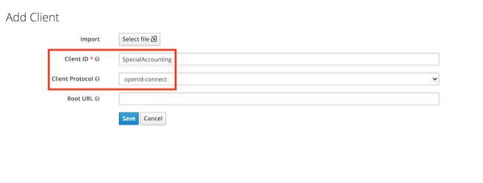
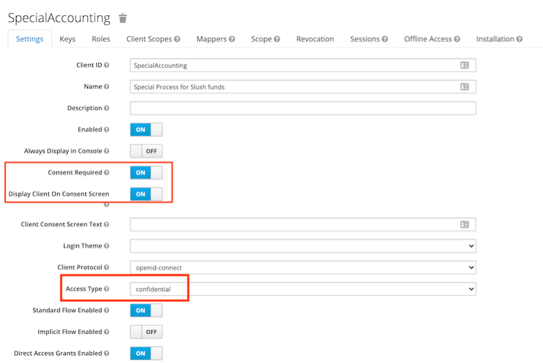
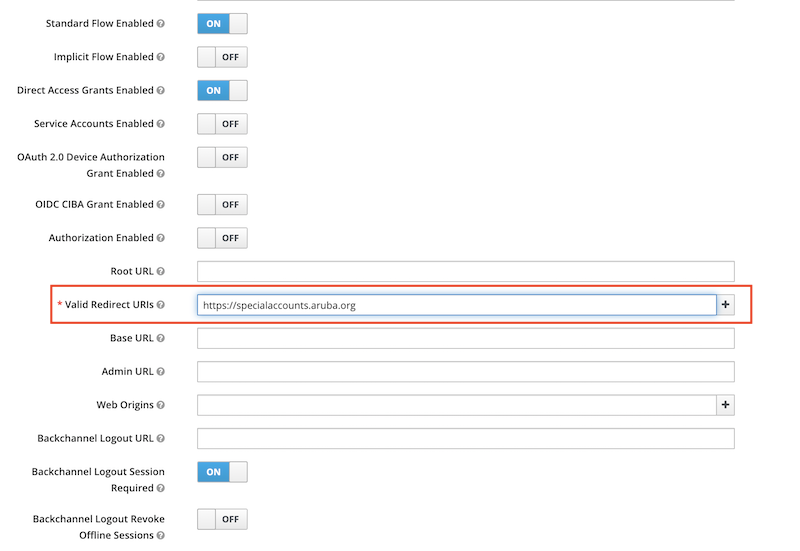

Next step is to assign the client the common client scopes `keep-common` and `offline_access` (this one for the refresh token). Remove the **Assigned Optional Client Scopes** first, so they become available in **Available Client Scopes**.

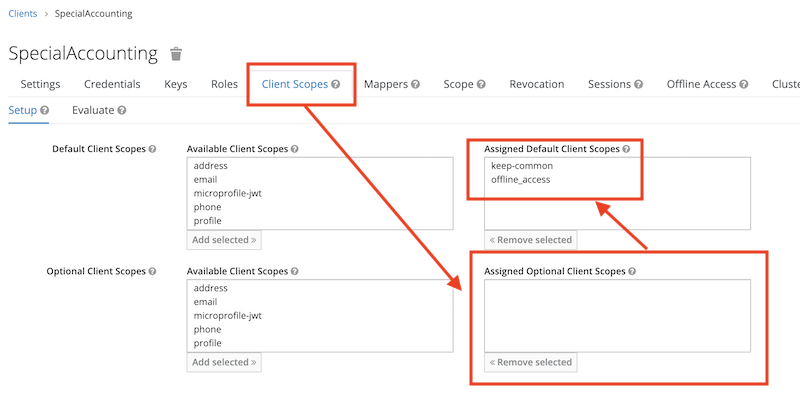

## Application specific scopes

The configuration so far will identify a user presenting the access token to Domino REST API, but not yet provide any access. We need to specify what scopes this application will be allowed to access. We can use any of the global scopes `MAIL`, `$DATA` or `$DECRYPT` or, preferably, a lowercase database alias. Multiple scopes are separated using a space.

<!-- prettier-ignore -->
!!! note
    It's best practice to give an external application as little as possible access so it can function. So think twice before allowing any of the uppercase general scopes.

The Mapper for the client is individual per application (client):

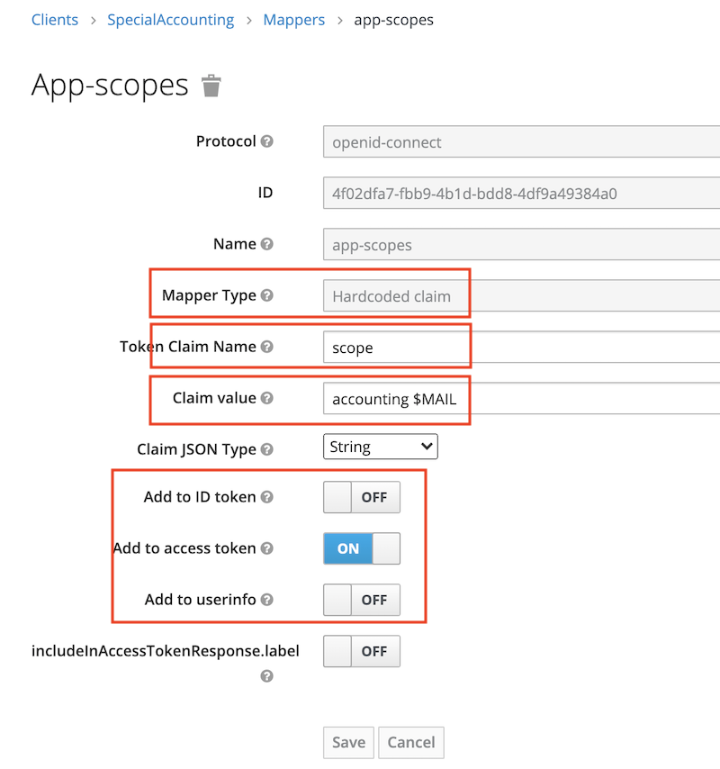{: style="height:80%;width:80%"}

Finally we can verify that an access token has all the required attributes:

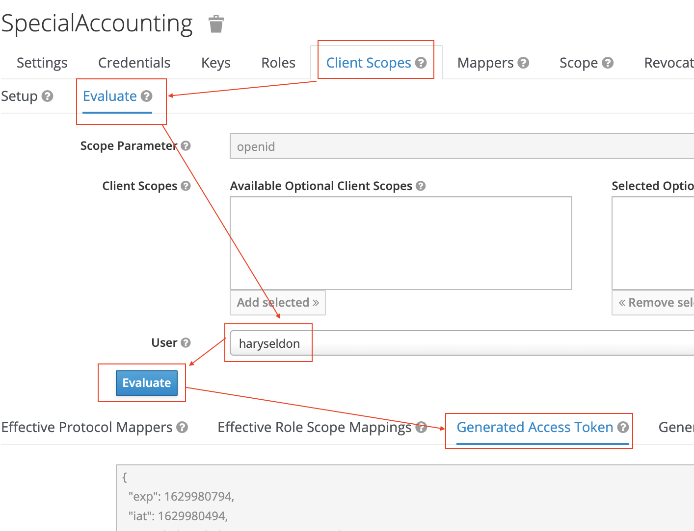{: style="height:80%;width:80%"}

## SPA applications

An SPA (Single Page App) or a mobile client can't keep a client secret. For those, the use of Proof Key for Code Exchange (PKCE) (defined in [RFC 7636](https://tools.ietf.org/html/rfc7636)) is recommended (read [this intro](https://auth0.com/docs/flows/authorization-code-flow-with-proof-key-for-code-exchange-pkce) for details). The only difference in Keycloak is to specify the client `Access Type` as public.

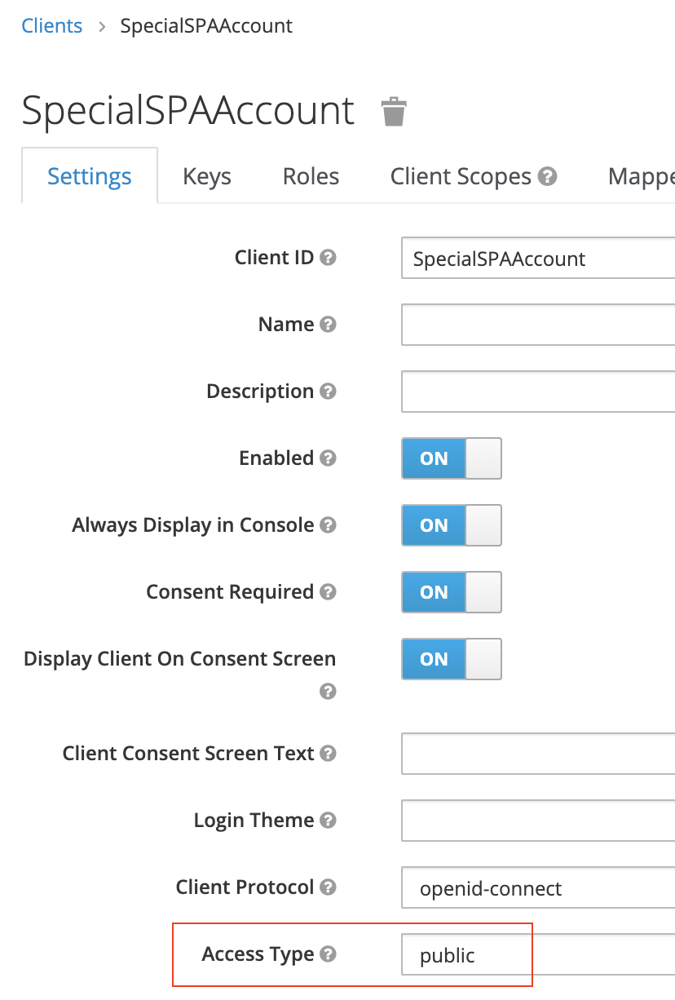{: style="height:60%;width:60%"}

!!!warning "Important"
    It's **SECURITY**, so learn about [Keycloak](https://www.keycloak.org/guides#getting-started/)!

## Configure the Domino REST API

You can find the full explanation [here](./configuringIdentityProvider.md). For the short version:

- Create a JSON file in `keepconfig.d` to contain the Keycloak related information
- Restart the REST API

```json
{
  "jwt": {
    "Trantor": {
      "providerUrl": "https://trantor.keycloak.yours/auth/realms/Trantor"
    }
  }
}
```

where:

| key         | explanation                                                                                                                   |
| ----------- | ----------------------------------------------------------------------------------------------------------------------------- |
| jwt         | Indicates that the config belongs to JWT                                                                                      |
| Trantor     | The sample Keycloak realm name. It must be unique in the jwt key. Replace it with your choosen realm                          |
| providerUrl | Points to Keycloak's endpoint with the public key. Note that the last segment is the realm name. The string is case sensitive |

!!! note

    Keycloak's `providerUrl` is different from the general IdP practise to use `/.well-known/openid-configuration`, mainly since Keycloak can handle multiple realms, the well-known approach can't handle. Hence you need ro use `/auth/realms/[RealmName]`
