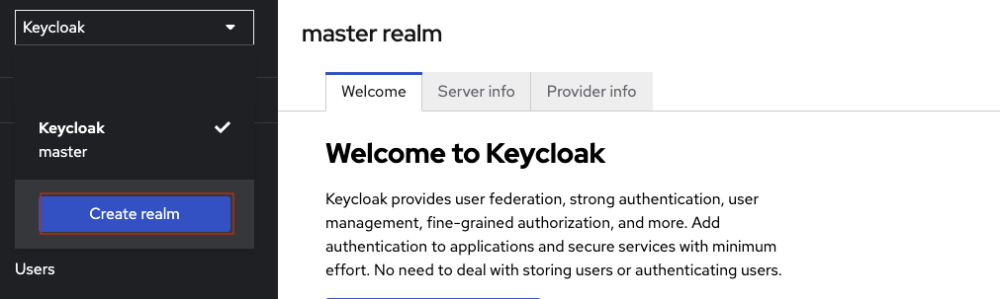
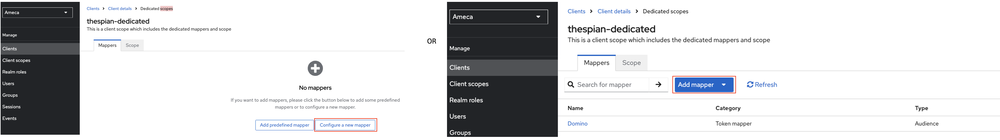
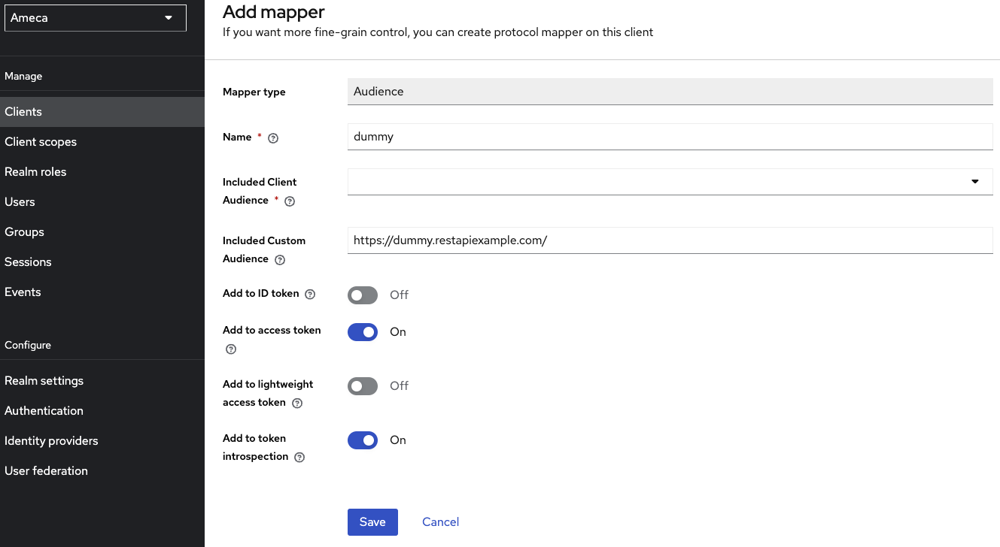
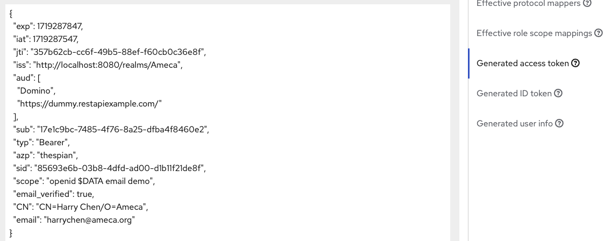

# Configure Keycloak

[Keycloak](https://www.keycloak.org/) is an Open Source Identity and Access Management sponsored by [RedHat](https://www.redhat.com/en).

Keycloak can be used to produce JWT Access Token for Domino REST API. Keycloak has many features like default configuration, use federation, identity brokering or social login. Those are topics not covered here, you want to consult a [Keycloak Tutorial](https://duckduckgo.com/?q=keycloak+tutorial&ia=web) or the [Keycloak documentation](https://www.keycloak.org/documentation) to learn more. This page focuses on the settings required for Domino REST API.

## About this task

This section describes key concepts and provides the steps required to configure Keycloak successfully for Domino REST API (it can be used for classic Domino SAML as well).

## Keycloak concepts

Listing only relevant concepts:


- **Realm**: The starting point for Keycloak identity management, contains all other elements.
- **Client**: Each accessing application, client app, Single Page App or server app will have a client entry. The client entry contains application Id and, if required, the application secret.
- **Client Scopes**: Attributes and properties available and/or assigned to client entries.
- **Mapper**: Configuration entry to determine what information is available in a client scope.

## Procedure

You creates a realm, a user, client scopes, and client.

1. Login to Keycloak. 
2. Click the `Master` dropdown and click **Create Realm**. 

      
  
    a. Fill in the **Realm Name**. For example **Ameca**.

    b. Click **Create**.
 

      
    
3. Click **Realm settings**. 

    a. Fill in the fields. Mandatory fields are those fields with red asterisk (<span style="color: red;">*</span>).

    b. Click **Save**.
    
      

    c. Go and click **User Profile** tab.
    d. Click **Create Attribute**.
          
      1. Turn `on` the *Required* field.
      2. Check the *Who can view* option on *Permission*.
      3. Click **Create**. 

      

      The attributes has been added to the list of user profile attribute.

      

4. Click **Users**.
    
    1. Click **Create a new user**. In a production environment you probably would connect to an existing LDAP or Active Directory server. 
    
        

    2. Fill in the fields. Mandatory fields are those fields with red asterisk (`*`). You can see here the user profile **attribute** you created on the **Realm Settings**.

    3. Click **Create**. The user has been created.
    
        

5. Create client scopes.

    Create a client scope named `demo` which contains the settings that are common to all clients (a.k.a apps) accessing Domino Rest API.

    
    
    1. Fill in the client scope name. Named it as `demo`.
    2. Enter *Description*.
    3. Turn `On` the toggle on *Display on Consent screen*. 
    4. Turn `Off` toggle on *Include in token scope*.
    5. Click *Save*.
    
        

    The configuration so far will identify a user presenting the access token to Domino REST API, but not yet provide any access. You need to specify what scopes this application will be allowed to access. You can use one or more (lowercase) scopes or some of the special scopes MAIL, $DATA or $DECRYPT.  Multiple scopes are separated using a space.

    Create another specific client scope, like **$DATA**.

    

    1. Fill in the client scope name. Named it as `$DATA`.
    2. Enter *Description*.
    3. Turn `On` the toggle on *Display on Consent screen*. 
    4. Turn `Off` toggle on *Include in token scope*.
    5. Click *Save*.
    
         

6. Go to **Client** and click **Create client**.    

    

    1. Fill in *Client type* and *Client ID*, for example, **thespian** and Click **Next**. 

          

    2. On the **Capability config**, turn `off` the *Client Authentication* and click **Next**. When it's ON, the OIDC type is set to confidential access type. When it's OFF, it's set to public access type. 
    
          

    3. On **Login Settings**, and click **Save**.
    
          

7. On the saved client's ID, for example **thespian**, click **Clients scopes** tab.

    1. Click the **thespian-dedicated**. This is the client's dedicated scope once the client is created.

        

    2. Click **Configure new mapper** or if there are existing mapper, click **Add mappers** &rarr; **by Configuration**. You need to add few mappers on your dedicated scope.
    
        In this example, you need to have 2 **Audience** mappers and 1 **User Atrribute**.
        
        

        Mapper-1 as **Audience** mapper
        
        1. Click **Audience** mapping in the list.
        2. Fill in the name, for example `Domino`.
        3. Fill in the *Included Custom Audience*, for example `Domino`.
        4. Turn `off` the toggle on *Add to ID token*. 
        5. Turn `on` toggle on *Add to access token*.
        6. Click **Save**.
        
        
        
        Mapper-2 as **Audience** mapper

        1. Click **Audience** mapping in the list.
        2. Fill in the name, for example `dummy`.
        3. Fill in the *Included Custom Audience*, for example `https://dummy.restapiexample.com/`.
        4. Turn `off` the toggle on *Add to ID token*. 
        5. Turn `on` toggle on *Add to access token*.
        6. Click **Save**.
          
          
        
        Mapper-3 as **User Attribute** mapper
        
        1. Click the **User Attribute** mapping in the list.
        2. Fill in the mapper name, for example `DominoNameAttr`.
        3. Fill in the *User Attribute*, as `CN`.
        4. Fill in the *Token Claim Name* as `CN`.
        5. Choose `String`from the dropdown menu of *Claim JSON Type*.
        6. Turn `on` toggle on *Add to access token*.
        7. Click **Save**.
        
                 

8. Click the **Client details**.

    
    
    The **Assign Type** of all scopes must be **Optional** except your `email` scope.
          
    1. Click the **Add client scope**. 
    
           
    
    2. Check the name of the client scopes you would like to add on your **thespian** client scope, for example `demo` and `$DATA`, and click **Add** and choose **Default** option.
    
        

    3. Click **Client Scope** &rarr; **Evaluate** tab.
    4. Fill in *Users*.
    5. Click **Generated access token**.
    
        


      
## SPA applications

An SPA (Single Page App) or a mobile client can't keep a client secret. For those, the use of Proof Key for Code Exchange (PKCE) (defined in [RFC 7636](https://tools.ietf.org/html/rfc7636)) is recommended (read [this intro](https://auth0.com/docs/flows/authorization-code-flow-with-proof-key-for-code-exchange-pkce) for details). The only difference in Keycloak is to toggle `off` the **Client Authentication**.


!!!warning "Important"
    It's **SECURITY**, so learn about [Keycloak](https://www.keycloak.org/guides#getting-started/)!

## Configure the Domino REST API

You can find the full explanation [here](./configuringIdentityProvider.md). For the short version:

- Create a JSON file in `keepconfig.d` to contain the Keycloak related information
- Restart the REST API

```json
{
  "jwt": {
    "Ameca": {
      "providerUrl": "https://ameca.keycloak.yours/auth/realms/Ameca"    
    }
  }
}
```

where:

| key         | explanation                                                                                                                   |
| ----------- | ----------------------------------------------------------------------------------------------------------------------------- |
| jwt         | Indicates that the config belongs to JWT                                                                                      |
| Ameca     | The sample Keycloak realm name. It must be unique in the jwt key. Replace it with your chosen realm                          |
| providerUrl | Points to Keycloak's endpoint with the public key. Note that the last segment is the realm name. The string is case sensitive |

!!! note

    Keycloak's `providerUrl` is different from the general IdP practise to use `/.well-known/openid-configuration`, mainly since Keycloak can handle multiple realms, the well-known approach can't handle. Hence you need ro use `/auth/realms/[RealmName]`


## Expected result

### Test Application specific scopes result in Postman

#### Prerequisite

- Configured Postman
- configured Keycloak

#### Procedure

1. Modify the token endpoint of via GET with this `{{server}}/realms/{{realm}}/protocol/openid-connect/token`
      
      - server: Your Keycloak server.
      - realm: Your realm name, for example Ameca.

2. In the `Body`, provide the `client_id`, `client_secret`, `grant_type`, `user_name` and `password` from your Keycloak.
3. Click **Send**.

The result must have an access token, which must be tested int [jwt](https://jwt.io/) to return the same result in Keycloak.


**JWT**

You can use the [official JWT site](https://jwt.io/) to decode and inspect the encoded token.

```bash
eyJhbGciOiJSUzI1NiIsInR5cCIgOiAiSldUIiwia2lkIiA6ICJkbVlLaWIzQnJodnJPVnVRc2ljcXdPVzcwX2N2MDJ1ekZFV091WC1uN3ZVIn0.eyJleHAiOjE3MTcxNzQ4MzQsImlhdCI6MTcxNzE3NDUzNCwianRpIjoiN2FmYTMxNmMtOGFjOC00ODMzLTkwN2YtMjUwNDM3MTY3ODNiIiwiaXNzIjoiaHR0cHM6Ly9kaWdpLXFzLWtleWNsb2FrLnFzLmhjbGxhYnMubmV0L3JlYWxtcy9BbWVjYSIsImF1ZCI6IkRvbWlubyIsInN1YiI6ImNkNGVhYTk4LTY3N2MtNGM2Mi1iZTU0LTdlOTBiZWUxMjQ0NyIsInR5cCI6IkJlYXJlciIsImF6cCI6IlNwZWNpYWxLZWVwRGVtbyIsInNlc3Npb25fc3RhdGUiOiI3MDA0Y2M2Yy1hMThkLTQ3YzUtODJiNC0wOGJlNjhiNTdiM2MiLCJzY29wZSI6IkFwcC1TY29wZSBvZmZsaW5lX2FjY2VzcyIsInNpZCI6IjcwMDRjYzZjLWExOGQtNDdjNS04MmI0LTA4YmU2OGI1N2IzYyIsIkNsYWltTmFtZS52YWx1ZSI6ImRlbW8gJERBVEEifQ.hRjB9EzKXNrWI8h1rQS8_xkPfrl99BWTyE5xBf6V-wVUKNIBsCC8wP1aFlPHQefciuUVM13XKIE6shC9LIBRiAQE4crKgZlxWL8tVZ4I4wUr2SqYwbZ5z9okMn6FCuDdyNRDbC8HXpFas6fcfYd3JU6k-ea8YmhdndW-mQ98kJbOL98H30ATIbYJh6u1wqed989E4aSToghLNZmtMChMlNd921QNdpr5_r6ZSLk4A7nOfjtz9fl0lXpxZ83NBiM9Y5-TWgq1wvNbbP9hLq9_Rf5CDX_KLb6ocQMvcNvdh_w4cGQJ7q5wzu4OmiF_tllU8q5A4wGQOGGMuZjWUV-QOw
```

When decoded, this translates to:

HEADER: ALGORITHM & TOKEN TYPE

```json
{
  "alg": "RS256",
  "typ": "JWT",
  "kid": "dmYKib3BrhvrOVuQsicqwOW70_cv02uzFEWOuX-n7vU"
}
```

PAYLOAD: DATA
```json
{
  "exp": 1717174834,
  "iat": 1717174534,
  "jti": "7afa316c-8ac8-4833-907f-25043716783b",
  "iss": "https://digi-qs-keycloak.qs.hcllabs.net/realms/Ameca",
  "aud": "Domino",
  "sub": "cd4eaa98-677c-4c62-be54-7e90bee12447",
  "typ": "Bearer",
  "azp": "SpecialKeepDemo",
  "session_state": "7004cc6c-a18d-47c5-82b4-08be68b57b3c",
  "scope": "App-Scope offline_access",
  "sid": "7004cc6c-a18d-47c5-82b4-08be68b57b3c",
  "ClaimName.value": "demo $DATA"
}
```

which has the same result in the Keycloak **generated access token**.



