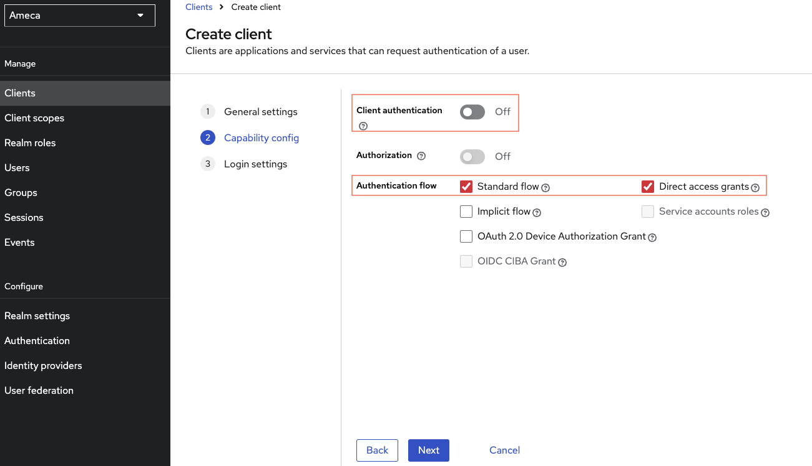
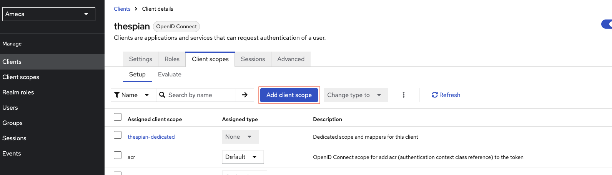

# Configure Keycloak

[Keycloak](https://www.keycloak.org/) is an Open Source Identity and Access Management solution sponsored by [RedHat](https://www.redhat.com/en).

Keycloak can be used to produce JWT Access Token for Domino REST API. Keycloak has many features like default configuration, user federation, identity brokering and social login. Those are topics not covered here. Consult the [Keycloak Tutorial](https://duckduckgo.com/?q=keycloak+tutorial&ia=web) or the [Keycloak documentation](https://www.keycloak.org/documentation) to learn more. This page focuses on the settings required for Domino REST API.

--8<-- "onclientids.md"

## About this task

This section describes key concepts and provides the steps required to configure Keycloak successfully for Domino REST API.

## Keycloak concepts

Only concepts relevant to Domino REST API are listed:

{: style="height:80%;width:80%"}

- **Realm**: The starting point for Keycloak identity management, contains all other elements.
- **Client**: Each accessing application, client app, Single Page App or server app will have a client entry. The client entry contains application Id and, if required, the application secret. Furthermore it has mapper and client scopes assigned to it.
- **Client Scopes**: Each scope in Domino REST API will have a client scope in Keycloak, so the Keycloak admin can assign them to clients
- **Mapper**: Configuration entry to determine what information is available in a client and/or Client scope. Each Client has a default entry for Mappers independent from assigned Client Scopes
- **Users**: Standard attributes assigned to users like username, firstname, lastname, email, credentials as well as any custom attributes. Domino REST API, for example, use `CN` for the Domino style name.

## Procedure

In this example, you will learn and create a realm, a user, client scopes, client and client scope mappers inside the Keycloak app.

!!! note

    The screenshots were captured using Keycloak version 25.0.

1. Login to Keycloak.
2. Create a realm.

      1. Click the **Keycloak** dropdown menu at the top left corner, and then click **Create Realm**.

         

      2. Fill in the **Realm Name**. For example **Ameca**.

      3. Click **Create**.

         

3. Configure realm settings.

      1. Click **Realm settings**.
      2. Fill in the fields applicable to your project. Mandatory fields are those fields with red asterisk (<span style="color: red;">\*</span>).

         **Display name**: `Humanoid Robots`.

         **HTML Display Name**: `<h1> Humanoid Robots </h1>`

      3. Click **Save**.

         

      4. Click **User Profile** tab.

      5. Create an attribute.

         Creating an attribute is optional. `CN` is used here to store the Domino style name, such as `CN=John Doe/O=Mauraders`.

         1. Click **Create Attribute**.
         2. Fill in the fields applicable to your project. Mandatory fields are marked with with red asterisk <span style="color: red;">\*</span>.

         3. Fill in the **Attribute name**. For example `CN`

         4. Fill in the **Display Name**. For example `Domino common name`

         5. Set **Required field** toggle to `On` position.

         6. Under **Permission** section, select the **User** checkbox for the **Who can view?** option.

         7. Click **Create**.

            

4. Add a user.

      1. Click **Users**.

      2. Click **Create new user**, if there are no existing users. Otherwise, click **Add user**, if there are existing users.

         

      3. Fill in the mandatory fields as minimum requirements to save. You can see here the user profile **attribute** you created on the **Realm Settings**. For example, _Domino common name_. For a direct access grant you must have first name, last name and eMail, even if they're not marked mandatory.

         Fill in the following:

         **Username**: `harrychen`.

         **Email**: `harrychen@ameca.org`

         **First name**: `Harry`

         **Last Name**: `Chen`

         **Domino common name**: `CN=Harry Chen/O=Ameca`

      4. Click **Create**. The user has been created.

         

      5. On your user details, for example user `harrychen`, click the **Credential** tab.

         You need configure [User credentials](https://www.keycloak.org/docs/latest/server_admin/#ref-user-credentials_server_administration_guide). For this example username and password are used, but it could be a social or federated login. Check [Keycloak](https://www.keycloak.org/docs/latest/server_admin/#ref-user-credentials_server_administration_guide) for details.

         1. Click **Set password**.

            

         2. Fill in the **Password** and **New password confirmation** with same phrases.
         3. Set **Display on consent screen** toggle to `off` position.
         4. Click **Save**.

            

5. Click **Client scopes**.

      Each Domino REST API scope in Domino, that you want to make accessible in Keycloak, will need a client scope in Keycloak. This includes all named scopes (the lowercase ones), and the [special scopes](../../references/usingdominorestapi/scopes.md) like `$DATA` or `MAIL`.

      Click **Create client scope**. Creating a client scope doesn't automatically expose it, for that, assign it to one or more clients. In this example, create a client scope named `demo`.

      

      1. Fill in the client scope name. For example, `demo`.
      2. Fill in **Description**. For example `demo for all demo`.
      3. Set **Display on consent screen** toggle to `On` position.
      4. Set **Include in token scope** toggle to `On` position.
      5. Click **Save**.

      

      The configuration so far will identify a user presenting the access token to Domino REST API, but not yet provide any access. You need to specify what scopes this application will be allowed to access. You can use one or more (lowercase) scopes or some of the special scopes MAIL, $DATA or $DECRYPT. Multiple scopes are separated using a space.

      Create another specific client scope, like **$DATA**.

      

      1. Fill in the client scope name. For example, `$DATA`.
      2. Fill in **Description**. For example `all data for database`.
      3. Set **Display on consent screen** toggle to `On` position.
      4. Set **Include in token scope** toggle to `On` position.
      5. Click **Save**.

      

6. Create a client.

      1. Click **Clients**, and then click **Create client**.

         

      2. On the **General Setting** section, fill in the following fields, and the click **Next**.

         **Client ID**: `thespian`.

         **Name**: `thespian`.

         **Description**: `ameca's client`

         

      3. On the **Capability config** section, turn `off` the **Client Authentication** and click **Next**. When it's ON, the OIDC type is set to confidential access type. When it's OFF, it's set to public access type. Confidential is used when an application server, using client_id and client_secret accesses Domino REST API, while public access is for situations where you can't have a client secret like a single page app or a mobile app accessing the API directly,

         

      4. On **Login Settings** section, click **Save**.

         

7. On the saved client's ID, for example **thespian**, click **Clients scopes** tab.

   1. Click the **thespian-dedicated**. This is the client's dedicated scope once the client is created. It is used to hold mappers that are independent from scopes, like user attributes.

      

   2. Click **Configure new mapper** or if there are existing mappers, click **Add mappers** &rarr; **by Configuration**. You need to add few mappers inside the dedicated client scope.

      In this example, you need to have 2 **Audience** mappers and 1 **User Atrribute**, inside the **thespian-dedicated** client scope.

      

      Mapper-1 as **Audience** mapper

      1. Click **Audience** mapping in the list.
      2. Fill in the name, for example `Domino`.
      3. Fill in the **Included Custom Audience**, for example `Domino`.
      4. Set **Add to access token** toggle to `On` position.
      5. Click **Save**.

         

      Mapper-2 as **Audience** mapper

      1. Click **Audience** mapping in the list.
      2. Fill in the name, for example `dummy`.
      3. Fill in the **Included Custom Audience**, for example `https://dummy.restapiexample.com/`.
      4. Set **Add to access token** toggle to `On` position.
      5. Click **Save**.

         

      Mapper-3 as **User Attribute** mapper

      1. Click the **User Attribute** mapping in the list.
      2. Fill in the mapper name, for example `DominoNameAttr`.
      3. Fill in the **User Attribute**, as `CN`.
      4. Fill in the **Token Claim Name** as `CN`.
      5. Choose `String`from the dropdown menu of **Claim JSON Type**.
      6. Set **Add to access token** toggle to `On` position.
      7. Click **Save**.

         

8. Click the **Client details**.

      

      1. Set **Assign Type** of all scopes to **Optional**, except your `email` scope.

      2. Click the **Add client scope**.

         

      3. Check the name of the client scopes you would like to add on your **thespian** client scope, for example `demo` and `$DATA`, and click **Add** and choose **Default** option.

         

      4. Click **Client Scope** &rarr; **Evaluate** tab.
      5. Fill in or select applicable **Users**.
      6. Click **Generated access token**.

         

## SPA applications

An SPA (Single Page App) or a mobile client can't keep a client secret. For those, the use of Proof Key for Code Exchange (PKCE) (defined in [RFC 7636](https://tools.ietf.org/html/rfc7636)) is recommended (read [this intro](https://auth0.com/docs/flows/authorization-code-flow-with-proof-key-for-code-exchange-pkce) for details). The only difference in Keycloak is to toggle `off` the **Client Authentication**.


!!! warning "Important"

    It's **SECURITY**, so learn about [Keycloak](https://www.keycloak.org/guides#getting-started/)!

## Configure the Domino REST API

You can find the full explanation [here](./configuringIdentityProvider.md). For the short version:

- Create a JSON file in `keepconfig.d` to contain the Keycloak related information.
- Restart the Domino REST API.

```json
{
  "jwt": {
    "Ameca": {
      "providerUrl": "https://ameca.keycloak.yours/auth/realms/Ameca"
    }
  }
}
```

where:

| key         | explanation                                                                                                                   |
| ----------- | ----------------------------------------------------------------------------------------------------------------------------- |
| jwt         | Indicates that the config belongs to JWT                                                                                      |
| Ameca       | The sample Keycloak realm name. It must be unique in the jwt key. Replace it with your chosen realm                           |
| providerUrl | Points to Keycloak's endpoint with the public key. Note that the last segment is the realm name. The string is case sensitive |

!!! note

    Keycloak's `providerUrl` is different from the general IdP practise to use `/.well-known/openid-configuration`, mainly since Keycloak can handle multiple realms, the well-known approach can't handle. Hence you need ro use `/auth/realms/[RealmName]`

## Expected result

### Test Application specific scopes result in Postman

#### Before you begin

- Configured Postman
- configured Keycloak

#### Procedure

1. Modify the token endpoint of via POST with this `{{server}}/realms/{{realm}}/protocol/openid-connect/token`

   - server: Your Keycloak server.
   - realm: Your realm name, for example Ameca.

2. In the `Body`, provide the `client_id`, `client_secret`, `grant_type`, `user_name` and `password` from your Keycloak.
3. Click **Send**.

The result must have an access token, which must be tested int [jwt](https://jwt.io/) to return the same result in Keycloak.


**JWT**

You can use the [official JWT site](https://jwt.io/) to decode and inspect the encoded token. Copy the access token from Postman and paste it inside the **Encoded** box.

When decoded, this translates to:

HEADER: ALGORITHM & TOKEN TYPE

```json
{
  "alg": "RS256",
  "typ": "JWT",
  "kid": "dtzYxf0a22BPo_M4A72PAJS8cAHUjFDFGKVqmzpu3po"
}
```

PAYLOAD: DATA

```json
{
  "exp": 1719281929,
  "iat": 1719281629,
  "jti": "e708dfd3-8218-450b-a98e-00e23af649ff",
  "iss": "http://localhost:8080/realms/Ameca",
  "aud": ["Domino", "https://dummy.restapiexample.com/"],
  "typ": "Bearer",
  "azp": "thespian",
  "sid": "1dbc900a-c490-47ef-a242-67be3a1aa250",
  "scope": "$DATA email demo",
  "email_verified": true,
  "CN": "CN=Harry Chen/O=Ameca",
  "email": "harrychen@ameca.org"
}
```

which has the same result in the Keycloak **generated access token**.


