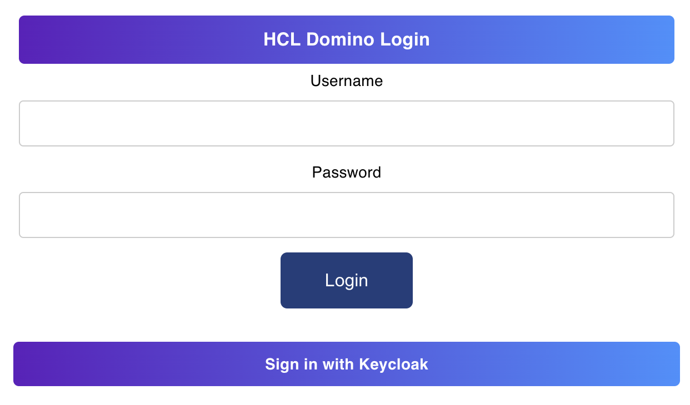

# Set up external IdP for Office Round Trip Experience

--8<-- "onclientids.md"

## About this task

Aside from the default Domino REST API login page, you can also use your configured external IdP for Office Round Trip Experience log in.

## Configuration

### Set up external IdP

Configure your external IdP in the configuration file. For more information, see [configuring external IdP](../IdP/index.md) for configuring an external IdP of your choice.

!!!note
When configuring your external IdP, make sure to set `{{origin}}/api/webdav-v1/login/callback` as one of your redirect URIs.

### Set up OFBA configuration

Configure the `ofba` property in your chosen external IdP. For more information, see [JWT parameters](../../references/parameters.md#jwt-parameters).

## OFBA log in

Once configured, the login UI for OFBA should look like the following example image. In the example image, _Keycloak_ is used as the external IdP.



Clicking **Sign in with {external_idp_name}** commences the authorization code flow.

!!!note
Office Round Trip Experience external IdP login uses authorization code flow with PKCE.

## Examples

### Azure

The following is an example configuration for Azure IdP:

```json
{
  "jwt": {
    "AzureIdP": {
      "active": true,
      "providerUrl": "https://login.microsoftonline.com/{tenant_id}/v2.0/.well-known/openid-configuration",
      "aud": "{client_id}",
      "iss": "https://login.microsoftonline.com/{tenant_id}/v2.0",
      "algorithm": "RS256",
      "ofba": {
        "active": true,
        "client_id": "{client_id}",
        "application_id_uri": "api://dominorest/"
      }
    }
  }
}
```

### Keycloak

The following is an example configuration for Keycloak IdP:

```json
{
  "jwt": {
    "KeycloakIdP": {
      "active": true,
      "providerUrl": "https://{keycloak_host}/realms/{realm_name}",
      "ofba": {
        "active": true,
        "client_id": "{client_id}"
      }
    }
  }
}
```
