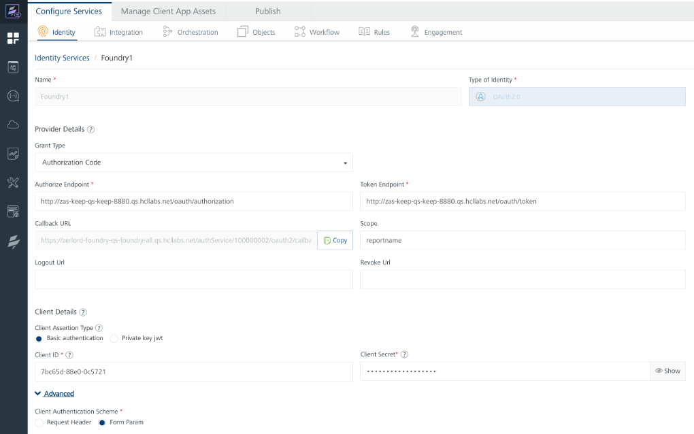
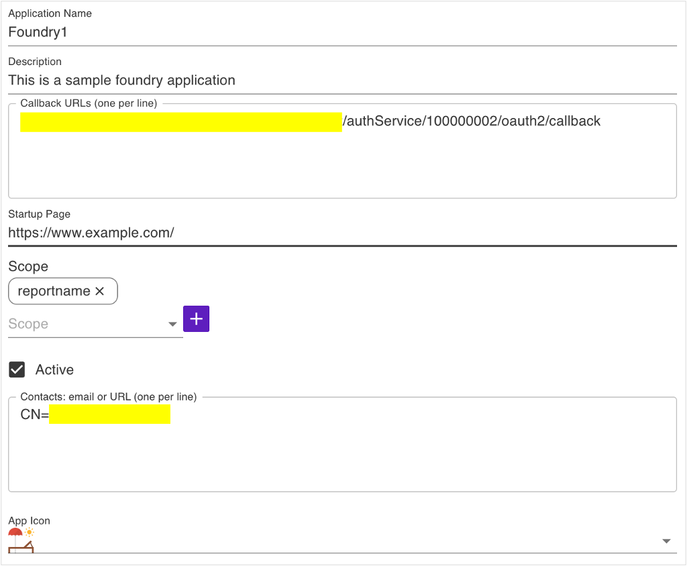

# How to configure Domino REST API IDP with Volt MX Foundry Identity Service

--8<-- "keepmngtURLcaution1.md"

## About this task

Domino REST API implements what essentially amounts to an OAuth2 Provider (called `IDP-lite`) and Volt MX Foundry implements an Integration Service adapter for OAuth2 providers. The following is a guide for creating a Foundry Identity Service using Domino REST API's OAuth provider.

## Set up Domino REST API

<!-- prettier-ignore -->
!!! warning "Caution"
     This is subject to change. Consult Domino REST API documentation (or code, or experts) for the latest steps. Currently, these general steps must be performed:

1. Deploy `oauth.nsf` and configure Domino REST API to recognize that file.
1. Add `OAuthAdmin` role for the ACL entry that gives your server manager access to the `oauth.nsf`.

To deploy and configure the NSF, place the following in the domino data directory (you may need to create the keepconfig.d folder if it doesn't already exist):

- [data folder]/oauth.nsf
- [data folder]/keepconfig.d/oauth.json

An example of `oauth.json` is shown below. Expiration times can be adjusted. Make sure to replace the Domino REST API URL to match your Domino REST API host (a fictitious Quickstart Domino REST API url is shown in this example.).

```json
{
  "oauth": {
    "active": true,
    "database": "oauth.nsf",
    "url": "http://yourquickstarthost-qs-keep-8880.qs.hcllabs.net",
    "authCodeExpiresIn": 120,
    "accessTokenExpiresIn": 3600,
    "refreshTokenExpiresIn": 525600
  }
}
```

<!-- prettier-ignore -->
!!! note
      If you are using Domino+Domino REST API docker image, the `oauth.nsf` should already be "deployed" in the image (though not fully configured as of this writing). If for some reason you need to create `oauth.nsf`, create it from a template.

To create `oauth.nsf` from a template:

1. Start the Notes Client.
2. Go to **File > Application > New** or press **Ctrl+N**.

   1. Pick (the target) server.
   2. Set the file name to `oauth.nsf`.
   3. Set the title as you deem fit.
   4. Pick `KeepOauth.ntf` as the application template.

3. Assign the role `[OAuthAdmin]` to the server and your administrative user or usergroup (we suggest `[LocalKeepAdmins]` using your notes client). Make sure there is an ACL entry of type `server` (for your server) that has Manager access and has `OAuthAdmin` role (make sure to select the checkbox).


If you don't have the ability to connect a Notes Client to your Domino server then:

1. Add the `oauth.nsf` to your list of Domino REST API databases.
2. Use postman or curl to add the `OAuthAdmin` role (see example, but note that headers are removed for clarity):

```json
curl --location --request PUT 'http://yourkeepserver.io:8880/api/admin-v1/acl/entries/CN%3Dyourkeepserver%2FO%3Dyourorg?dataSource=oauth.nsf' \
--data-raw '{
    "name": "CN=yourkeepserver/O=yourorg",
    "level": "MANAGER",
    "roles": ["OAuthAdmin"],
    "type": "SERVER",
    "flags": ["NODELETE"]
}'
```

!!! note
    The part after `/entries/` before `?dataSource` must be [URL encoded](https://en.wikipedia.org/wiki/Percent-encoding).
    {: .alert .alert-info}

## Create Foundry Identity Service

Some things to note when creating an identity service in Volt MX Foundry using Domino REST API IDP-lite (also refer to the screenshot below):

1. Create a new Identity service in the Foundry browser console by filling in the fields:

      - **Type of identity** = OAuth 2.0
      - **Grant Type** = Authorization Code
      - **Authorize Endpoint** = `[your Domino REST API API server]/oauth/authorization`
      - **Token Endpoint** = `[your Domino REST API API server]/oauth/token`
      - **IMPORTANT** - make sure to select **Form Param** under **Advanced**. <!--{: .alert .alert-danger}-->
      - Take note of the **Callback URL**.

      Pause here for a moment (don't save yet), and complete the steps for [setting up Domino REST API databases and applications](#domino-rest-api-application-and-database-setup).

      - **Scope** = database `name` (API Name) for the database added in the next step; if more than one database, you should be able to enter a list of database names; check Domino REST API documentation to see how the names are delimited (perhaps a comma or space, but to Domino REST API it simple, just enter one db name if uncertain about how to specify multiple).
      - **Client ID** = `App id` from the application created in the next section below.
      - **Client Secret** = Obtained when you first create the application (next section).

2. Now you can **Save**.



## Set up Domino REST API application and database

From the Domino REST API Admin browser client:

1. Add a database, and note its name (API name, when you create the DB in Domino REST API).
2. Create an application, and note its client id, and client secret.

!!! note
    When you create the application, you'll need the callback URL [defined earlier](#create-foundry-identity-service).



The App id (Client ID) is available any time you view a created application. The secret is shown only when the secret is created the first time. If you forget the secret, generate a new one by clicking the circular arrow as indicated in the following image:


