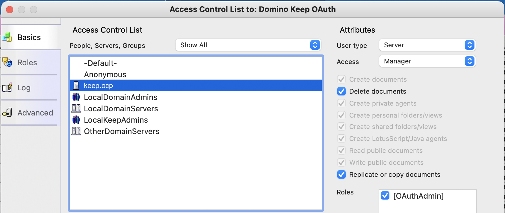

# Set up oauth.nsf

## About this task
The procedure guides you on creating and setting up an `oauth.nsf` from a template.

## Procedure 

**To create oauth.nsf from a template**

1. Start the Notes Client.
2. Go to **File > Application > New** or press **Ctrl+N**.

    1. Select a target server.
    2. Set the filename to `oauth.nsf`.
    3. Set the title as you deem fit.
    4. Select `KeepOauth.ntf` as the application template.

3. Assign the role `[OAuthAdmin]` to the server and your administrative user or user group. We suggest `[LocalKeepAdmins]` using your Notes Client. 
4. Make sure there is an access control list (ACL) entry of the type `server` that has `Manager` access and `OAuthAdmin` role. Make sure to select the checkbox corresponding to `OAuthAdmin`.



## Additional details

If you don't have the ability to connect a Notes Client to your Domino server:

1. Add the `oauth.nsf` to your list of Domino REST API databases.
2. Use postman or curl to add the `OAuthAdmin` role. See the following example, but note that headers are removed for clarity:

```json
curl --location --request PUT 'http://yourkeepserver.io:8880/api/admin-v1/acl/entries/CN%3Dyourkeepserver%2FO%3Dyourorg?dataSource=oauth.nsf' \
--data-raw '{
    "name": "CN=yourkeepserver/O=yourorg",
    "level": "MANAGER",
    "roles": ["OAuthAdmin"],
    "type": "SERVER",
    "flags": ["NODELETE"]
}'
```

!!! note
    The part after `/entries/` and before `?dataSource` in the URL in the example must be [URL encoded](https://en.wikipedia.org/wiki/Percent-encoding).
    {: .alert .alert-info}