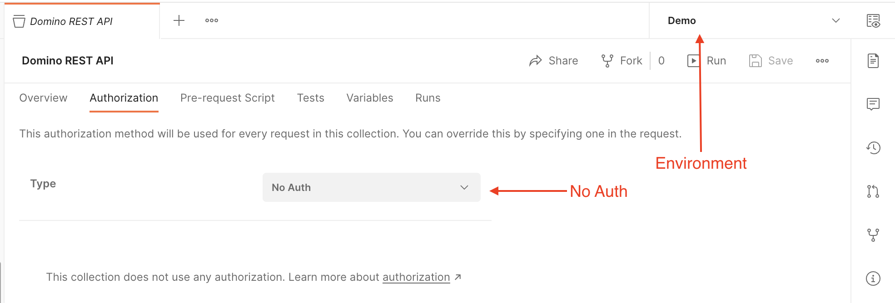
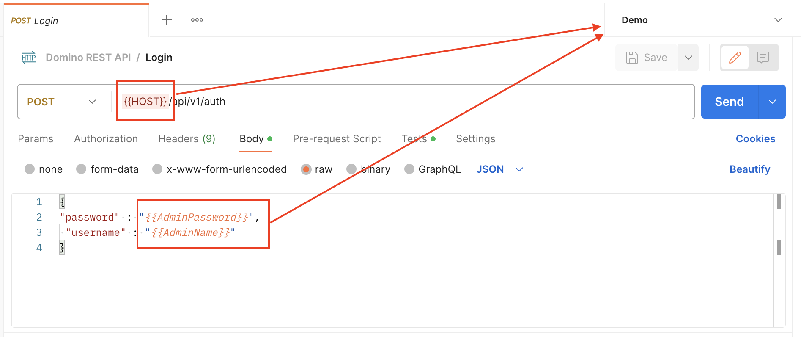
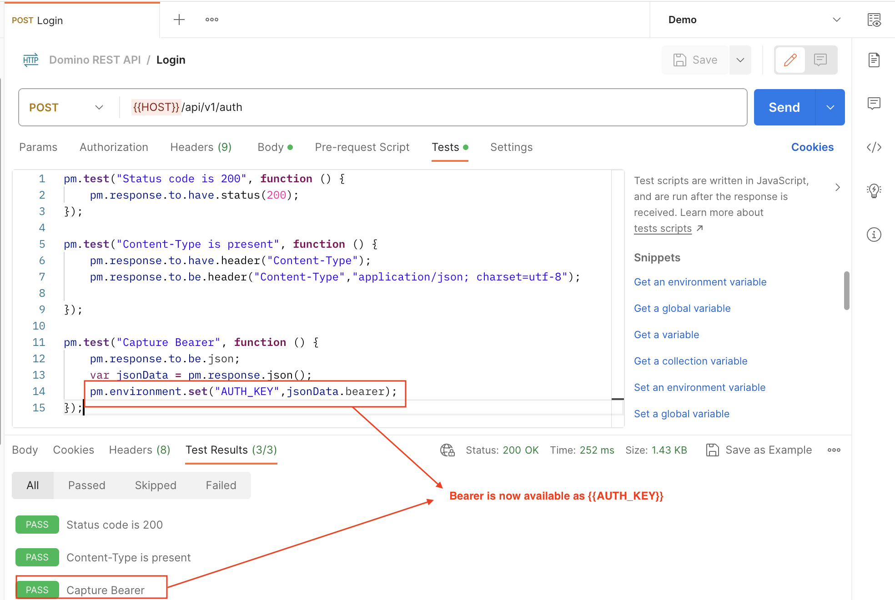
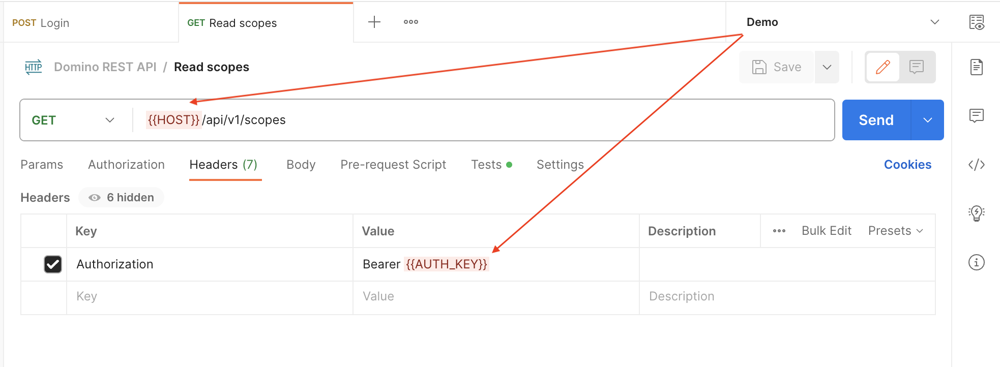
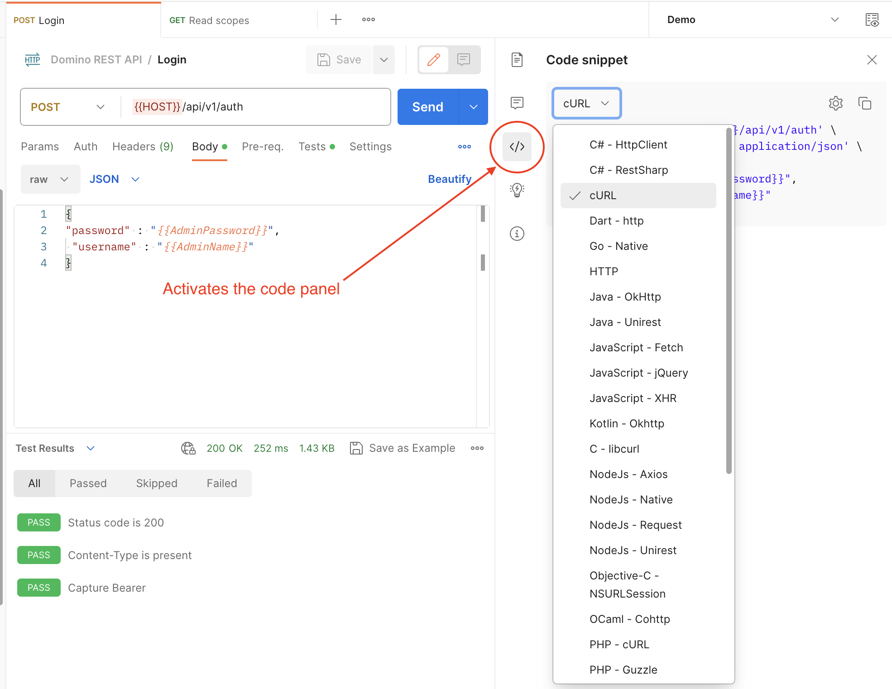

# Code examples

The Domino REST API can be called by any http library in any language following these simple steps:

1. Obtain a valid [JWT](https://en.wikipedia.org/wiki/JSON_Web_Token) Access Token from your configured Identity provider. Out of the box, that would be your REST enabled Domino server using a `POST` request with JSON `username` and `password` as body to the URL `/api/v1/auth`. In the resulting JSON, the `bearer` is your JWT Access Token.

2. Pick the operation you want to complete from the [OpenAPI spec](../../references/openapidefinitions.md) and provide the bearer in the `Authorization` header as `Bearer [insert bearer here]`. You could do a pre-check if the bearer is still valid.

## Sample applications

Look at the implemented source code to see a working implementation

| Mentioned | Source | Language |
|----| ---- | ---- |
| Walkthrough [Lab 06](../../tutorial/walkthrough/lab-06.md) | [Source](../../tutorial/downloads/apps-src.zip) | NodeJS (OAuth) |
| Walkthrough [Lab 07](../../tutorial/walkthrough/lab-07.md) | [Source](../../tutorial/downloads/apps-src.zip) | JavaScript (Browser) |
| Walkthrough [Lab 08](../../tutorial/walkthrough/lab-08.md) | [Source](../../tutorial/downloads/apps-src.zip) | Java |
| The landing page | use `view source` | JavaScript |

Read more details in the sub-pages (menu on the left).

## On Postman usage

Postman offers to handle authentication for a user, which is "just" a shiny UI covering what goes into the `Authorization` header. For our sample collection, we took a different approach following the 2 steps outlined above. We use a [Postman environment](https://learning.postman.com/docs/sending-requests/managing-environments/) to capture the bearer in a test:

1. Have an environment and set the collection to `No Auth`.

      

2. Have a login action that pulls username/password from the environment (you have to add them there).

      

3. Use the Tests tab to capture the Bearer.

      

      This simplifies operation. running the login action won't require manual copy & paste bearer information anymore

4. In all operations, set the `Authorization` header to `Bearer {{AUTH_KEY}}`.

      

### Postman provides code

Activating the code panel **&#60;/&#62;** provides over 30 variations in various programming languages, including shell scripting (curl / powershell), how to code a given call.

## Let's connect

--8<-- "feedback.md"
