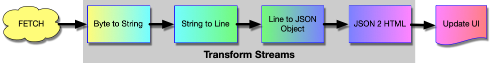

# JavaScript

Sample code to interact with the Domino REST API in JavaScript. No additional libraries have been harmed.

!!! note "Know your runtime"

    The [`fetch`](https://developer.mozilla.org/en-US/docs/Web/API/Fetch_API/Using_Fetch) API is ubiquitous in browsers, but available only in current versions of server side JavaScript environments like NodeJS (so check your documentation).

We will look at three functions that can give you a head start.

## URL collection

Instead of sprinkling URLs across the JS functions, use global objects to abstract them away:

```js
const urls = {
  login: '/api/v1/auth',
  list: '/api/v1/query?dataSource=approvals&action=execute'
};
```

You want to adjust the list to your needs.

## Login function

The function returns the bearer or throws an error.

```js
const login = async (user, pwd) => {
  try {
    const response = await fetch(urls.login, {
      method: 'POST',
      headers: {
        'Content-Type': 'application/json'
      },
      body: JSON.stringify({ username: user, password: pwd })
    });
    const jBody = await response.json();
    if (jBody.bearer) {
      return jBody.bearer;
    }
    throw new Error('No bearer returned');
  } catch (err) {
    console.err(err);
    throw err;
  }
};
```

## Calling an API

In this example, you call the query endpoint and return the JSON when successful.

```js
const loadApprovals = async (bearer, status) => {
  const query = {
    query: `form = 'equipment' and status = '${status}'`,
    viewRefresh: true,
    noViews: false
  };

  const options = {
    method: 'POST',
    headers: {
      'Content-Type': 'application/json',
      Authorization: `Bearer ${bearer}`
    },
    body: JSON.stringify(query)
  };

  try {
    const response = await fetch(urls.list, options);
    if (response.status != 200) {
      throw new Error(
        `Query returned failure status ${response.status}: ${response.statusText}`
      );
    }
    const jBody = await response.json();
    // Add additional checks here
    return jBody;
  } catch (err) {
    console.error(err);
    throw err;
  }
};
```

## Processing list results

The Domino REST API uses chunked returns ([RFC9112](https://tools.ietf.org/html/rfc9112#section-7.1)) for anything that returns an array and thus could return a lot of data. Instead of calling `await response.json()`, we use the [http stream API](https://developer.mozilla.org/en-US/docs/Web/API/Streams_API). Browsers implement that API in native code for speedy processing. A fetch request returns a [readable stream](https://developer.mozilla.org/en-US/docs/Web/API/ReadableStream) that can be processed using a [TransformStream](https://developer.mozilla.org/en-US/docs/Web/API/TransformStream) (a stream that is both readable and writable) to then be consumed by a [writeable stream](https://developer.mozilla.org/en-US/docs/Web/API/WritableStream). There are a few steps involved:



All of these steps get tied together using the `pipeThrough` method calls. Lets look at it step by step:

### Byte to String

The first part "**Byte to String**" is build-in using a [`TextDecoderStream`](https://developer.mozilla.org/en-US/docs/Web/API/TextDecoderStream). As a result, we get a stream of characters and we now chop into parts.

### String to lines

String to lines is our first [`TransformStream`](https://developer.mozilla.org/en-US/docs/Web/API/TransformStream). An instance needs to implement two methods:

- `transform(imcoming, controlle)` reads incoming data and eventually call the controller's `enqueue(output)` method 0:n times
- `flush(controller)` called for cleanup

In our case, the incoming character stream is chopped into lines.

```js
/* Chops arriving chunks along new lines,
    takes into account that a chunk might end middle of line */
const splitStream = () => {
  const splitOn = '\n';
  let buffer = '';
  return new TransformStream({
    transform(chunk, controller) {
      buffer += chunk;
      const parts = buffer.split(splitOn);
      parts.slice(0, -1).forEach((part) => controller.enqueue(part));
      buffer = parts[parts.length - 1];
    },
    flush(controller) {
      if (buffer) controller.enqueue(buffer);
    }
  });
};
```

### String to JSON

We chop of the leading `[` and trailing `]` and user `JSON.parse()`. In production code, you could pack the parsing in a try/catch block.

```js
/* Parses JSON if row looks like JSON (with eventual comma at end of line) */
const parseJSON = () => {
  return new TransformStream({
    transform(chunk, controller) {
      // IGONRES THE [ and ]
      if (chunk.endsWith(',')) {
        controller.enqueue(JSON.parse(chunk.slice(0, -1)));
      } else if (chunk.endsWith('}')) {
        controller.enqueue(JSON.parse(part));
      }
    }
  });
};
```

### JSON to HTML

This depends very much on your intended output, a table, cards, graphics etc. For our example, we create table rows.
You could use a more sophisticated approach using parameters to drive the table shape, your JS skills will help.

```js
const rowMaker = () => {
  return new TransformStream({
    transform(json, controller) {
      const row = document.createElement('tr');
      const col1 = document.createElement('td');
      col1.innerText = json.name ?? 'n/a';
      const col2 = document.createElement('td');
      col2.innerText = json.age ?? 'unknown';
      row.appendChild(col1);
      row.appendChild(col2);
      controller.enqueue(row));
    },
    flush(controller) {
      // No action here
    }
  });
};
```

### Update the UI

We use a [`WritableStream`](https://developer.mozilla.org/en-US/docs/Web/API/WritableStream) to update the UI.

```js
const updateUI = (parent) => {
  return new WritableStream({
    write(child, controller) {
      parent.appendChild(child);
    }
  });
};
```

### Putting it all together

With the object instances in place, we can stick the pipe together to execute the flow

```js
const insertPoint = document.getElementById('resultTableBody');
await httpResponse = fetch(url, options);
await httpResponse.body
  .pipeThrough(new TextDecoderStream())
  .pipeThrough(splitStream())
  .pipeThrough(parseJSON())
  .pipeThrough(rowMaker())
  .pipeTo(updateUI(insertPoint));
```

based on [this article](https://wissel.net/blog/2023/07/handle-http-chunked-responses.html).

## Considerations

- Once you retrieve the bearer, you need to keep it somewhere. A simple, but not very secure option is to save it into `window.bearer`.

  - Advantage: goes away when window closes
  - Challenge: can be read from elsewhere unless your [CSP](https://developer.mozilla.org/en-US/docs/Web/HTTP/CSP) is tightly managed

    A common way is to use [local storage](https://developer.mozilla.org/en-US/docs/Web/API/Window/localStorage), which also needs to be handled [carefully](https://auth0.com/docs/secure/security-guidance/data-security/token-storage).

- Tighten your [CSP](https://developer.mozilla.org/en-US/docs/Web/HTTP/CSP) and **please** only HTTP**S**.
- Besides extracting the bearer, you could grab the expiry time and create a function that first validates the token's lifespan before making a call.
