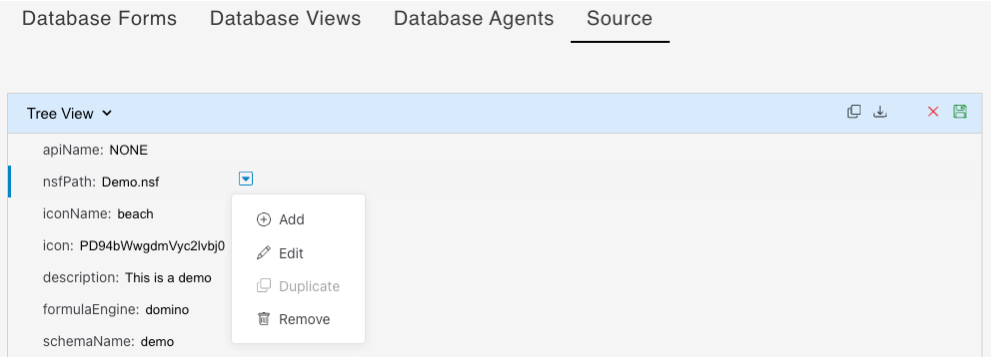
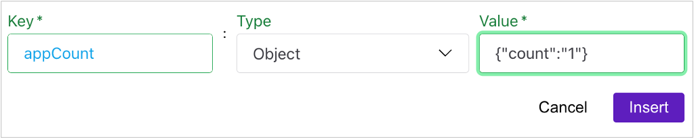
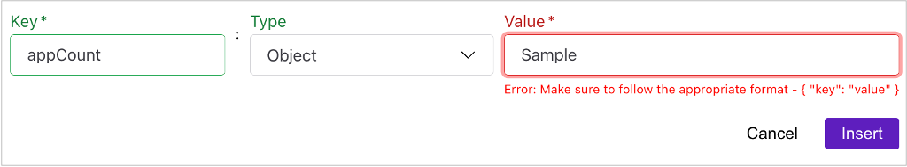
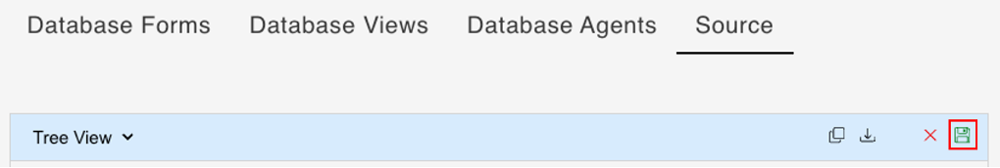

# Edit database schema JSON

## About this task

The procedures guide you in editing the database schema JSON in the **Tree View** mode in the **Source** tab under **Schema Management** so you can:

- add a new JSON object to the database schema
- add a JSON object to an existing JSON object
- edit the value and data type of JSON object
- delete a JSON object from the database schema
- duplicate a JSON object

## Prerequisite

- You have selected a schema on the **Schema Management** page.
- You have selected **Source** from the menu bar and is in the **Tree View** mode.  

## Procedures

### To add a JSON object to the database schema

1. Hover over any JSON object and then click the down arrow icon to open the context menu.

    

    !!! tip
        You can also right-click in the value of the JSON object to open the context menu. This option isn't applicable for JSON objects whose data type is *Object* or *Array*. 

2. Select **Add**. 

3. Enter a **Key**, select a **Type**, and then enter a **Value**.

    
 
    !!!note
        - The available value **Types** are *String*, *Boolean*, *Number*, *Array*, and *Object*.
        - If you are adding an *Array* or an *Object*, you must enter a key-value pair in the **Value** text box.
        - The entered value is validated according to the selected type. If the value doesn't match the expected format for that type, the **Value** field is highlighted in red. An error message appears, guiding you to follow the correct format and providing an example for clarification.

            The following images show examples of correct and incorrect entered values.

            

            

3. Click **Insert**. The added JSON object is placed at the end of the list. 

4. Click the **Save** icon to save the changes. 

    

### To add a JSON object to an existing JSON object

!!!note
    You can only add a new JSON object to existing JSON object whose data type is either an *Object* or an *Array*. 

1. Hover over the object you want to add a new object to and then click the down arrow icon to open the context menu.

2. Select **Add**. 

3. Enter a **Key**, select a **Type**, and then enter a **Value**.

    !!!note
        - If you are adding an *Array* or an *Object*, you must enter a key-value pair in the **Value** text box.
        - The entered value is validated according to the selected type. If the value doesn't match the expected format for that type, the **Value** field is highlighted in red. An error message appears, guiding you to follow the correct format and providing an example for clarification.

4. Click **Insert**. The added JSON object is placed at the end of the list of JSON objects. 

4. Click the **Save** icon to save the changes.

### To update a JSON object

!!!note
    You can only update JSON objects whose data type isn't *Object* or *Array*.

1. Hover over any JSON object and then click the down arrow icon to open the context menu.

    !!! tip
        You can also right-click in the value of the JSON object to open the context menu.

2. Select **Edit**. 

3. Update the **Key**, **Type**, and **Value** as required.

3. Click **Insert**. 

4. Click the **Save** icon to save the changes.

### To delete a JSON object from the database schema

1. Hover over the JSON object that you want to delete and then click the down arrow icon to open the context menu.   

2. Select **Remove**. 

3. Click the **Save** icon to save the changes.

### To duplicate a JSON object

!!!note
    You can only duplicate JSON objects whose data type is either an *Object* or an *Array*.

1. Hover over any JSON object and then click the down arrow icon to open the context menu.

2. Select **Duplicate**. The duplicated JSON object is placed at the end of the list.

3. Click the **Save** icon to save the changes.