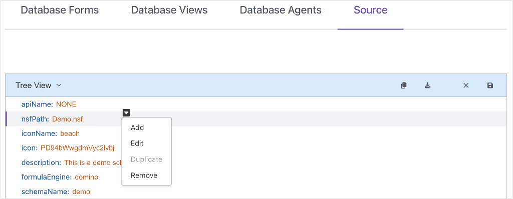
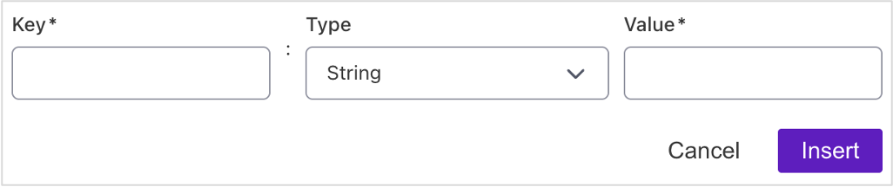
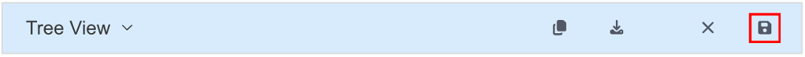
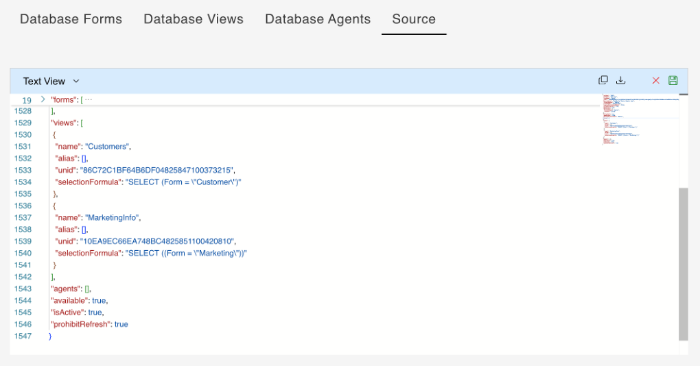
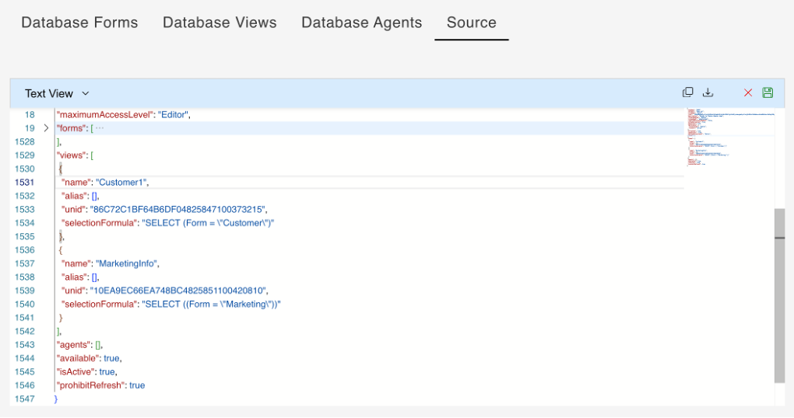
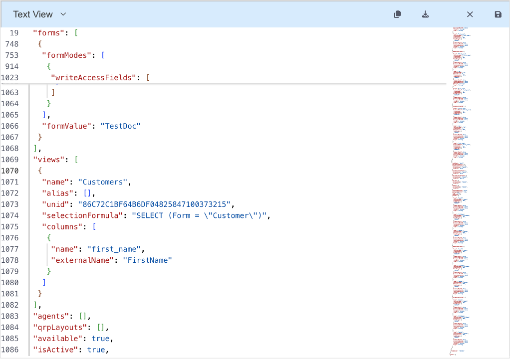
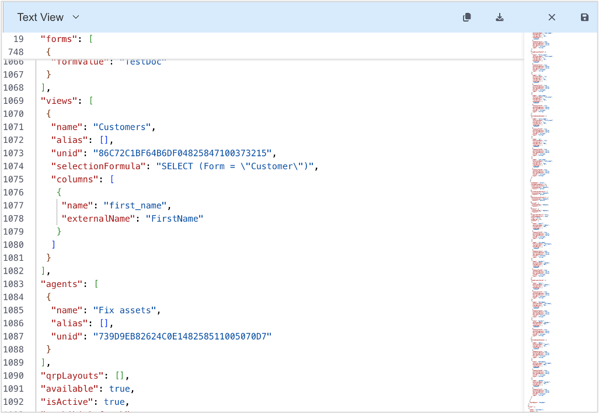
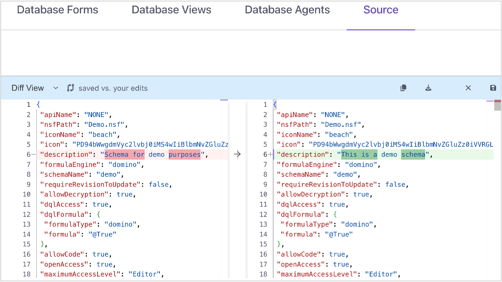

# Edit database schema JSON

## About this task

The procedures guide you in editing the database schema JSON in the **Tree View**, **Text View**, and **Diff View** modes in the **Source** tab under **Schema Management**, so you can:

- add a new JSON object to the database schema
- add a JSON object to an existing JSON object
- edit the value and data type of JSON object
- delete a JSON object from the database schema
- duplicate a JSON object

## Before you begin

- Select a schema on the **Schema Management** page, and then select the **Source** tab from the menu bar.
- Select the appropriate mode from the drop-down list to execute the corresponding procedures below.  

## Tree View procedures

### To add a JSON object to the database schema

1. Hover over any JSON object and then click the down arrow icon to open the context menu.

    

    !!! tip

        You can also right-click in the value of the JSON object to open the context menu. This option isn't applicable for JSON objects whose data type is *Object* or *Array*. 

2. Select **Add**.

3. Enter a **Key**, select a **Type**, and then enter a **Value**.

    

    !!! note

        - The available value **Types** are *String*, *Boolean*, *Number*, *Array*, and *Object*.
        - If you are adding an *Array* or an *Object*, you must enter a key-value pair in the **Value** text box.
        - The entered value is validated according to the selected type. If the value doesn't match the expected format for that type, the **Value** field is highlighted in red. An error message appears, guiding you to follow the correct format and providing an example for clarification.

4. Click **Insert**. The added JSON object is placed at the end of the list.

5. Click the **Save** icon to save the changes.

    

### To add a JSON object to an existing JSON object

!!! note

    You can only add a new JSON object to existing JSON object whose data type is either an *Object* or an *Array*.

1. Hover over the object you want to add a new object to and then click the down arrow icon to open the context menu.

2. Select **Add**.

3. Enter a **Key**, select a **Type**, and then enter a **Value**.

    !!! note

        - If you are adding an *Array* or an *Object*, you must enter a key-value pair in the **Value** text box.
        - The entered value is validated according to the selected type. If the value doesn't match the expected format for that type, the **Value** field is highlighted in red. An error message appears, guiding you to follow the correct format and providing an example for clarification.

4. Click **Insert**. The added JSON object is placed at the end of the list of JSON objects.

5. Click the **Save** icon to save the changes.

### To update a JSON object

!!!note
    You can only update JSON objects whose data type isn't *Object* or *Array*.

1. Hover over any JSON object and then click the down arrow icon to open the context menu.

    !!! tip

        You can also right-click in the value of the JSON object to open the context menu.

2. Select **Edit**.

3. Update the **Key**, **Type**, and **Value** as required.

4. Click **Insert**.

5. Click the **Save** icon to save the changes.

### To delete a JSON object from the database schema

1. Hover over the JSON object that you want to delete and then click the down arrow icon to open the context menu.

2. Select **Remove**.

3. Click the **Save** icon to save the changes.

### To duplicate a JSON object

!!! note

    You can only duplicate JSON objects whose data type is either an *Object* or an *Array*.

1. Hover over any JSON object and then click the down arrow icon to open the context menu.

2. Select **Duplicate**. The duplicated JSON object is placed at the end of the list.

3. Click the **Save** icon to save the changes.

## Text View procedure

With the implementation of the Monaco Editor to the **Text View** mode on the **Source** tab, you can now edit the database schema JSON just like using a normal text editor.

As an example, you can edit a value of a key. As shown in the images, the name of a view is changed from `Customers` to `Customer1`.

=== "Before editing"

    

=== "After editing"

    

You can also enter additional data. As shown in the images, the following are added to `agents`:

```json
{
   "name": "Fix assets",
   "alias": [],
   "unid": "739D9EB82624C0E148258511005070D7" 
}
```

=== "Before editing"

    

=== "After editing"

    

!!! tip

    - Make sure to click the **Save** icon, and then select **Yes** in the **Save changes** dialog to save your changes.
    - Make sure to follow the correct syntax when adding data.

## Diff View procedure

The **Diff View** mode lets you edit the database schema JSON just like using a text editor while viewing a side-by-side comparison of the current saved database schema and your in-progress changes.

1. Identify the JSON key whose value you want to edit.
2. Edit the value in the JSON on the right. The JSON on the left is read-only.

    When you modify a key, the updated key and its new value are highlighted on the right. The corresponding key and its original value are also highlighted on the left, making it easier to compare your changes with the saved schema.

    

3. Ensure that the JSON syntax is valid while you edit the value.
4. Click the **Save** icon, and then select **Yes** in the **Save changes** dialog to save your changes.
