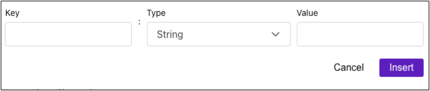

# Edit database schema JSON

## About this task

The procedures guide you in editing the database schema JSON in the **Styled Object** view mode in the **Source** tab under **Schema Management** so you can:

- add a new JSON object to the database schema
- add a JSON object to an existing JSON object
- update the value and value type of a JSON object
- delete a JSON object from the database schema

## Prerequisite

- You have selected a schema on the **Schema Management** page.
- You have selected **Source** from the menu bar and is in the **Styled Object** view mode.  

## Procedures

### To add a JSON object to the database schema

1. Click **Insert Object**.

    

2. Enter a **Key**, select a **Type**, and then enter a **Value**.

    
 
    !!!tip
        The available value **Types** are string, number, Boolean, null, object, and array.

3. Click **Update**, and then click **Save**. 

### To add a JSON object to an existing JSON object

!!!note
    You can only add a new JSON object to existing JSON object whose type is either an *object* or an *array*. 

**For a JSON object whose type is *object***

1.	Hover over the object you want to add a new object to, and then click **Add**.

    

2.	Enter a **Key**, select a **Type**, and then enter a **Value**.
3.	Click **Update**, and then click **Save**. 

**For a JSON object whose type is *array***

1. Hover over the object you want to add a new object to, and then click **Add**.

    

2.	Select a **Type**, and then enter a **Value**.
3.	Click **Update**, and then click **Save**. 

### To update the type and value of a JSON object

!!!note
    You can only update the type and value of the JSON object whose type isn't *object* or *array*. 

1. Click the object to be updated.

    Or
	
    Hover over the object to be updated, and then click **Edit**.

2.	Select the new **Type**, and then enter the new **Value**.

    !!!tip
        If you only need to update the **Value**, then just enter the new value.

3.	Click **Update**, and then click **Save**. 

### To delete a JSON object from the database schema

- Click the object to be deleted, click **Delete**, and then click **Save**.

    Or

    Hover over the object to be deleted, click **Delete**, and then click **Save**.
