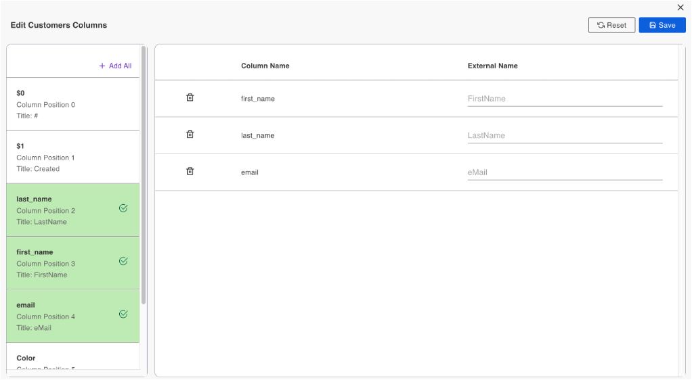
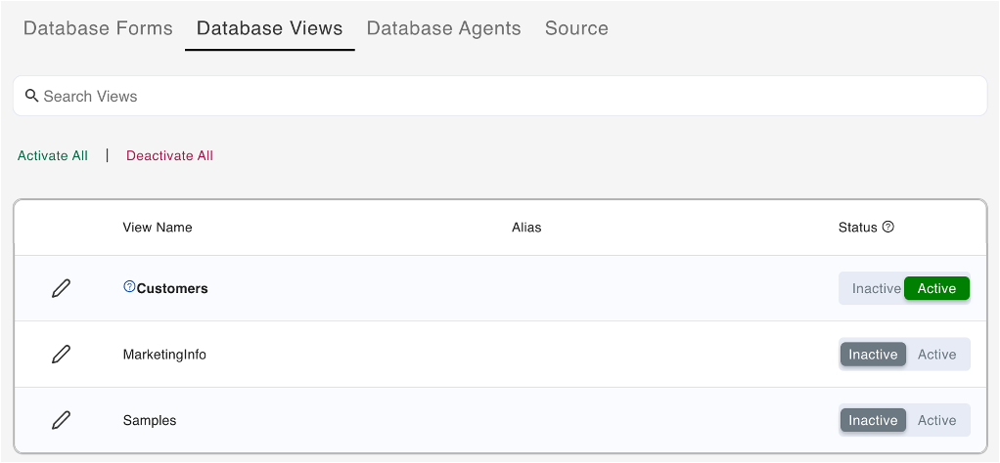

# Edit database view of a schema
 
## About this task
 
The procedures guide you in editing a database view of a schema so you can:

- select the columns you want to include in the view 
- edit the external name of each selected column
- reset an edited view to its initial state
 
## Prerequisite
 
- The view should be in **Active** status. For more information, see [Activate a view](../../references/usingwebui/schemaui.md#activate-a-view).

## Procedures 

### To edit a view
 
1. Log in to the Domino REST API Admin UI and click **Database Management - REST API**.
2. Select a schema on the **Schema Management** page.
3. Click **Database Views** from the menu bar. 
4. Click the pencil icon corresponding to the name of the view you want to edit. The **Edit (view name) Columns** page opens. 
5. From the left pane, select the columns that you want to include in the view. The names of the selected columns should appear in the right pane under **Column Name**. 

    !!!tip
	    - The order in which you select the names of the columns corresponds to the order of the columns.
	    - Click **Add All** if you want to add all the columns. 
	    - To delete a selected column, click the corresponding trash icon. 

    

6.  **(Optional)** Set the external name of a selected column by entering a name in the corresponding text field under **External Name**.

    !!!note
        The text field under **External Name** corresponding to a selected column shows the column name, the column title, or the set external name of the column in a read-only format. 

7. Click **Save**. A notification informs you that the schema has been successfully updated.   

### Expected result 

- The view now only shows the columns that you have selected. 
- On the **Database Views** tab, the edited view is shown in bold font as shown in the example image. Hovering over the question mark icon beside the edited view displays a statement that a change has been made in the view.  

 
### To reset an edited view
 
1. Log in to the Domino REST API Admin UI and click **Database Management - REST API**.
2. On the **Schema Management** page, select a schema.
3. Click **Database Views** from the menu bar. 
4. Click the pencil icon corresponding to the name of an edited view you want to reset. The **Edit (view name) Columns** page opens. 
5. Click **Reset**. A confirmation dialog appears.
6. Click **Yes**. A notification informs you that the schema has been successfully updated.

### Expected result

The view is reset to its initial state showing all its columns.
