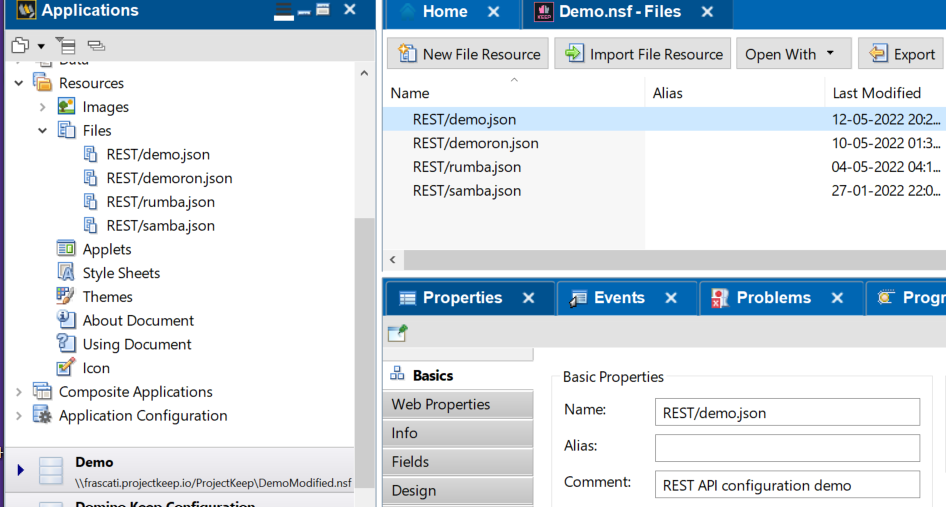
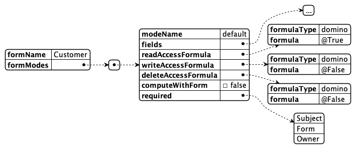
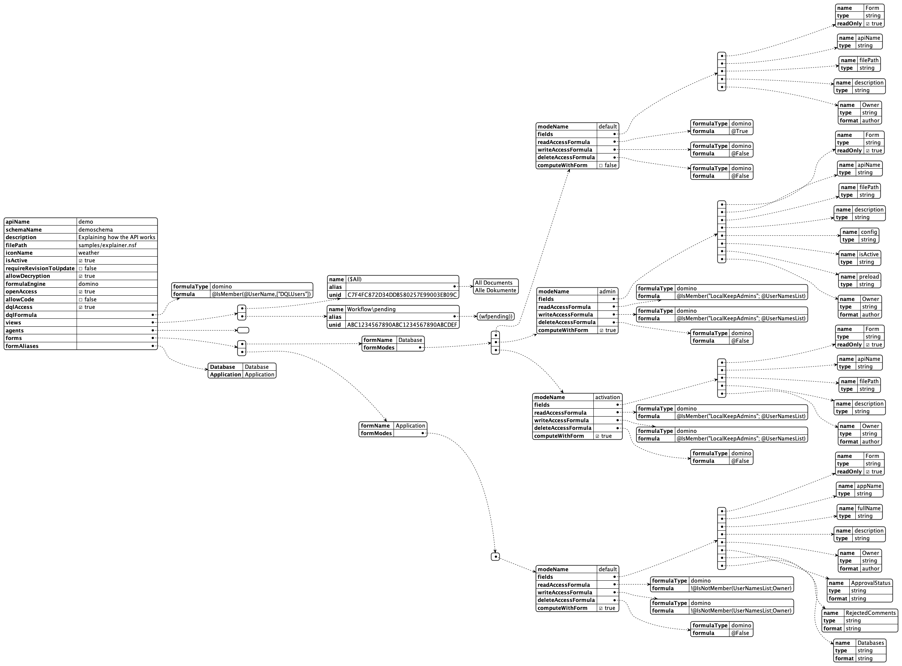

# Enable a database

The Domino REST API doesn't expose any database to HTTP(S) by default. Enabling a database for REST access requires some configuration first:


1. **Create a Domino REST API Schema** in the NSF database to be enabled. A database can have one or more Domino REST API schemas for different access needs. A Domino REST API schema is stored as JSON file in the database's design file resources.

    

    

    Most people will use [**Schema and Scope Management UI**](../../references/usingwebui/schemaui.md), also known as the **AdminUI**, to modify the schema. This can also be done through the API. 
   
    A brave developer  could use Domino designer to create or update the schema. If you manually modify your schema make sure to refresh the schema cache, see [**Domino REST API task**](../../references/usingdominorestapi/restapitask.md#domino-rest-api-task-commands) for details. 


2. **Link a schema to a scope** The scope configuration is stored in the `KeepConfig.nsf` database. This separation of `scope` and `schema` means multiple scopes can link to a single schema. You use the scope name when performing all CRUD operations, it's the value to the query param `dataSource`. You can create the scope using the API or the AdminUI.

3. Optional **Create an OAuth application** When you use Domino REST API as your IdP, you can create one or more OAuth applications that can access one or more of the defined scopes.

## The Domino REST API Schema

The schema defines what views, folders, document, and agents can be accessed through the Domino REST API. Access to documents is controlled by accessing their `Form` item and use the value to lookup access definitions, called `Mode` in Domino REST API's lingo that define the item names and properties accessible read- or writable.

Since the exact terminology is long winded and colloquially often no distinction is made between document/item and form/field, the short version is that the *Domino REST API schema controls access to forms and fields*.


While the AdminUI helps to generate a Domino REST API schema from an existing form, there no technical need for a form to be present, other than the possibility to open the Notes document in a Notes client too. Creating such a Schema requires direct post to the API.

## Schema components

<!-- prettier-ignore -->
!!! tip 
    Refer to the OpenAPI specification running on your server. It's the complete reference guide to the APIs available to your deployed version of the Domino REST API.

The high level entry contains a few properties and the collection of forms, views, and agents made available:


| Entry                       | Description                                                                              |
| --------------------------- | ---------------------------------------------------------------------------------------- |
| **schemaName**              | internal name, matches the JSON filename in Domino design                               |
| **description**             | visible in AdminUI                                                                       |
| **nsfPath**                 | path to nsf relative to data directory                                                   |
| **iconName**                | name of the icon (fixed set) used in the UI. Alternative `icon` can contain a Base64 svg |
| **isActive**                | Can the API be used now                                                                  |
| **requireRevisionToUpdate** | Measure to prevent overwrite conflicts                                                   |
| **allowDecryption**         | When also the user has the permission, decrypt documents                                |
| **formulaEngine**           | domino (current only option)                                                             |
| **openAccess**              | true - allow access when user has $DATA scope, false: require exact scope                |
| **allowCode**               | Run supplied external code                                                               |
| **dqlAccess**               | allow DQL queries                                                                        |
| **dqlFormula**              | Domino formula with @True/@False result to restrict use of DQL query access              |
| **views**                   | collection of available views                                                            |
| **agents**                  | collection of available agents                                                           |
| **forms**                   | collection of available forms                                                            |
| **formAliases**             | defined aliases to avoid duplicate definitions                                           |

### Views

An array of entries describing name, alias(es), if any and UNID of the view design element.
Views will show all columns contained


### Agents

An array of agent names that can be called from the REST endpoint. The API doesn't check if the agent is suitable for being called individually, it's the developers responsibility to ensure this.

### Forms & Mode

The form array has Form entries with 2 elements:

- **formName**: Ideally the value stored in "`Form`" items. Alias resolution provided by `formAliases` element
- **formModes**: Named schema for a form defining fields and access conditions. A form needs at least one FormMode to make documents available on Domino REST API. There are three mode names with special meaning:
  - **default** : The first (and last) formMode in a Domino REST API schema
  - **odata** : The mode used when accessing Domino REST API's ODATA endpoints
  - **dql** : The mode used when executing a DQL query



| Entry               | Description                                                                                                    |
| ------------------- | -------------------------------------------------------------------------------------------------------------- |
| modeName            | lowercase letters, used in URL addressing                                                                      |
| fields              | Array of KeepFields defining field properties (see below)                                                      |
| readAccessFormula   | Domino formula that needs to compute to @True/@False to determine if this mode is available for read access    |
| writeAccessFormula  | Domino formula that needs to compute to @True/@False to determine if this mode is available for write access   |
| deleteAccessFormula | Domino formula that needs to compute to @True/@False to determine if this mode is available for delete access  |
| required            | Array of field names that must be provided on creation or update. Following the JSON schema specification here |

## Access formulas

The availability of access formulas follows typical Notes development pattern where actions are rendered based on Formula conditions (a.k.a HideWhen formula). Typically, those formula include references to the user name, role, or group membership and item values like `Status` or `Approver`

## Domino REST API Fields

We follow the ideas proposed by [JSON schema](https://json-schema.org) with the intention to support most of the constrains available there at some point in time.


| Entry       | Description                                                        |
| ----------- | ------------------------------------------------------------------ |
| name        | Field name mapping to item name                                    |
| type        | Type as permitted by [JSON](https://www.json.org/json-en.html)     |
| items       | when type = `array`, entry with type/format for array entries      |
| format      | data format as specified in [JSON schema](https://json-schema.org) |
|             | with the addition of Notes specific `names`, `authors`, `readers`  |
| readyOnly\* | Field value can be read, but not written                           |
| writeOnly\* | Field value can be written, but not read                           |
|             | \* only one can be set true at a time                              |
| fieldGroup  | allows to group a set of multi values into records                 |

## FieldGroups

A typical Notes construct are documents containing a group of multi value fields, where values with the same index position form a record. On the REST API that's an odd construction. A document might get returned like this:


By assigning the fields `Name`, `age` and `fruit` the **fieldGroup** `LostBoys`, Domino REST API will render them as records in an JSON Object. We opted for an object to ease processing and addressing since arrays might not have a guarantee of sequence. The result looks like this:


### Form aliases

The form aliases object allows to specify additional values in the form item to be mapped to the form configuration in the schema. The AdminUI will use form alias information extracted from the database design, but the API isn't bound to these settings

### Sample Schema

[](../../assets/images/SchemaComplete.png)

## Enabling a database via Schema and Scope

Follow the tutorial for instructions on how to do this using [AdminUI](../../tutorial/adminui.md) or [Postman or curl](../../tutorial/postmancurl.md).

It's worth noting that all the actions that you can do using the Admin UI can also be done using Postman, curl, or any similar tool.
Below are some examples to perform additional actions for database and application management, like adding a database, listing views, agents, and forms, and listing and adding application.

A group of API requests is known as a collection. Each collection may have subfolders and multiple requests. Request URL or the endpoint is used to identify the link to where the API will communicate with.

<!-- prettier-ignore -->
!!! note
    The following examples require a `bearer` token, which is returned in the response of the `/api/v1/auth` api. Replace `$Bearer` in the examples below with that `bearer` token.

### Add a database schema

To add a database schema, run the following command. Find the applicable Request URL from the OpenAPI Specification document. Provide the body for `POST` request.


<details>
<summary><b>cURL code snippet</b></summary>

```bash
curl --location --request POST 'localhost:8880/api/setup-v1/schema?nsfPath=Demo.nsf&configName=demo' \
--header 'Authorization: Bearer $Bearer' \
--header 'Content-Type: application/json' \
--data-raw '
{
    "apiName": "demo",
    "name": "demo",
    "description": "Demo database",
    "nsfPath": "Demo.nsf",
    "icon": "Base64 stuff, preferably SVG",
    "iconName": "mountain",
    "isActive": true,
    "requireRevisionToUpdate": false,
    "formulaEngine": "domino",
    "openAccess": true,
    "allowCode": true,
    "dqlAccess": true,
    "dqlFormula": {
        "formulaType": "domino",
        "formula": "@True"
    },
    "views": [
        {
            "name": "Customers",
            "alias": [
                "Customers"
            ],
            "unid": "86C72C1BF64B6DF04825847100373215"
        },
        {
            "name": "MarketingInfo",
            "alias": [
                "MarketingInfo"
            ],
            "unid": "10EA9EC66EA748BC4825851100420810"
        },
        {
            "name": "ChineseCustomers",
            "alias": [
                "ChineseCustomers"
            ],
            "unid": "3FE5CD63E179F21600258680006DB25B"
        },
        {
            "name": "($All)",
            "alias": [
                "($All)"
            ],
            "unid": "0E35D520A1EBBB5B48258435003E8284"
        },
        {
            "name": "Samples",
            "alias": [
                "Samples"
            ],
            "unid": "5318911D496571410025860D00544B17"
        }
    ],
    "forms": [
        {
            "formName": "Customer",
            "formModes": [
                {
                    "modeName": "default",
                    "fields": [
                        {
                            "name": "Form",
                            "type": "string",
                            "readOnly": true,
                            "fieldGroup" : "thing",
                            "multivalue" : true
                        },
                        {
                            "name": "Pet",
                            "type": "string"
                        },
                        {
                            "name": "color",
                            "type": "string"
                        },
                        {
                            "name": "email",
                            "type": "string"
                        },
                        {
                            "name": "employee_count",
                            "type": "integer"
                        },
                        {
                            "name": "first_name",
                            "type": "string"
                        },
                        {
                            "name": "last_name",
                            "type": "string"
                        },
                        {
                            "name": "hobbies",
                            "type": "array",
                            "items": {
                                "type": "string"
                            }
                        },
                        {
                            "name": "Owner",
                            "type": "string",
                            "format": "authors"
                        },
                        {
                            "name": "Body",
                            "type": "object",
                            "format": "richtext"
                        }
                    ],
                    "required": [
                        "Form",
                        "email",
                        "first_name"
                    ],
                    "readAccessFormula": {
                        "formulaType": "domino",
                        "formula": "@True"
                    },
                    "writeAccessFormula": {
                        "formulaType": "domino",
                        "formula": "@True"
                    },
                    "deleteAccessFormula": {
                        "formulaType": "domino",
                        "formula": "@False"
                    },
                    "computeWithForm": false
                },
                {
                    "modeName": "dql",
                    "fields": [
                        {
                            "name": "Form",
                            "type": "string",
                            "readOnly": true
                        },
                        {
                            "name": "Pet",
                            "type": "string"
                        },
                        {
                            "name": "color",
                            "type": "string"
                        },
                        {
                            "name": "email",
                            "type": "string"
                        },
                        {
                            "name": "first_name",
                            "type": "string"
                        },
                        {
                            "name": "last_name",
                            "type": "string"
                        },
                        {
                            "name": "hobbies",
                            "type": "array",
                            "items": {
                                "type": "string"
                            }
                        }
                    ],
                    "required": [
                        "Form",
                        "email",
                        "first_name"
                    ],
                    "readAccessFormula": {
                        "formulaType": "domino",
                        "formula": "@True"
                    },
                    "writeAccessFormula": {
                        "formulaType": "domino",
                        "formula": "@True"
                    },
                    "deleteAccessFormula": {
                        "formulaType": "domino",
                        "formula": "@False"
                    },
                    "computeWithForm": false
                }
            ]
        },
        {
            "formName": "Marketing",
            "formModes": [
                {
                    "modeName": "default",
                    "fields": [
                        {
                            "name": "Form",
                            "type": "string",
                            "readOnly": true
                        },
                        {
                            "name": "Assets",
                            "type": "string"
                        },
                        {
                            "name": "Country",
                            "type": "string"
                        },
                        {
                            "name": "FullName",
                            "type": "string"
                        },
                        {
                            "name": "Industry",
                            "type": "string"
                        },
                        {
                            "name": "Newsletter",
                            "type": "string"
                        },
                        {
                            "name": "email",
                            "type": "string"
                        },
                        {
                            "name": "gender",
                            "type": "string",
                            "writeOnly": true
                        }
                    ],
                    "readAccessFormula": {
                        "formulaType": "domino",
                        "formula": "@True"
                    },
                    "writeAccessFormula": {
                        "formulaType": "domino",
                        "formula": "@True"
                    },
                    "deleteAccessFormula": {
                        "formulaType": "domino",
                        "formula": "@False"
                    },
                    "computeWithForm": false
                }
            ]
        },
        {
            "formName": "SampleForm",
            "formModes": [
                {
                    "modeName": "default",
                    "fields": [
                        {
                            "name": "Color",
                            "type": "string"
                        },
                        {
                            "name": "Form",
                            "type": "string"
                        },
                        {
                            "name": "Shape",
                            "type": "string"
                        },
                        {
                            "name": "Taste",
                            "type": "string"
                        }
                    ],
                    "readAccessFormula": {
                        "formulaType": "domino",
                        "formula": "@True"
                    },
                    "writeAccessFormula": {
                        "formulaType": "domino",
                        "formula": "@True"
                    },
                    "deleteAccessFormula": {
                        "formulaType": "domino",
                        "formula": "@False"
                    },
                    "computeWithForm": false
                },
                {
                    "modeName": "odata",
                    "fields": [
                        {
                            "name": "Color",
                            "type": "string"
                        },
                        {
                            "name": "Form",
                            "type": "string"
                        },
                        {
                            "name": "Shape",
                            "type": "string"
                        },
                        {
                            "name": "Taste",
                            "type": "string"
                        }
                    ],
                    "readAccessFormula": {
                        "formulaType": "domino",
                        "formula": "@True"
                    },
                    "writeAccessFormula": {
                        "formulaType": "domino",
                        "formula": "@True"
                    },
                    "deleteAccessFormula": {
                        "formulaType": "domino",
                        "formula": "@False"
                    },
                    "computeWithForm": false
                }
            ]
        }
    ],
    "formAliases": {
        "Entry": "Entry",
        "SampleEntry": "SampleEntry",
        "Customer": "Customer"
    }
}
'
```

</details>

### Add a database scope

To add a database scope, run the following command. Find the applicable Request URL from the OpenAPI Specification document. Provide the body for `POST` request.


<details>
<summary><b>cURL code snippet</b></summary>

```bash
curl --location --request POST 'localhost:8880/api/setup-v1/admin/scope' \
--header 'Authorization: Bearer $Bearer' \
--header 'Content-Type: application/json' \
--data-raw '{
    "apiName": "demo",
    "schemaName": "demo",
    "nsfPath": "Demo.nsf",
    "isActive": true
}
'
```

</details>

### List available views

To list the views available through this scope, run the following command. Find the applicable Request URL from the OpenAPI Specification document. Execute. For `GET` request, body isn't needed.


<details>
<summary><b>cURL code snippet</b></summary>

```bash
curl --location --request GET 'localhost:8880/api/v1/lists?dataSource=demo' \
--header 'Authorization: Bearer $Bearer' \
--header 'Accept: application/json'
```

</details>

### Retrieve documents from the Customers view

Find the applicable Request URL from the OpenAPI Specification document. Execute. For `GET` request, body isn't needed.


<details>
<summary>cURL code snippet</summary>

```bash
curl --location -g --request GET 'localhost:8880/api/v1/lists/Customers?dataSource=demo' \
--header 'Authorization: Bearer $Bearer' \
--header 'Content-Type: application/json' \
--data-raw ''
```

</details>

### List available agents

To list the agents, run the following command. Find the applicable Request URL from the OpenAPI Specification document. Execute. For `GET` request, body isn't needed.


<details>
<summary>cURL code snippet</summary>

```bash
curl --location --request GET 'localhost:8880/api/setup-v1/design/agents?dataSource=demo' \
--header 'Authorization: Bearer $Bearer '
```

</details>

### List available forms

To list the forms available through this scope, run the following command. Find the applicable Request URL from the OpenAPI Specification document. Execute. For `GET` request, body isn't needed.


<details>
<summary>cURL code snippet</summary>

```bash
curl --location --request GET 'localhost:8880/api/setup-v1/design/forms?dataSource=demo' \
--header 'Authorization: Bearer $Bearer '
```

</details>

### Creating a document

Find the applicable Request URL from the OpenAPI Specification document. In Postman, include the request body in JSON format for the `POST` request.


<details>
<summary>cURL code snippet</summary>

```bash
curl --location --request POST 'localhost:8880/api/v1/document?dataSource=demo' \
--header 'Authorization: Bearer $Bearer' \
--header 'Content-Type: application/json' \
--data-raw '{
    "first_name": "Madison",
    "last_name": "Branthwaite",
    "email": "mbranthwaite0@nba.com",
    "Color": "Puce",
    "Pet": "Black-capped chickadee",
    "Form": "Customer"
}'
```

</details>

### Retrieving a document

Find the applicable Request URL from the OpenAPI Specification document. Execute. For `GET` request, body isn't needed.

<!-- prettier-ignore -->
!!! tip "Document UniversalID (unid)"
    This API requires the Document's UniversalID (`unid`). The `unid` is returned within the response from APIs such as the Create Document (from the previous example) as well as within the list of documents retrieved from a View (from a previous example as well).


<!-- prettier-ignore -->
!!! tip "Postman Variables"
    In the image above `{{UNID_0}}` is a Postman Environment Variable that automatically got created if you ran the `Create Document` Postman test. This is a feature built into the Postman collection we provided.
    If you aren't using Postman, replace that with the `unid` of the document you'd like to retrieve.

<details>
<summary>cURL code snippet</summary>

Replace `$Unid` below with the unid you'd like to retrieve.

```bash
curl --location -g --request GET 'localhost:8880/api/v1/document/$Unid/default?db=demo' \
--header 'Authorization: Bearer $Bearer' \
--header 'Content-Type: application/json' \
--data-raw ''
```

</details>

### List available applications

To live the available applications, run the following command. Find the applicable Request URL from the OpenAPI Specification document. Execute. For `GET` request, body isn't needed.


<details>
<summary>cURL code snippet</summary>

```bash
curl --location --request GET 'localhost:8880/api/setup-v1/admin/applications/all' \
--header 'Authorization: Bearer $Bearer ' \
--header 'Content-Type: application/json' \
--data-raw '{
   "appName": "My Second Application",
   "databasesRequested": [
     "keepconfig",
     "demo"
    ]
}'
```

</details>

### Add an application

To add an application, run the following command. Find the applicable Request URL from the OpenAPI Specification document. Provide the body for Post request.


<details>
<summary>cURL code snippet</summary>

```bash
curl --location --request POST 'localhost:8880/api/setup-v1/admin/application' \
--header 'Authorization: Bearer $Bearer ' \
--header 'Content-Type: application/json' \
--data-raw '{
  "client_name": "My App",
  "client_uri": "https://www.projectcastle.io/coolapp",
  "contacts": [
    "admin@projectcastle.io"
  ],
  "description": "Super cool demo App",
  "logo_uri": "https://www.projectcastle.io/castle.jpg",
  "redirect_uris": [
    "http://localhost/callback",
    "https://domino.projectcastle.io/identity",
    "https://www.projectcastle.io/oauth"
  ],
  "scope": "demo $DECRYPT",
  "status": "isActive"
}'
```

</details>
