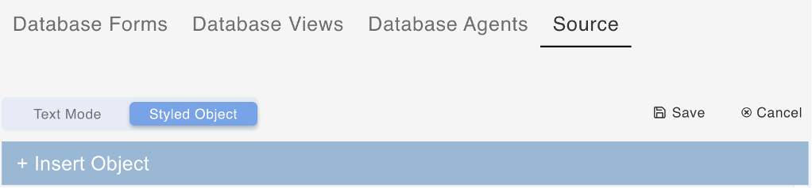

# Export database schema as JSON file

## About this task

The procedure guides you on how to export the database schema in JSON format on the **Source** tab within **Schema Management**.

## Prerequisite

- You have selected a schema on the **Schema Management** page.
- You have selected **Source** tab.

## Procedures

1. Click **Export**.

    

     The export button downloads the Source text in .json format with a filename (exampleschema.json). 