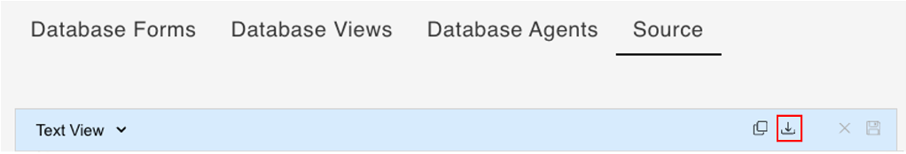

# Export database schema as JSON file

## About this task

The procedure guides you on exporting the database schema in JSON format from the **Source** tab on the **Schema Management** page.

## Prerequisite

- You have selected a schema on the **Schema Management** page.

## Procedure

- Go to the **Source** tab, and then click **Export**.

    

A JSON file containing the Source text is downloaded to your default download location. 

<!--The export button downloads the Source text in .json format with a filename *selected schema*.json (e.g,reportschema.json).--> 

!!!tip
    For information on importing a schema, see [Import schema to a database](../../references/usingdominorestapi/administrationui.md#import-schema-to-a-database).
