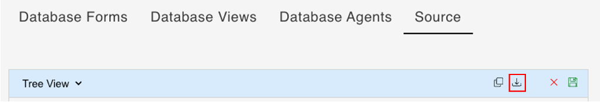

# Export database schema as JSON file

## About this task

The procedure guides you on exporting the database schema in JSON format from the **Source** tab on the **Schema Management** page so that you can share the database schema across databases.

## Prerequisite

- You have selected a schema on the **Schema Management** page.

## Procedure

### To download a JSON file

1. Go to the **Source** tab, and then click the **Download** icon.

    === "From Text View"

        

    === "From Tree View"

        

2. In the dialog indicating that the schema has been downloaded as `schema.json`, click **OK**.

The JSON file with `schema.json` filename and containing the source text is downloaded to your default download location. 

### To create a JSON file

1. Go to the **Source** tab, and then click the **Copy** icon. 

    === "From Text View"

        

    === "From Tree View"

        

2. In the dialog indicating that the schema has been copied to the clipboard, click **OK**.
3. Create a JSON file using a text editor, and then paste the copied database schema.
4. Save the JSON file.   

!!!tip
    For information on importing a schema, see [Import a schema](../../references/usingwebui/schemaui.md#import-a-schema).
