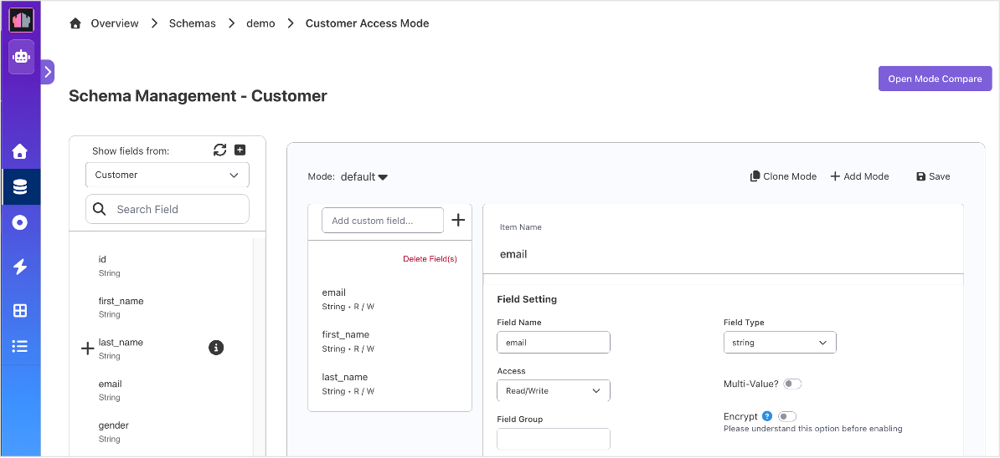
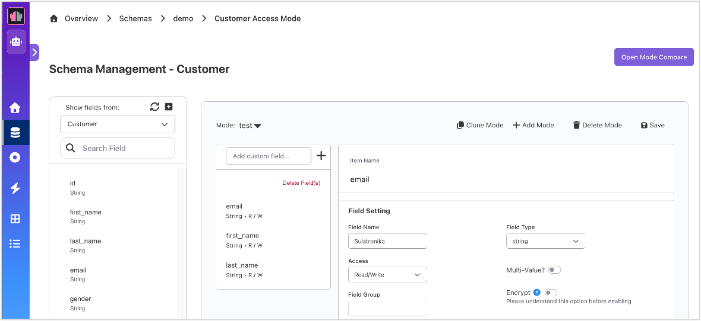

# Use external names in schema definitions

External names allow you to work with fields in configured forms by providing external or specific names for fields.

For example, if the field name on the form or document is `date`, you can set its `ExternalName` to `orderDate` to be specific. If you get that document, the resulting field in the JSON will be `orderDate`. If you update that field by specifying `orderDate = “2023/12/6”`, it would write the date back to the document as `date` even if you specified the field based on its external name.  

## About this task

The procedures guide you on using external names in schema definitions and in testing external name results in Postman.

## Use external name

### Before you begin

- You must have the credentials to use the service user interface.
- You need configured schema and scopes.

### Procedure

1. Log in to HCL Domino REST API.
2. Click **Database Management - REST API** option.
3. On the **Schema Management** page, click the **Only show schemas configured with scopes** toggle to the on position.
4. Select a schema.
5. Under the **Database Forms** tab, click the pencil icon corresponding to the configured form that you want to use. This loads the form **Access Mode** page showing the `default` access mode.
6. Click **Add Mode**.
7. Enter a name in the **Add New Mode** dialog and click **Save**. The new mode is shown and also selectable from the **Mode** drop-down list.
8. For every field under **Show fields from** that you want to add to the new mode, hover over that field and click the **+** icon to add the field to the new mode.
9. For every added field to the new mode that you want to use an external name, select that field and enter a name in the **Field Name** under **Field Setting**.

      The name you entered for the field in the new mode is used as a translation for the name of the same field in the `default` mode. When using the new mode to create, get, or update data through the API, the field in the new mode will refer to the field name in the `default` mode. This is the case regardless of which mode is being used.

10. Click **Save**.

### Expected result

The following image shows the **default** mode with the field `email` selected and having the field name `email`.



The following image shows the new mode named **test** with the field `email` selected and having the changed field name `Sulatroniko`.



The service UI will return the field names you put in the new test mode.

## Test external names result in Postman

### Before you begin

- You need a configured Postman.

### Procedure

- Modify the schema mode according the mode you have defined in the service URL by using the `GET` command.

      - When using the **default** mode, set `mode` to `default`:

      ```
      {{HOST}}/document/{{UNID_0}}?dataSource=demo&<mark style="background-color: #FFFF00">mode=default</mark>&meta=false
      ```      

      - When using the **test** mode, set  `mode` to `test`:

      ```
      {{HOST}}/document/{{UNID_0}}?dataSource=demo&<mark style="background-color: #FFFF00">mode=test</mark>&meta=false
      ```

It retrieves the same data result but a different field name translation. The same thing happens if you want to edit the data. It's delivered to the field name of a different schema mode.

### Expected result

`default` mode

```json
{
  "email": "mbranthwaite0@nba.com",
  "first_name": "Madisons",
  "last_name": "Branthwaite",
  "Pet": "Black-capped chickadee",
  "Form": "Customer"
}
```

`test` mode

```json
{
  "Sulatroniko": "mbranthwaite0@nba.com",
  "Pangalan": "Madisons",
  "Apelyido": "Branthwaite",
  "AlagangHayop": "Black-capped chickadee",
  "Form": "Customer"
}
```
