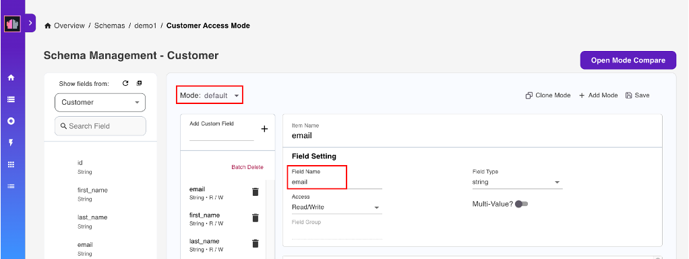
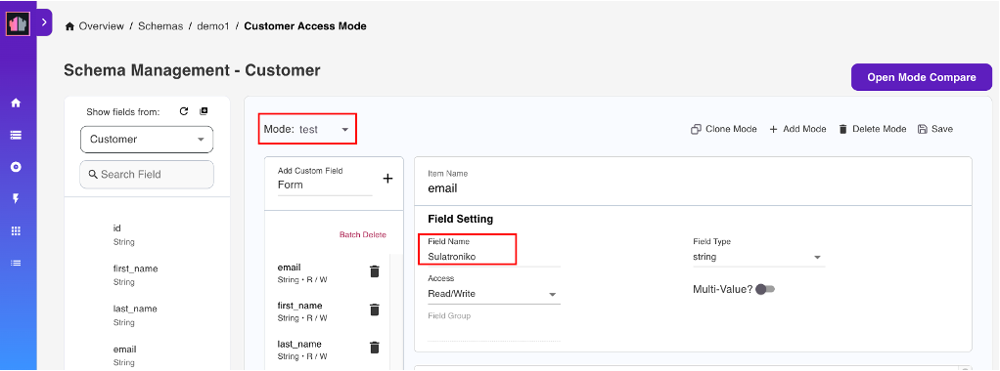

# Use external names in schema definitions

The external name allows you to specify the name of the matching configured forms used in the KEEP service URL. The **customer** is one of the configured forms that can deliver the same data using multiple cases from different clients and schemas. If no other schema mode is identified, the data will be sent and received using the default mode.

## About this task

The procedures guide you on using external names in schema definitions and in testing external name results in Postman.

## Prerequisite

- You must have credentials to use the service user interface.
- Configured schema and scopes

## Procedure

1. Log in to HCL Domino REST API.
2. Choose the **Database Management REST API** option.
3. Under the **Schema Management** page, turn on the **only show schemas configured with scope** toggle.
4. Choose the **default** schema.
5. Under the **Database Form** tab, choose **Customer** configured form.
6. Click **Add Mode**. This opens the dialog for creating a new mode.
      
      The default mode will be used if no added mode exists for this configured form (i.e, customer).

7. Enter the new mode name (i.e. test) and click **_Save_**. The new mode will be available. The customer fields can be seen in the left pane.

      The new mode will be added on the schema **Mode** dropdown menu. Click the dropdown menu to see the schema modes.

8. Hover over the available field name and click "+" to add the field to your newly created mode.

      This customer field on the left pane came from the schema **default** mode. You can include these fields in your newly created mode. You can modify the field name from the schema **default** mode and use it as your field name in the new mode.

9. The field name added is available on the right pane. Modify the name displayed in the `Field Name` field (i.e., email, `field name`= Sulatroniko).

      
      The field name you change will be used as the translation for the **default** field name on the mode you created. When using this new schema mode to create, get, or update data through API, this field will refer to the default customer field name. This is the case regardless of which mode is being used.

10. Click **Save**. You can add more fields to your new mode using the fields in the **default** mode.

## Expected result

The image below is the **default** mode.



The service UI will return the field names you put in the new test mode.

The image below is the **test** mode.



## How to test external names result in Postman

### Pre-requisite

- Configured postman

### Procedure:

1. Modify the schema mode according the mode you have defined in the service URL by using the `GET` command:

2. When you are using the **default** mode, change the `mode=default`.

      > {{HOST}}/document/{{UNID_0}}?dataSource=demo&<mark style="background-color: #FFFF00">mode=default</mark>&meta=false

3. When you are using the **test** mode, change the `mode=test`.

      > {{HOST}}/document/{{UNID_0}}?dataSource=demo&<mark style="background-color: #FFFF00">mode=test</mark>&meta=false

It retrieves the same data result but a different field name translation. The same thing happens if you want to edit the data. It's delivered to the field name of a different schema mode.

### Expected Result

Default (mode)

```json
{
  "Email": "mbranthwaite0@nba.com",
  "first_name": "Madisons",
  "last_name": "Branthwaite",
  "Pet": "Black-capped chickadee",
  "Form": "Customer"
}
```

test (mode)

```json
{
  "Sulatroniko": "mbranthwaite0@nba.com",
  "Pangalan": "Madisons",
  "Apelyido": "Branthwaite",
  "AlagangHayop": "Black-capped chickadee",
  "Form": "Customer"
}
```
