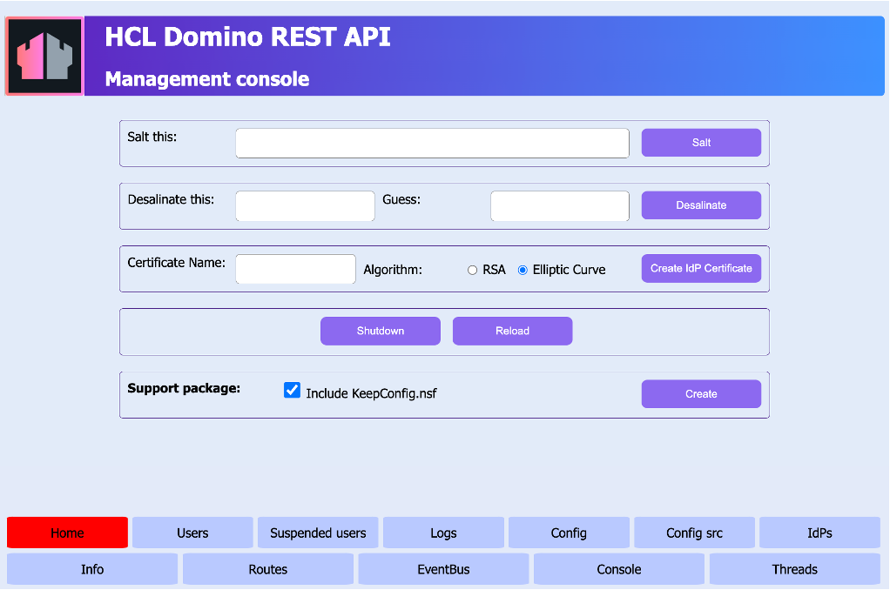

# Modify configuration of Domino REST API

## About this task

Domino REST API is preconfigured with settings that allow you to get started right away. This task guides you on how to modify the settings by modifying the configuration parameters.

## Before you begin

- You must have access to the **Management console** to see the preconfigured settings.

    !!! note

         - Make sure the **Management console** is secure. For more information, see [Functional Accounts](../../references/functionalUsers.md).
         - Credentials for the **Management console** aren't managed by the configured IdP, but are derived from the [configuration of functional accounts](../../references/functionalUsers.md).


- Get a better understanding of the core configuration concepts and parameters that enable effective management and customization of the Domino REST API by checking the following topics:

    - [Configuration management and overlay hierarchy](../../references/configuration/understandingconfig.md)

    - [Configuration parameters](../../references/configuration/parameters.md)

## Procedure

1. Log in to the **Management console** (Port 8889).

    

2. Click **Config** to see the preconfigured settings.

3. Identify and copy the configuration entries that you need to modify to change the preconfigured settings.

4. Create a JSON file using a text editor and paste the copied configuration entries to the JSON file.

    !!! note

        - Ensure that the structure of the configuration entries you copied into the JSON file exactly matches the structure you observed in the **Config** tab.
        - Include only the entries you intend to modify in the JSON file

    The following is an example of a configuration entry related to Domino REST API's metrics endpoint.

    ```json
    {
      "metrics" : {
        "enabled" : true,
        "jvmMetricsEnabled" : false
       } 
    }
    ```

5. Modify the value of the parameter and save the JSON file in the `keepconfig.d` directory.

    The following example shows the configuration entry after modifying the value of the `enabled` parameter to `false` to disable Domino REST API's `metrics` endpoint. In this example, the metrics endpoint is disabled when you don't want to take advantage of the [Prometheus](https://prometheus.io/) formatted runtime metrics by using a metric server, such as [Grafana](https://grafana.com/).

    ```json
    {
      "metrics" : {
         "enabled": false,
         "jvmMetricsEnabled": false
       }
    }
    ```

    !!! tip

        Use a filename for the JSON file that reveals its purpose, such as `enable-names-nsf.json`. To learn more on how JSON files in `keepconfig.d` are processed, see [configuration sources and overlay process](../../references/configuration/understandingconfig.md#configuration-sources-and-overlay-process).

6. Restart Domino REST API on all servers.

## Expected result

The updated configuration takes effect the next time you start Domino REST API.

## Additional example

In this additional example, the protocol will be swapped by disabling `TLSv1.2` and enabling `TLSv1.3`.

The default configuration entry that you will see in the **Config** tab in the **Management Console** will look as follows:

```json
{
  /* Lots of JSON here */
  "enabledProtocols": {
    "TLSv1.3": false,
    "TLSv1.2": true
  }
  /* more JSON here */
}
```

To update the configuration by swapping the protocols, the following configuration entry should be added to a JSON file, which is then saved in the `keepconfig.d` directory.

```json
{
  "enabledProtocols": {
    "TLSv1.3": true,
    "TLSv1.2": false
  }
}
```

The updated configuration takes effect after restarting Domino REST API.
