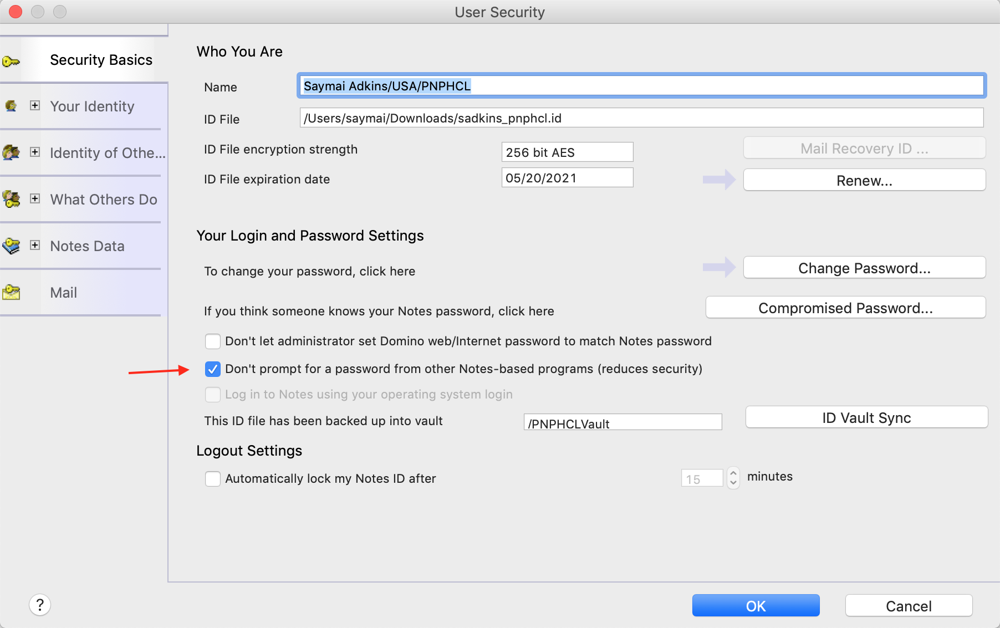

# Deploy to HCL Notes Client

<!-- prettier-ignore -->
!!! danger "**Domino REST API on Notes Client**"
    The HCL Domino REST API is designed for use with the HCL Domino server. The ability to deploy it to a Notes client on Windows or macOS is provided for your convenience so you can evaluate and experiment. You can explore the API without setting up an HCL Domino server.<br />
    **This setup is not supported for any production use**. HCL Support won't entertain tickets for it.

## About this task

The procedure guides you to try the Domino REST API with a sample demo Notes database with your existing HCL Notes Desktop Client.

## Prerequisites

- HCL Notes Desktop Client installed.
- Domino REST API installed using the `restapiInstall.jar` from My HCLSoftware Portal or HCL Software License and Download Portal.

    --8<-- "jarfilename.md"

- `Demo.nsf` from [Downloads](../../references/downloads.md).

## Procedure

1.  Locate your Notes Data directory:

    1. Open the HCL Notes Desktop Client.
    2. Go to the menu **Preferences**.
    3. Under **Basic Notes Client Configuration**, look for the Local application folder.

       For Mac, it's under `/Users/[userid]/Library/Application Support/HCL Notes Data/`.

2.  Place `Demo.nsf` in the Notes data folder.
3.  Create a functional users file to specify local Domino REST API Users:

    1. Locate your Notes Data directory and find the subdirectory named `keepconfig.d`.
    2. Create a new json file in the `keepconfig.d` directory. You can use any filename as long as the extension is json. As an example, you can use `localusers.json`.
    3. Copy the following data into the `localusers.json`file:

    ```json
    {
      "identity": {
        "managementAPI": {
          "Rest Admin": {
            "active": true,
            "secret": "E4B321EBA91B7F92D9BF5EAFA5322824FEC2287B8A6C133D7C31EFB706A2BA30:1A57478185E7AF3A98F01ECA08F0BA881DBC88BEC60AE8C6F1B1CC5CC55C11A20F676E082BF2D28BB96DB5A8CFB091C767C035B380DB4CBC7D1001EA8BE01663"
          }
        },
        "singleDbModeUsers": {
          "Joshua Falken": {
            "active": true,
            "CN": "CN=Joshua Falken/O=LocalUser",
            "secret": "E4B321EBA91B7F92D9BF5EAFA5322824FEC2287B8A6C133D7C31EFB706A2BA30:1A57478185E7AF3A98F01ECA08F0BA881DBC88BEC60AE8C6F1B1CC5CC55C11A20F676E082BF2D28BB96DB5A8CFB091C767C035B380DB4CBC7D1001EA8BE01663"
          },
          "John Doe": {
            "active": true,
            "CN": "CN=John Doe/O=Mauraders",
            "secret": "E4B321EBA91B7F92D9BF5EAFA5322824FEC2287B8A6C133D7C31EFB706A2BA30:1A57478185E7AF3A98F01ECA08F0BA881DBC88BEC60AE8C6F1B1CC5CC55C11A20F676E082BF2D28BB96DB5A8CFB091C767C035B380DB4CBC7D1001EA8BE01663"
          }
        }
      }
    }
    ```

    !!! note 
        The json file creates temporary users that Domino REST API recognizes while the API is running. The users include a Management API user and 2 local users. To use these users, you may need to add their CN to the Database's ACL. `John Doe/Mauraders` should already be in the `Demo.nsf`'s ACL. The password for each user is `password`. For more information, see [Functional Accounts](../../references/functionalUsers.md).

4.  Open an elevated terminal and navigate to where Domino REST API was installed.
5.  Run either the Windows cmd file (`runrestapi.cmd`) or Mac bash script (`runrestapi.sh`) that was installed by the installer.

    On Mac, you may have to change file permission to execute the script. To do that, issue the command:

    > `chmod 755 runrestapi.sh`

    <!-- prettier-ignore -->
    !!! note "Beware of the JRE"
        For different versions of Notes, the Notes JRE path in the script may vary. You may need to change the path in the script.

6.  When prompted for a password for your notes.id file in the Java window, enter your password in that Java window. If any error occurs, stop the running process (kill -9 for Mac) and restart the script. For more information, see [Troubleshooting guide](../../references/troubleshooting.md).

    <!-- prettier-ignore -->
    !!! tip "Password Prompt"
        To avoid being prompted for a password each time you start the Domino REST API, go to **File > Security > User Security** in your HCL Notes Client, and then select the *Don't prompt for a password from other Notes-based programs** checkbox in the *Security Basics* tab.

    {: .scale-img-seventy-five-percent }

## Expected result

If everything is set up correctly, you should get the following message in the terminal console output:

```text
   *** HCL Domino REST API open for business ***
```

## Additional details

When run, the Domino REST API starts and checks for any issues. On the first time run, the Domino REST API creates the databases `KeepConfig.nsf` and `KeepAgents.nsf` that are crucial for its operation.

For any issues with the installation, see the [Troubleshooting guide](../../references/troubleshooting.md).

To shutdown the Domino REST API, go to the **Management console** located at `http://localhost:8889`, enter the Management credentials as specified in the `localusers.json` file described above, and click **Shutdown**.
