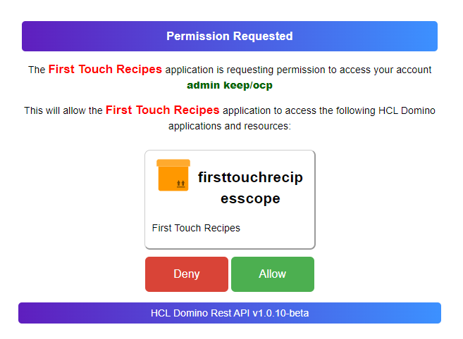

# Customize OAuth consent screen

!!! warning "Expert understanding required!"

    Modifiying the consent screen is **not** for the faint of heart and should only be attempted when corporate identity mandates altering the look and feel. Exercise caution when attempting this. You must be proficient in HTML, CSS, CSP and Javascript.



The OAuth consent screen uses 3 files:

- `authorization.html` located in `resources/oauth`
- `authorization.css` located in `resources/webroot`
- `authorization.js` located in `resources/webroot`

They are located inside the jar or the container and need to be [extracted](https://www.wikihow.com/Extract-a-JAR-File) from there. You can't modify the original file.

The most likely change might be adjustment of the CSS values. You must do this in a CSS file. The [CSP](https://developer.mozilla.org/en-US/docs/Web/HTTP/CSP) will not entertain inline styles. Host your custom CSS in `keepweb.d`, so it is accessible on the same host.

The HTML file uses the [Mustache](https://mustache.github.io/) templating system to fill in the values for the current consent request. In a nutshell: Mustache variables look like this: **&#123;&#123;&nbsp;&#125;&#125;**. A good introduction tutorial [can be found here](https://www.baeldung.com/mustache/).

## About this task

Steps to be taken to alter the look & feel of the consent screen

## Prerequisites

- You must be proficient in using the HTML, CSS, CSP and Javascript

- You must understand [Mustache](https://mustache.github.io/).
- You must understand the URLs of the Domino REST API and the difference between a file location and its URL

!!! error "Content Security Policy in place!"

    The consent screen uses a tight [CSP](https://developer.mozilla.org/en-US/docs/Web/HTTP/CSP), You can't use inline CSS or JavaScript or load CSS or JavaScript from a different server.

## Procedure

There are 2 steps required: configure the REST API to load an alternate screen and creating a modified screen. In the simplest case, editing the html file and point to a different or additional CSS file. The worst case: you try to mess with the JavaScript, which we strongly discourage.

### Pointing to a different HTML file

You need to create or edit a json file in `keepconfig.d` that has the `oauth` key. This can be an existing file with `oauth` or a new and otherwise empty file

```json
{
  "oauth": {
    "alternateConsentDir": "some-directory-that-must-exist"
  }
}
```

That directory must contain you custom `authorization.html`. It doesn't need to be accessible via http(s), since the REST task will pick it up. You can use `keepconfig.d` for this. For CSS and JS (again: don't mess with the JS) you need http(s) accessible locations, like `keepweb.d` that [is visible](../../references/hostingstatic.md) as `/keepweb`.

!!! tip "Use a name matching the purpose"

    Use a filename for the JSON file that reveals its purpose. To learn more on how JSON files in `keepconfig.d` are processed, see [Understanding configuration](../production/configparam.md#understanding-configuration).

### Modifying the HTML files

The HTML file contains only HTML and links to CSS and JavaScript. It does not contain inline CSS or inline JS. The HTML body consists of 4 main sections:

- error DIV: usually hidden, shows up when things go wrong
- `splashScreen` : The initial screen shown while consent is checking if there is an active user session or an existing consent
- `loginScreen` : Initially hidden, shows up when user needs to login
- `consentScreen` : Initially hidden, shows up when user needs to provide their consent. Contains `{{ mustache }}` variables

### List of Mustache variables

| Name                  | Purpose                                                             |
| --------------------- | ------------------------------------------------------------------- |
| `{{ client_name }}`   | Application name as configured in the AdminUI                       |
| `{{ claims }}`        | Repeat element for each scope requested, closes with `{{ claims }}` |
| `{{ logoURL }}`       | Points to the scope icon configured in the AdminUI                  |
| `{{ claim }}`         | Scope name as configured in the AdminUI                             |
| `{{ description }}`   | Scope description as configure in the adminUI                       |
| `{{ client_id }}`     | UniqueId of the requesting application                              |
| `{{ state }}`         | application state, required by OAUTH flow (don't touch)             |
| `{{ redirect_uri }}`  | sends you to your app, configured in AdminUI (don't touch)          |
| `{{ scope }}`         | requested scopes, matched again app configuration (don't touch)     |
| `{{ response_type }}` | response type, required by OAUTH flow (don't touch)                 |

Don't alter any of the input fields (they are hidden anyway) or the button ids. You can modify anything inside the `form` tag before the first `input` element.

Good luck with the changes.

!!! tip "When things go wrong"

    If you encounter any issues with the OAuth consent screen, you can revert to the default settings by removing the `alternateConsentDir` in the `oauth` section of your JSON configuration file.
