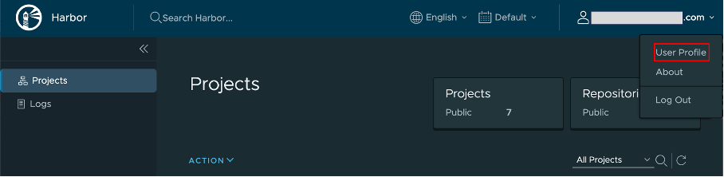

# Obtain authentication token from HCL Container Repository

## About this procedure

The binary images and Helm charts for Domino REST API are pulled from the HCL Container Repository. This requires you to get your authentication token from the HCL Container Repository. This procedure guides you on how to obtain your authentication token.

## To obtain your authentication token

1. Go to the [HCL Container Repository](https://hclcr.io){: target="_blank"}.
2. On the login page, click **LOGIN VIA OIDC Provider**, and then login using your corporate email address.
3. On the **Projects** page, click your username and select **User Profile**.

    

5. On the **User Profile** dialog, copy the value of the **CLI secret** by clicking the copy icon.

    

6. Save the **CLI secret** value as you will use it as your authentication token or password when using Docker or Helm CLI to access HCL Container Repository.

7. Take note of exactly how your email address is written in the **User Profile** dialog as authentication is case sensitive on the user email.
