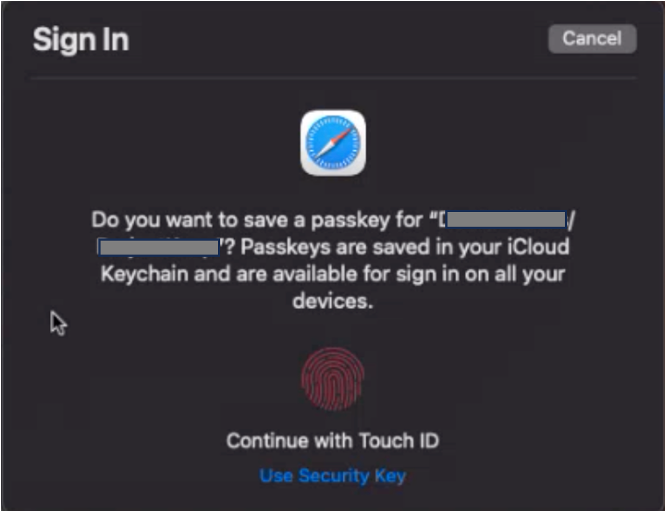
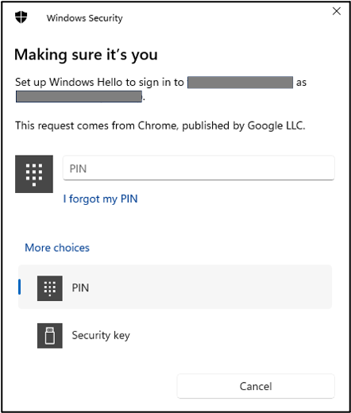

# Use passkey to log in to Admin UI

## About this task
The procedures guide you in using a passkey to log in to **Admin UI**. The procedures involve:

- signing up with passkey
- logging in to Admin UI using a passkey
- clearing the passkey

Passkeys are better options to passwords as they use public key cryptography to create secure experiences. Passkeys allow sign-in to websites without remembering and managing passwords by using a biometric sensor, PIN, or pattern. For more information, see [passkey.org](https://passkey.org/){: target="_blank" rel=”noopener noreferrer”}.

## Prerequisites

### For Mac

- You have [set up iCloud Keychain](https://support.apple.com/en-ph/guide/mac-help/mh43699/13.0/mac/13.0){: target="_blank" rel=”noopener noreferrer”} to create a passkey.
- You have an Apple ID to set up iCloud Keychain.
- Your Mac has a Touch ID sensor.

!!!note 
    Passkeys from iCloud Keychain aren't yet available in Chrome on macOS.

### For Windows

- You have set up [Windows Hello](https://support.microsoft.com/en-us/windows/learn-about-windows-hello-and-set-it-up-dae28983-8242-bb2a-d3d1-87c9d265a5f0){: target="_blank" rel=”noopener noreferrer”} as Chrome on Windows stores passkeys in Windows Hello.
- Your Windows machine supports the Windows Hello options.     

## Procedures

### To sign up with passkey

1. Open the **Domino REST API Admin UI** sign-in page in your browser.

    !!!tip
        For example, open *http://restapi.myhost.com:8880/admin/ui* in your browser, and replace the host with your Domino REST API's host.

2. Enter your username and password.
3. Click **Sign up with Passkey**.

    {: style="height:60%;width:60%"}

    If you are using Safari on Mac, a **Sign In** dialog appears.

    {: style="height:60%;width:60%"}
    
    If you are using Chrome on a Windows machine, a **Windows Security** dialog appears.

    

4. Set up your passkey.
    
    - For Mac, continue with **Touch ID** by scanning your fingerprint using the Touch ID sensor.

    - For Windows, select the **Windows Hello** option that you have set up. As an example shown in the above image, signing in with a PIN option is set so enter your PIN.

You have now logged in to the **Domino REST API Admin UI**.

### To log in to Admin UI with passkey

1. Open the **Domino REST API Admin UI** sign-in page in your browser.
2. Click **Log in with Passkey**

    {: style="height:60%;width:60%"}

3. Use your passkey.

    - For Mac, continue with Touch ID by scanning your fingerprint using the Touch ID sensor.
    - For Windows, select the **Windows Hello** option that you have set up. As an example shown in the above image, signing in with a PIN option is set so enter your PIN.

You have now logged in to the **Domino REST API Admin UI**.

### To clear your passkey

1. Open the **Domino REST API Admin UI** sign-in page in your browser.
2. Click **Clear Passkey**.

    {: style="height:60%;width:60%"}

Passkey is cleared and you now need to enter your username and password to log in to the **Domino REST API Admin UI**.