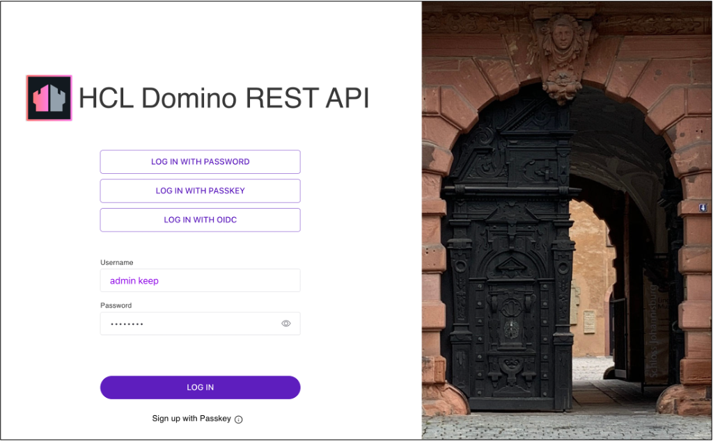
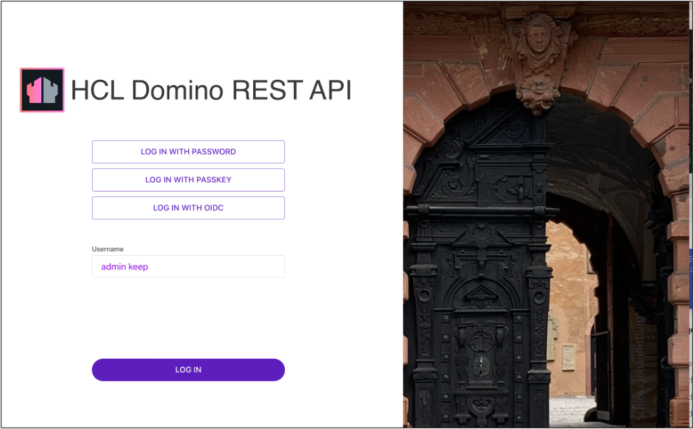

# Use passkey to log in to Admin UI

!!!caution "Important"
    This feature is only applicable if your host is using HTTPS. 

## About this task
The procedures guide you in using a passkey to log in to **Admin UI**. The procedures involve:

- signing up with passkey
- logging in to Admin UI using a passkey
- clearing the passkey

Passkeys are better options to passwords as they use public key cryptography to create secure experiences. Passkeys allow sign-in to websites without remembering and managing passwords by using a biometric sensor, PIN, or pattern. For more information, see [passkey.org](https://passkey.org/).

## Prerequisites

### For Mac

- You have [set up iCloud Keychain](https://support.apple.com/en-ph/guide/mac-help/mh43699/13.0/mac/13.0) to create a passkey.
- You have an Apple ID to set up iCloud Keychain.
- Your Mac has a Touch ID sensor.

!!!note 
    Chrome supports passkeys on iCloud Keychain starting in Chrome 118, on macOS 13.5 or later. For more information, see [Chrome for Developers blog post](https://developer.chrome.com/blog/passkeys-on-icloud-keychain).

### For Windows

- You have set up [Windows Hello](https://support.microsoft.com/en-us/windows/learn-about-windows-hello-and-set-it-up-dae28983-8242-bb2a-d3d1-87c9d265a5f0) as Chrome on Windows stores passkeys in Windows Hello.
- Your Windows machine supports the Windows Hello options.     

## Procedures

### To sign up with passkey

1. Open the **Domino REST API Admin UI** sign-in page in your browser.
2. Enter your **Username** and **Password**, and then click **Sign up with Passkey**. 

    {: style="height:60%;width:60%"}
    
    A dialog opens. The following image shows an example of the dialog opened in Chrome on macOS. 

    {: style="height:60%;width:60%"}          

3. Choose how you want to create a passkey from the available options in the dialog and follow the succeeding instructions to complete the process. 

You have now logged in to the **Domino REST API Admin UI**.

### To log in to Admin UI with passkey

!!!note
    See [Configure WebAuthn with Domino REST API and Domino 14](../../howto/install/webauthn.md) to use the same passkey.

1. Open the **Domino REST API Admin UI** sign-in page in your browser.
2. Click **Log in with Passkey**.

    {: style="height:60%;width:60%"}

3. Follow the instructions to use your passkey. The instructions vary depending on what you have chosen on how to create the passkey. 

You have now logged in to the **Domino REST API Admin UI**.

### To clear your passkey

1. Open the **Domino REST API Admin UI** sign-in page in your browser.
2. Click **Clear Passkey**.

    {: style="height:60%;width:60%"}

Passkey is cleared and you now need to enter your username and password to log in to the **Domino REST API Admin UI**.

