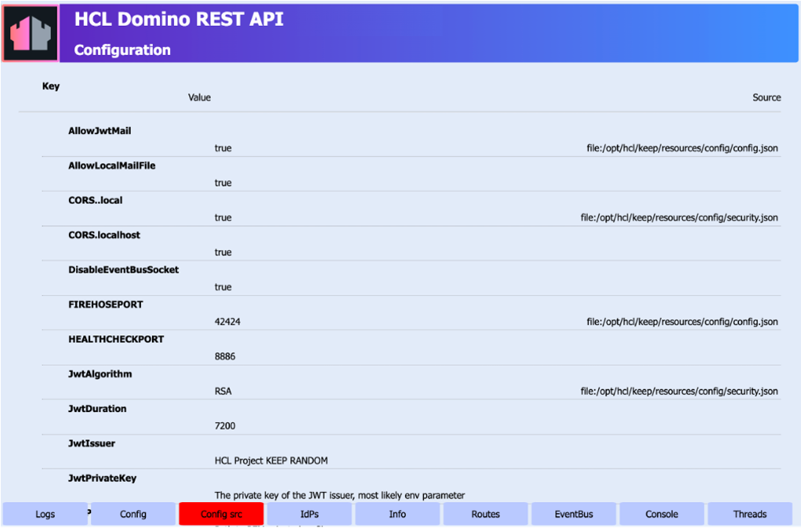
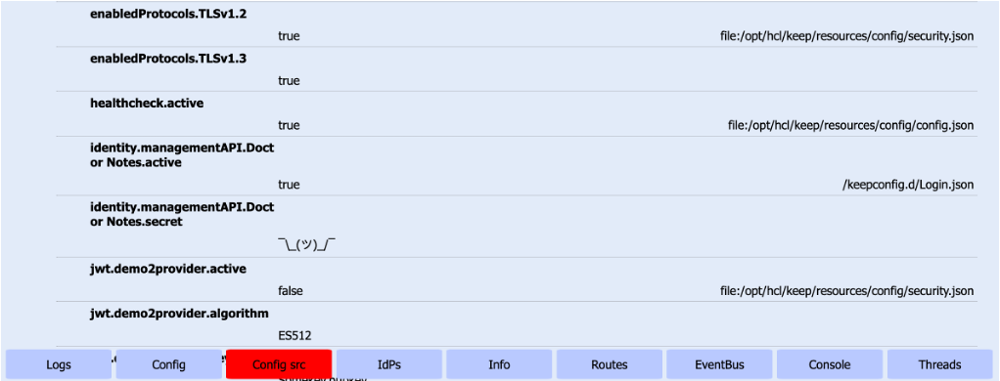

# Find configuration sources

## About this task

You can [check the Domino REST API settings via the **Config** tab](../management/checksettings.md) in the **Management console**. The **Config** tab shows you all the default configuration of the Domino REST API and all the additional configuration made using the JSON files saved in the `keepconfig.d` directory. This procedure guides you on how to identify the source files of all the configuration parameters that you see in the **Config** tab by using the **Config src** tab.

## Before you begin

You must have access to the **Management console**.

!!! note

     - Make sure the **Management console** is secure. For more information, see [Functional Accounts](../../references/functionalUsers.md).
     - Credentials for the **Management console** aren't managed by the configured IdP, but are derived from the [configuration of functional accounts](../../references/functionalUsers.md).

## Procedure

1. Log in to the **Management console** (Port 8889).

    

2. Click **Config src**. The **Configuration** page opens.

    The **Configuration** page includes the **Key** column that shows the configuration parameters or keys, the **Value** column that shows the value of the respective configuration parameters or keys, and the **Source** column that shows in which configuration files you can find the configuration parameters/keys and their values.

    

## Additional information

Using the following example image, you can find the configuration parameter `AllowJwtMail` in the `config.json` file located in the `/opt/hcl/keep/resources/config` directory.

Using the same example image, you can see that the configuration parameter `AllowLocalMailFile` doesn't have a corresponding entry under the **Source** column. When you see instances like this, it means that you can find the configuration parameter in the preceding file entry in the **Source** column. Based on this example, you can also find the configuration parameter `AllowLocalMailFile` in the `config.json` file located in the `/opt/hcl/keep/resources/config` directory.

 
Using the following example image, you can find `identity.managementAPI.Doctor Notes.active` and `identity.managementAPI.Doctor Notes.secret` in the `Login.json` file added to the `keepconfig.d` directory. You can also see that the value of `identity.managementAPI.Doctor Notes.secret` has random characters that doesn't provide understandable meaning. This means that the value of `identity.managementAPI.Doctor Notes.secret` can't be exposed. 

