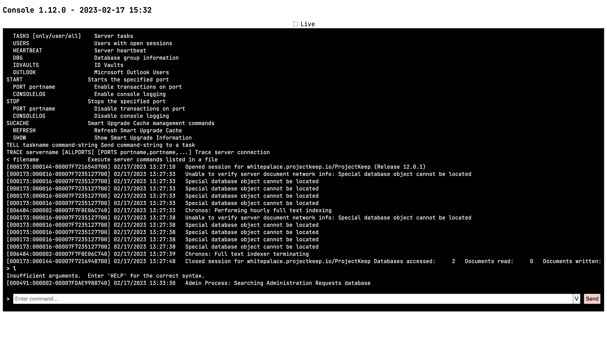

# Use Domino Console

The **Domino Console** lets an administrator send commands and listen to messages from the Domino server. The **Domino Console** can be opened from the **Management console** and has a _remote console feature_ that lets the administrator get real-time command responses and logs from the Domino server. The _remote console feature_ also enables sending and receiving messages to and from other Domino consoles in real time and viewing interactions between other Domino consoles and the Domino server.

## About this task

This topic guides you in using the different features of the Domino console.

## Before you begin

You must enable the remote console feature by adding `DEBUG_ALLOW_REMOTE_CON_SERVER=1` to your server's **notes.ini**.

## Procedures

### Open the Domino Console

<!-- prettier-ignore -->
!!! note

    Make sure the **Management console** is secure. For more information, see [Functional Accounts](../../references/functionalUsers.md).

1. Log in to the **Management console** (Port 8889).

      

      Take note that credentials for the management console aren't managed by the configured IdP, but are derived from the [configuration of functional accounts](../../references/functionalUsers.md).

2. Click **Console**. The **Domino Console** opens.

      

### Show the Domino server commands

On the **Domino Console**, enter `help` in the **Enter command** text box, and then press **Enter** or click **Send**.

The command output shows the server commands, their corresponding descriptions, arguments if any, and proper syntax.

### See live console output

On the **Domino Console**, select the **Live** checkbox.

The command output shows a `web socket opened` message. When clearing the **Live** checkbox, the command output shows the `Live connection closed` and `web socket closed` messages.

### Send commands to the Domino Server

On the **Domino Console**, enter the Domino server command in the **Enter command** text box, and then press **Enter** or click **Send**.

<!-- prettier-ignore -->
!!! note

    The output from an entered command is shown even if you don't select the **Live** checkbox.

When the _Live_ feature is enabled, the command output shows the corresponding command response from the Domino server. When disabled, the command is executed, but you might not get a command response.

### Show and enter previously entered commands

1. On the **Domino Console** window, click **V** at the end of the **Enter command** text box. A **Command history** dialog opens and shows the list of previously entered commands.
2. Select a command from the list shown in the **Command history** dialog to enter it in the **Enter command** text box.
3. Press **Enter** or click **Send**.
