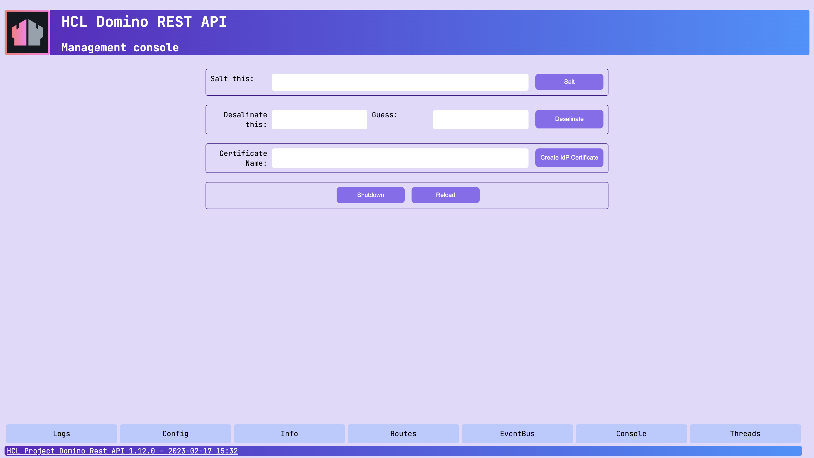

# Use Management console for encryption operations

The **Management console** (UI) provides convenient functions for encryption and certificate-related tasks.



## About this task

This guide walks you through using the **Management console** to perform these encryption operations:

- Hashing a salted password
- Generating keys and certificates for SAML and JWT authentication

## Before you begin

You must have access to the **Management console**.

!!! note

    - Make sure the **Management console** is secure. For more information, see [Functional Accounts](../../references/functionalUsers.md).
    - Credentials for the **Management console** aren't managed by the configured IdP, but are derived from the [configuration of functional accounts](../../references/functionalUsers.md).

## Procedures

### Hash a salted password

<!--The shutdown key and the metrics credential password are stored in the Domino REST API configuration `.ini` files, salted and hashed. 

To change one of them:-->

1. Login into the **Management console** (Port 8889).
2. Enter a password in the **Salt this** text field and click **Salt**.

The salted and hashed version of the entered password will be shown, and you can copy and use it in a configuration JSON file.

### Generate keys and certificates for SAML and JWT

Domino REST API uses X509 certificates and a public/private key pair for [SAML](../../howto/IdP/keepsaml.md) interaction with the Domino R12 ID Vault. The **Management Console** offers a convenient way to generate those and the needed configuration entries.

!!! note

    You need access to the Domino server's file system to collect the keys/cert.

1. Login into the **Management console** (Port 8889).
2. Enter a certificate name in the **Certificate Name** text field.

    !!! tip

        Use only **`0-9,a-z,A-z,-,_`**. No spaces or special characters.

3. Select the **Algorithm**, either **RSA** or **Elliptic Curve**.
4. Click **Create IdP Certificate**.

The following events happen:

- The `X509` certificate, the public/private key pair, and the configuration file are created in the `keepconfig.d` directory.

    You can distribute them to all Domino REST API servers to achieve single login and decryption capabilities.

- The IdP list, accessible by clicking the **IdPs** button on the **Management console** page, is updated.

As an example, when you enter **AcmeKeepTest** in the **Certificate Name** field, you get the following configuration file:

```json
{
  "JwtUsePubPrivKey": true,
  "JwtUsePemFile": true,
  "JwtIssuer": "CN=ServerName/O=OrgName/F=AcmeKeepTest",
  "JwtPrivateKeyFile": "keepconfig.d/AcmeKeepTest.private.key.pem",
  "JwtPublicKeyFile": "keepconfig.d/AcmeKeepTest.public.key.pem",
  "JwtCertFile": "keepconfig.d/AcmeKeepTest.cert.pem",
  "JwtAlgorithm": "RSA"
}
```

<!--
Enter a certificate name, don't use spaces or special characters, stick to: `0-9,a-z,A-z,-,_`.
Then enter the `Shutdown key` (masked input) and click on `Create IdP Certificate. 4 things will happen:

- Creation of an `X509` certificate
- Creation of a public/private key pair
- Creation of a configuration json file
- Update of the IdP Cert button on the management page

The 4 files get created in your `keepconfig.d` directory. Distribute them to all Domino REST API servers to achieve single login and decryption capabilities. For example, when you specified **AcmeKeepTest** as your `Certificate Name`, you get this configuration file:

```json
{
  "JwtUsePubPrivKey": true,
  "JwtUsePemFile": true,
  "JwtIssuer": "CN=ServerName/O=OrgName/F=AcmeKeepTest",
  "JwtPrivateKeyFile": "keepconfig.d/AcmeKeepTest.private.key.pem",
  "JwtPublicKeyFile": "keepconfig.d/AcmeKeepTest.public.key.pem",
  "JwtCertFile": "keepconfig.d/AcmeKeepTest.cert.pem",
  "JwtAlgorithm": "RSA"
}
```
-->