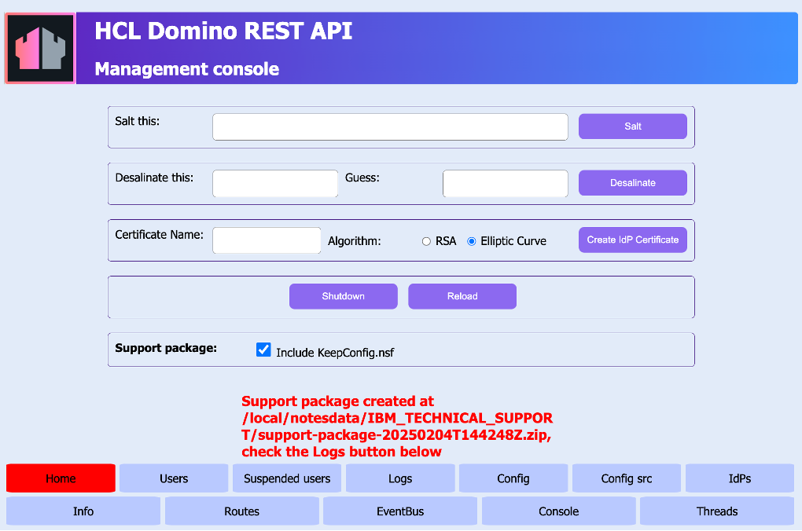

# Create support package

## About this task

Guides you on how to create a support package from the **Management console**. The support package can help the support team to better identify, troubleshoot, and resolve encountered issues. The support package is a zip file that includes:

- all files in the `IBM_TECHNICAL_SUPPORT` directory
- JSON files in the `keepconfig.d` directory
- text file containing a list of all the files in `keepconfig.d`
- `config.json` file containing data output from the **Config** in the **Management console** 
- `configSrc.json` file containing data output from the **Config scr** in the **Management console**
- `info.json` file containing data output from the **Info** in the **Management console**
- `threads.json` file containing data output from the **Threads** in the **Management console**

There is also an option to include `KeepConfig.nsf` in the support package.   

## Before you begin

You must have access to the **Management console**.

!!! note
     - Make sure the **Management console** is secure. For more information, see [Functional Accounts](../../references/functionalUsers.md).
     - Credentials for the **Management console** aren't managed by the configured IdP, but are derived from the [configuration of functional accounts](../../references/functionalUsers.md).

## Procedure

1. Log in to the **Management console** (Port 8889).
2. On the **Management console** page, click **Create** in the **Support package** section. 

    

    !!!tip
        The **Include KeepConfig.nsf** checkbox is selected by default to include the `KeepConfig.nsf` in the support package. Clear the checkbox to exclude `KeepConfig.nsf` from the support package.

    You are then notified that the support package has been created at the `IBM_TECHNICAL_SUPPORT` directory with a specific filename.

    

## Additional information

### Filename

The support package is a zip file that has the filename format `support-package-<datetime\>.zip`. The `<datetime\>` variable indicates when the support package is created and has the format *YYYYMMDDTHHMMSSZ*. *YYYY* is the four-digit year, *MM* is the two-digit month, *DD* is the two-digit day, *T* is the time indicator, *HH* is the two-digit hour, *MM* is the two-digit minutes, *SS* is the two-digit seconds, and *Z* is the indicator that the time is in Zulu Time or Greenwich Mean Time.

### Console command

You can also generate the support package by running the console command `tell restapi support` or `tell restapi support -includensf` on the Domino console. The console command `tell restapi support` creates the support package without the `KeepConfig.nsf`, while the `tell restapi support -includensf` creates the support package that includes the `KeepConfig.nsf`.

