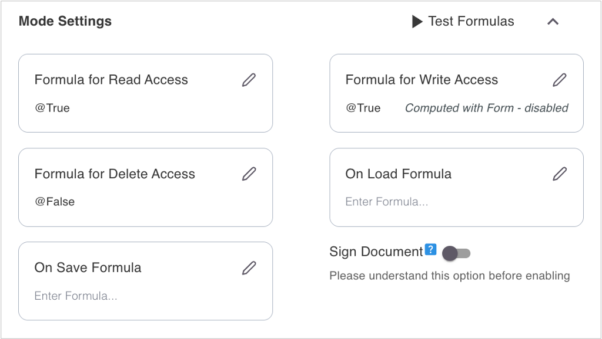
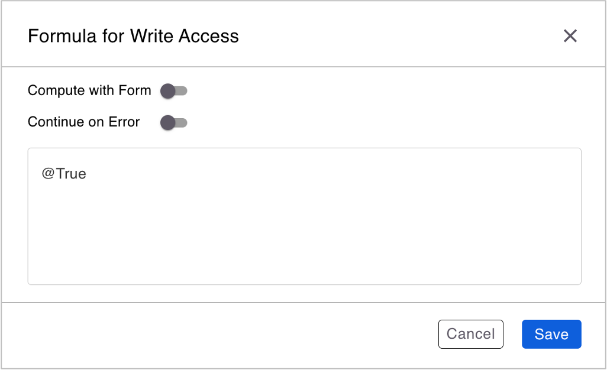
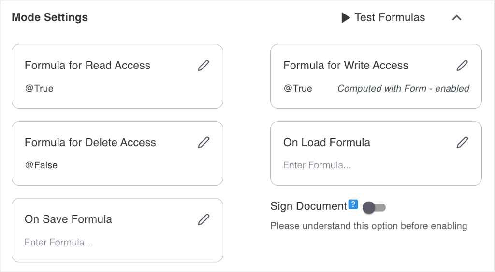

# Set compute with form

## About this task

The procedure guides you on configuring the **Formula for Write Access** under **Mode Settings** in the **Admin UI** with the ComputeWithForm method. For more information about the method, see [ComputeWithForm](https://help.hcl-software.com/dom_designer/14.0.0/basic/H_COMPUTEWITHFORM_METHOD.html "Opens a new tab"){: target="_blank" rel="noopener noreferrer"}&nbsp;{: style="height:15px;width:15px"} in the *HCL Domino Designer* documentation.

## Before you begin

You are aware of how to [change the form configuration](../../references/usingwebui/schemaui.md#change-form-configuration) in the **Admin UI** as it's the starting point of this procedure.

## Procedure

1. Under **Mode Settings**, click the pencil icon corresponding to the **Formula for Write Access**.

    {: style="height:70%;width:70%"}

    The **Formula for Write Access** dialog opens.

    {: style="height:70%;width:70%"}

2. Click the **Compute with Form** toggle to the on position.
3. Click the **Continue on Error** toggle to the on position.

    !!! note

        - **Continue on Error** toggle is only enabled when the **Compute with Form** toggle is set to the on position. 
        - The **Continue on Error** toggle is set to the on position by default when the **Compute with Form** toggle is set to the on position.
        - When **Continue on Error** toggle is set to the on position, the process continues even if the document validation fails. 

4. Click **Save**.

The text *Computed with Form - enabled* in the **Formula for Write Access** card provides a visual indication that the **Formula for Write Access** has been configured to be computed with form.

{: style="height:70%;width:70%"}

## Additional information

Continue with the steps in [changing the form configuration](../../references/usingwebui/schemaui.md#change-form-configuration).
