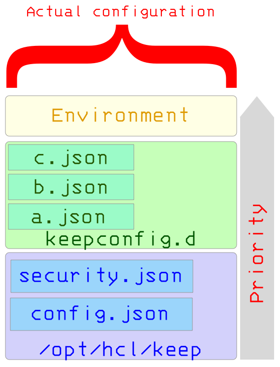

# Configuration parameters

Domino REST API is preconfigured with settings that allow you to get started right away. However, you should familiarize yourself with all configuration parameters and security settings before you deploy into a production environment.

## Procedure

1. **Log in** into the Management console (Port 8889). 

    Make sure that the administration location can only be accessed from a network that can be accessed by a your system administrator.

3. **Go** to the `keepconfig.d` and open the `config.json`. The default configuration settings are here, [config.json](/docs/references/security/configjson.md).

4. Copy only  that one you need to change your parameters from the `config.json`.

  Example: 
  Place your measurements behind a firewall that only your metric server can access. This ensures that only authorized users can access the data. 
  If you don't use a metric server, the firewall should have its protection completely disabled.


  ```
    "metrics": {
      "enabled": false,
      "jvmMetricsEnabled": false
      }
  ```
5. Click **Save** in .json format.

6. Restart Domino REST API on all servers with this new configuration.


## Understanding configuration

The configuration follows the concept of an [Overlay File System](https://en.wikipedia.org/wiki/OverlayFS). The base configuration is retrieved from the installation directory or `jar` files.

When jar files contain a resource `/config/config.json`, that configuration file is added to total configuration.

Then, it's overlaid with any JSON files in the `keepconfig.d` directory within the Notes data directory and then finally, with any environment parameters.

### Hierarchy



All files contribute JSON, which are overlaid on top of each other. JSON elements with same names get overwritten. Arrays are replaced and not overwritten.

The JSON files in `keepconfig.d` are processed in alphabetical order. Last entry wins. This processing order allows you, for example, to disable elements temporarily through settings in a `z-final-words.json` file without impacting the permanent configuration.


