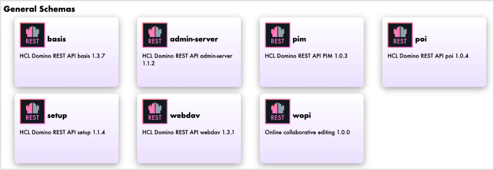

# Customize available API schemas and endpoints

## About this task

Guides you on how to customize which API schemas and endpoints are available or visible to meet your specific requirements or use cases. 

## Before you begin

!!!note
    This prerequisite is applicable to [Customize available endpoints in a specific API schema](#customize-available-endpoints-in-a-specific-api-schema).

You have to take note of the `operationId` of the endpoints in a specific API schema that you want to be unavailable. 

**To know the operationId**:

1. Go to [OpenAPI (SwaggerUI)](http://localhost:8880/openapi/index.html).
2. Select the API schema that contains the endpoints that you don't want to be available.

    

    As an example, **basis** API schema is selected.

3. Select the endpoint or endpoints that you don't want to be available. You will see the value of the `operationId` after the endpoint description.

    In the example image, the `operationId` of each listed endpoint is enclosed in the red box. 

    

4. Take note of the `operationId` of each endpoint you don't want to be available. 

## Procedure

### Customize available API schemas

This procedure enables you customize which API schemas are unavailable to end users. 

1. Create a JSON file using a text editor.
2. Add the `versions` JSON object with the entry name of the API schema you want to be unavailable and the `active` property.

    ``` json
    {
        "versions" : {
            "entry name" : {
                "active" : true
            }
        }

    }
    ```

    Refer to the table for the entry name of the API schema:

    |entry name|API schema|
    |:---|:---|
    |basis|HCL Domino REST API basis|
    |setup|HCL Domino REST API setup|
    |admin|HCL Domino REST API admin|
    |admin-server|HCL Domino REST API admin-server|
    |poi|HCL Domino REST API poi|
    |pim|HCL Domino REST API pim|
    |webdav|HCL Domino REST API webdav|

4.	Set the value of the `active` property to `false` to make the API schema unavailable.

    ``` json
    {
        "versions" : {
            "entry name" : {
                "active" : false
            }
        }

    }
    ```

    For example, if you want to make the *HCL Domino REST API admin 1.0.2* API schema unavailable, you will add the following to the JSON file:

    ``` json
    {
        "versions" : {
            "admin" : {
                "active" : false
            }
        }

    }
    ``` 

5. Save the JSON file in the `keepconfig.d` directory.
6. Restart Domino REST API on all servers.

The following image shows the available API schemas **before** saving the example JSON file, which makes the *HCL Domino REST API admin* API schema unavailable, in the `keepconfig.d` directory.


The following image shows the available API schemas **after** saving the example JSON file, which makes the *HCL Domino REST API admin* API schema unavailable, in the `keepconfig.d` directory.




### Customize available endpoints in a specific API schema 

This procedure enables you to customize which endpoints in a specific API schema are unavailable to end users by using the endpoint's `operationId`. 

1. Create a JSON file using a text editor.
2. Add the `versions` JSON object with the entry name of the API schema you want to customize and the `disabledOperationIds` property.

    ``` json
    {
        "versions" : {
            "entry name" : {
                "disabledOperationIds" : ["value1","value2"]
            }
        }

    }
    ```

    !!!note 
        `disabledOperationIds` is an array.

3.	Enter the `operationID` of each endpoint you want to be unavailable as an array value for the `disabledOperationIds` property.

    For example, if you want to make the `POST v1/document` and `GET v1/document/{unid}` endpoints on the *HCL Domino REST API basis* API schema, and the `GET setup-v1/schema` endpoint on the *HCL Domino REST API setup* API schema to be unavailable, add the `operationId` of each of those endpoints in the JSON file as array values of the `disabledOperationIds` property. 

    ``` json
    {
        "versions" : {
            "basis" : {
                "disabledOperationIds" : ["createDocument","getDocument"]
            },
            "setup" : {
                "disabledOperationIds" : ["getSchema"]
            }
        }

    }
    ```

5. Save the JSON file in the `keepconfig.d` directory.
6. Restart Domino REST API on all servers.

The following images show the availability of the `POST v1/document` and `GET v1/document/{unid}` endpoints on the *HCL Domino REST API basis* API schema, and the `GET setup-v1/schema` endpoint on the *HCL Domino REST API setup* API schema **before** saving the example JSON file in the `keepconfig.d` directory.

???example "Example images before making the endpoints unavailable"

    

    

The following images show the availability of the `POST v1/document` and `GET v1/document/{unid}` endpoints on the *HCL Domino REST API basis* API schema, and the `GET setup-v1/schema` endpoint on the *HCL Domino REST API setup* API schema **after** saving the example JSON file in the `keepconfig.d` directory.


???example "Example images after making the endpoints unavailable"

    

    


### Customize accessible endpoints according to the API version 

This procedure enables you to make endpoints in API schemas available to end users according to the `keepVersion` parameter. Each endpoint in an API schema has an `x-keep-version` attribute whose value corresponds to the supported API version defined by the `keepVersion` parameter. By modifying the value of the `keepVersion` parameter, you can make endpoints that are experimental or endpoints under development that might be supported in future releases available to meet your specific use case.  

!!!warning "Important"
    Even if experimental endpoints or endpoints to be supported in future releases can be made available, there is no guarantee that they will function as expected.

1. Create a JSON file using a text editor.
2. Add the `keepVersion` parameter with a value of `5`.

    ``` json
    {
        "keepVersion" : 5
    }
    ```

3. Save the JSON file in the `keepconfig.d` directory.
4. Restart Domino REST API on all servers.

The following image shows the currently supported endpoints for running code against data **before** making experimental endpoints or endpoints under development available.

 

The following image shows some supported and experimental endpoints for running code against data **after** making the experimental endpoints or endpoints under development available.

 

