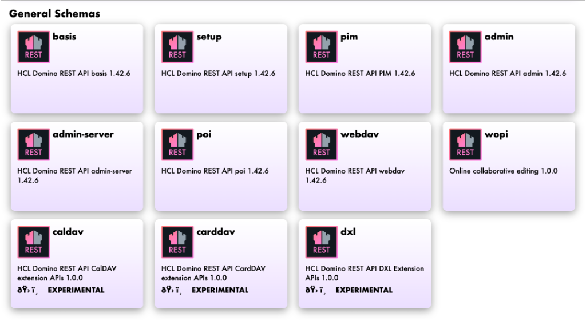

# Enable CalDav, CardDav, and DXL extension APIs

## About this task

This task guides you on how to enable the CalDAV, CardDAV, and DXL extension APIs to extend Domino REST API support for calendar and contact synchronization, as well as Domino XML data exchange. By default, the CalDAV, CardDAV, and DXL extension APIs are disabled as they are **experimental and not officially supported**.

!!! note

    The task is only applicable starting from Domino REST API v1.1.8 release.

## Before your begin

Before enabling and working with the extension APIs, it is important to get familiar with the following terms:

|Term|Description|
|:---|:---|
|CardDav|An open Internet protocol that allows you to sync and manage your address book and contacts. The CardDAV extension APIs are only tested and supported on Mozilla Thunderbird.|
|CalDav|An open Internet protocol that allows you to access, manage, and synchronize calendar data. The CalDav extension APIs are only tested and supported on Mozilla Thunderbird.|
|DXL|Domino XML (DXL) is a set of APIs for retrieving and manipulating a database's design.|

!!! warning "Important"

    The CalDAV, CardDAV, and DXL extension APIs are **experimental and not officially supported**. The CalDAV and CardDAV extension APIs have been tested only with the Mozilla Thunderbird mail client, and we will only provide some level of support for issues limited to Mozilla Thunderbird client integrations. Kindly reach us on the [OpenNTF Discord channel](https://discord.com/invite/jmRHpDRnH4 "Opens a new tab"){: target="_blank" rel="noopener noreferrer"}&nbsp;{: style="height:15px;width:15px"}. 

## Procedure

1. Create a JSON file using a text editor.
2. Add the JSON object containing configuration settings for the CalDAV, CardDAV, and DXL extension APIs.

    ```json
    {
        "versions" : {
            "caldav" : {
                "active" : true
            },
            "carddav" : {
                "active" : true
            },
            "dxl" : {
                "active" : true
            }
        }
    }
    ```

    The configuration setting will enable the CalDAV, CardDAV, and DXL extension APIs. If you want to enable only a specific one, change the value of the `active` property to `false`. In the following example configuration setting, only CalDAV and CardDAV extensions APIs are enabled.

    ```json
    {
        "versions" : {
            "caldav" : {
                "active" : true
            },
            "carddav" : {
                "active" : true
            },
            "dxl" : {
                "active" : false
            }
        }
    }
    ```

3. Save the JSON file in the `keepconfig.d` directory.

    !!! tip

        Use a filename for the JSON file that reveals its purpose. To learn more on how JSON files in `keepconfig.d` are processed, see [Configuration management and overlay hierarchy](../../references/configuration/understandingconfig.md).

4. Restart Domino REST API on all servers.

After restarting Domino REST API, you will now be able to see the CalDAV, CardDAV, and DXL extension APIs tiles under **General Schemas**.

{: style="height:80%;width:80%"}