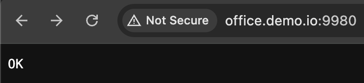
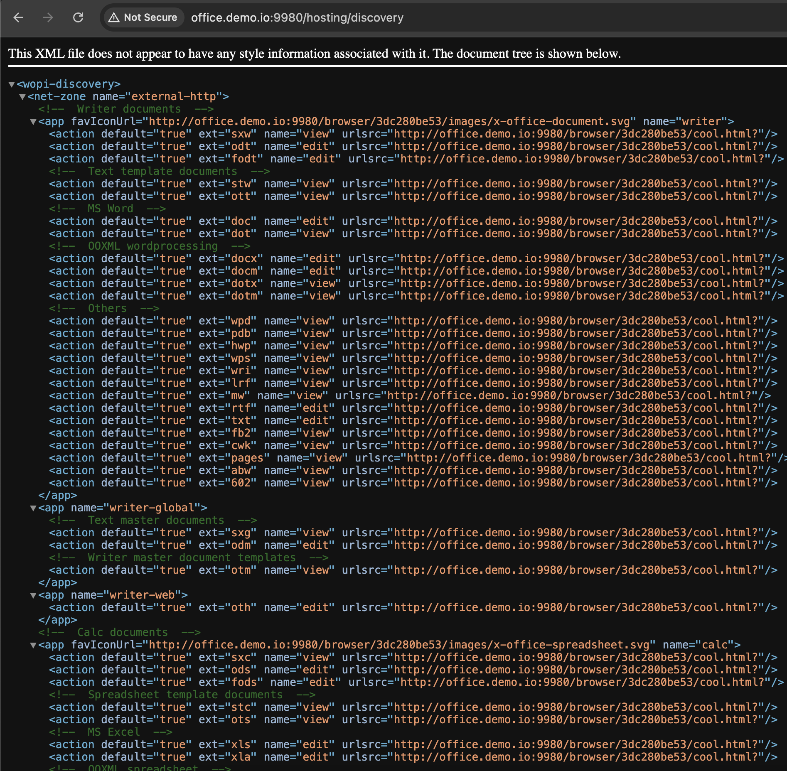
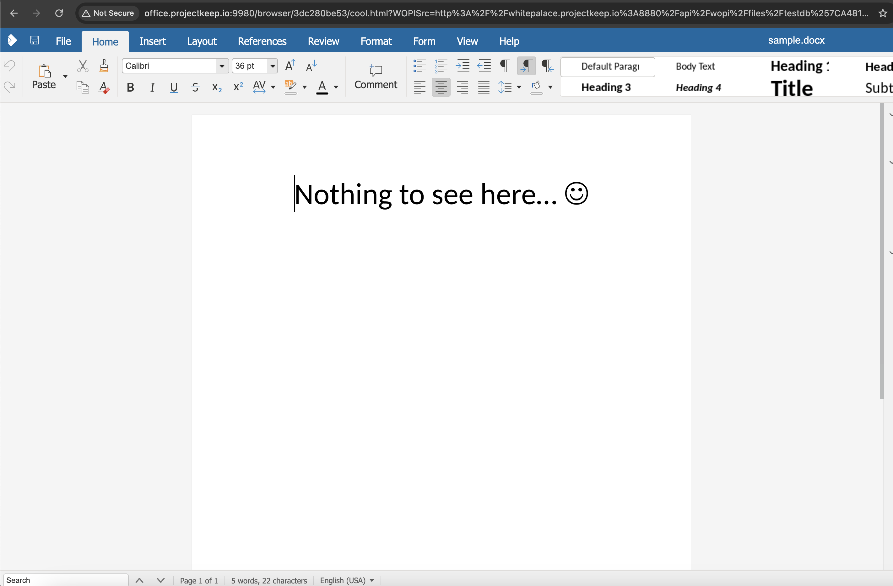

# Run Domino REST API WOPI with Collabora container

The Domino REST API can function as a [WOPI](https://learn.microsoft.com/en-us/microsoft-365/cloud-storage-partner-program/rest/ "Opens a new tab"){: target="_blank" rel="noopener noreferrer"}&nbsp;{: style="height:15px;width:15px"} host, allowing WOPI clients to connect. One such WOPI client is Collabora[^1], an open-source office suite based on LibreOffice[^2], that enables real-time collaborative document editing in a web browser.

[^1]: Collabora is a trademark or registered trademark of Collabora Productivity Ltd or Collabora Ltd in various countries.
[^2]: LibreOffice and The Document Foundation are registered trademarks of their corresponding registered owners or are in actual use as trademarks in one or more countries.

## About this task

Guides you on how to set up a local Collabora container and use it to enable real-time collaborative document editing in a web browser.

## Before you begin

Download the following zip file to extract the necessary files for setting up a Collabora container.

[collabora.zip](../../assets/downloads/collabora.zip)

## Procedures

The following procedures guide you in setting up your local Collabora container and configuring it to work with Domino REST API.

### Set up the Collabora container

1. Navigate to the directory where you downloaded the zip file, and then extract the downloaded zip file. You should see a `config` folder, a `docker-compose.yml` file, and a `readme.md` file.
2. Create an `.env` file using a text editor and include the following configuration parameters.

    ```env
    COLLABORA_DOMAIN=office.demo.io:9980
    COLLABORA_USER=admin
    COLLABORA_PASSWORD=secret
    ```

3. Save the created `.env` file.
4. Execute the `docker compose up` command to create and start your Collabora container.
5. Once the container is running, open your web browser and navigate to `office.demo.io:9980`. You should see an **OK** response indicating that the service is operational.

    {: style="height:80%;width:80%"}

!!! tip

    - If the container is running but the service is not working, add the following line in your `hosts` file then try again.

        ```text
        127.0.0.1 office.demo.io:9980
        ```
    - For more information, see the [Collabora Installation Guide](https://sdk.collaboraonline.com/docs/installation/index.html).

### Configure Collabora client to work with Domino REST API

1. Create a document with a file attachment, such as `.pptx` file or `.docx` file. Make sure to take note of **UNID** and **dataSource** of the document you created.

2. Send a POST request to your Domino REST API host `/api/wopi/filetoken?dataSource={dataSource}` with the following body:

    ```json
    {
      "fileName": "{fileName}",
      "unid": "{unid}"
    }
    ```

    wherein:

    - `{dataSource}` is the name of the **dataSource** where the document containing the file attachment is located.
    - `{fileName}` is the attachment filename.
    - `{unid}` is the UNID of the document containing the file attachment.

3. Check the response and take note of the values of the `access_token`, `file_id`, and `access_token_ttl`.

    The response should include details of the attachment file as shown in the following example response.

    ```json
    {
      "dataSource": "testdb",
      "unid": "A3A40F96234F592A00258CE4002F7E57",
      "fileName": "sample.docx",
      "access_token": "3bbf9765cc149c283a37f8ea786269be0cdd63b94f4955da9b054c82bca9ce9caaa0893e37be842b4259baf8bb1eab97c742ab9a66422937cc6d57be9d8841f82b37b98eb0295d0bab0994f322b57efbc6f2f252b346258704af29f4b75bedf4e4737aa2",
      "file_id": "testdb%7CA3A40F96234F592A00258CE4002F7E57%7Csample.docx",
      "access_token_ttl": 1755024046000
    }
    ```

4. Open your browser and go to `office.demo.io:9980/hosting/discovery` where you will see an XML with URLs having the format `office.demo.io:9980/browser/{hash}/cool.html?`. Take note of the `{hash}` value.

    In the following example image, the value of `{hash}` is `3dc280be53`.

    {: style="height:80%;width:80%"}

5. Construct the URL using the format `{DRAPI_HOST}/api/wopi/files/{file_id}` by replacing the following variables as indicated below:

    - Substutite `{DRAPI_HOST}` with your Domino REST API hostname.
    - Substitute `{file_id}` with the `file_id` you took note from the response to the POST request.

    The resulting URL will serve as the value assigned to the variable `WOPISrc`.

6. Send a POST request to `office.demo.io:9980/browser/{hash}/cool.html?WOPISrc={UrlEncodedWOPISrc}`.

    wherein:

    - `{hash}` is the value you noted in one of the previous steps.
    - `{UrlEncodedWOPISrc}` is the value of the `WOPISrc` variable in a URL encoded format.

    The request body should be a `multipart/form-data` format, and include the following:

    - `access_token` obtained from the response to the POST request you made to your Domino REST API host.
    - **Optional**: `access_token_ttl` that can also be obtained from the response to the POST request you made to your Domino REST API host.

    !!! tip

        If you can't do a `multipart/form-data` request body, send a GET request to the same URL with the `access_token` and *optionally* the `access_token_ttl` as query parameters.


    A successful request enables you to view and edit the document using Collabora.

    {: style="height:80%;width:80%"}

<!--
    This request should have something like this as a response:

    ```json
    {
      "dataSource": "testdb",
      "unid": "A3A40F96234F592A00258CE4002F7E57",
      "fileName": "sample.docx",
      "access_token": "3bbf9765cc149c283a37f8ea786269be0cdd63b94f4955da9b054c82bca9ce9caaa0893e37be842b4259baf8bb1eab97c742ab9a66422937cc6d57be9d8841f82b37b98eb0295d0bab0994f322b57efbc6f2f252b346258704af29f4b75bedf4e4737aa2",
      "file_id": "testdb%7CA3A40F96234F592A00258CE4002F7E57%7Csample.docx",
      "access_token_ttl": 1755024046000
    }
    ```

    The response should list out the details and source of the attachment file you want to open, as well as the `access_token` in order to use it with Collabora. Take note of the `access_token` and `file_id`.


We need a running Collabora container, if you don't have one, you can use the following ZIP file to extract files needed to setup a Collabora container: [collabora.zip](../../assets/downloads/collabora.zip)


Extract `collabora.zip`, you should be able to see a `config` folder, as well as a `docker-compose.yml` file. Create an `.env` file like the following:

```env
COLLABORA_DOMAIN=office.demo.io:9980
COLLABORA_USER=admin
COLLABORA_PASSWORD=secret
```

Once the `.env` file is setup, do the command `docker compose up`. Once it is running, try to go to `office.demo.io:9980` using your web browser, you should be able to see an `OK` response.


!!!tip
    If it's not working even if it's running, you can try to add the following line in your `hosts` file then try again:

    ```text
    127.0.0.1 office.demo.io:9980
    ```

!!!note
    For more information, there is an [installation guide](https://sdk.collaboraonline.com/docs/installation/index.html) on their documentation.

## Making Collabora work with DRAPI

Once you got Collabora client all setup, we can now make it work together with DRAPI in order to have a browser based Office file editing.

Assuming that the `COLLABORA_DOMAIN` is set to `office.demo.io:9980`, here are the steps:

1. Create a document with an Office file attachment (.pptx, .docx, etc.) and take note of its UNID and dataSource.

2. Send a POST request to your DRAPI host `/api/wopi/filetoken?dataSource={dataSource}` with the following body:

    ```json
    {
      "fileName": "{fileName}",
      "unid": "{unid}"
    }
    ```

    Replace the values:

    - `{dataSource}` with the dataSource the document with attachment is located.
    - `{fileName}` with the attachment file name.
    - `{unid}` with the UNID of the document with attachment.

3. Check the response and take note of the values of the `access_token` and `file_id`. The response should include details of the 

    This request should have something like this as a response:

    ```json
    {
      "dataSource": "testdb",
      "unid": "A3A40F96234F592A00258CE4002F7E57",
      "fileName": "sample.docx",
      "access_token": "3bbf9765cc149c283a37f8ea786269be0cdd63b94f4955da9b054c82bca9ce9caaa0893e37be842b4259baf8bb1eab97c742ab9a66422937cc6d57be9d8841f82b37b98eb0295d0bab0994f322b57efbc6f2f252b346258704af29f4b75bedf4e4737aa2",
      "file_id": "testdb%7CA3A40F96234F592A00258CE4002F7E57%7Csample.docx",
      "access_token_ttl": 1755024046000
    }
    ```

    The response should list out the details and source of the attachment file you want to open, as well as the `access_token` in order to use it with Collabora. Take note of the `access_token` and `file_id`.

3. Go to `office.demo.io:9980/hosting/discovery`.

    

    This will return an XML with a bunch of URLs with the format `office.demo.io:9980/browser/{hash}/cool.html?`. Take note of the `{hash}` value.

4. Assemble the URL format `{DRAPI_HOST}/api/wopi/files/{file_id}`.

    Replace the values:

    - `{DRAPI_HOST}` with your DRAPI hostname.
    - `{file_id}` with the `file_id` you took note earlier (see step 2).

    The formed URL will serve as the `WOPISrc`.

5. Send a POST request to `office.demo.io:9980/browser/{hash}/cool.html?WOPISrc={UrlEncodedWOPISrc}`.

    Replace the values:

    - `{hash}` with the `hash` you took note earlier (see step 3).
    - `{UrlEncodedWOPISrc}` is the `WOPISrc` URL formed earlier (see step 4) in a URL encoded format.

    The request body should be a `multipart/form-data` format, with the following values:

    - `access_token` as the `access_token` you took note earlier (see step 2).
    - *(OPTIONAL)* `access_token_ttl` as the `access_token_ttl` from step 2.

    **ALTERNATIVELY**, if you can't do a `multipart/form-data` request body, you can send a GET request instead to the same URL, with the `access_token` and *optionally* `access_token_ttl` as query parameters.

    A successful request would allow you to view/edit the document using Collabora.

    

## References

- [WOPI specification](https://learn.microsoft.com/en-us/microsoft-365/cloud-storage-partner-program/rest/)
- [Collabora Online documentation](https://sdk.collaboraonline.com/docs/introduction.html)
-->