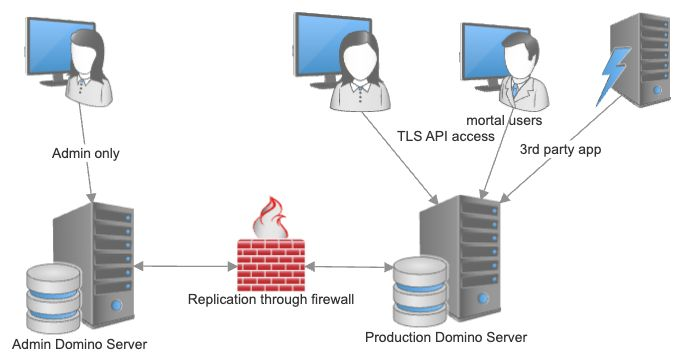
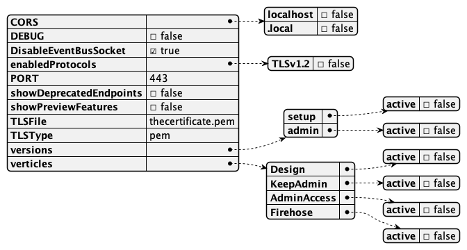

# Hardened production setup

The Domino REST API can be configured to run without configuration and admin access on the server that hosts production databases. Let us outline how.



- The admin server is only accessible by administrators and not reachable from the general network.
- The Domino REST API is installed on both servers.
- The `KeepConfig.nsf` replicates between admin and production server.
- We have a TLS certificate `thecertificate.pem`.
- The password for the TLS certificate is provided as environment parameter `TLSPassword`.
- The production server has a hardened config using `hardening.json`.
- Domino's nhttp isn't running or isn't using Port 443.

## hardening.json

The name, as long as it ends in `.json`, can be chosen freely. It needs to be placed into the `keepconfig.d` directory.



```json
{
  "CORS": {
    "localhost": false,
    ".local": false
  },
  "DEBUG": false,
  "DisableEventBusSocket": true,
  "enabledProtocols": {
    "TLSv1.3": true,
    "TLSv1.2": false
  },
  "PORT": 443,
  "showDeprecatedEndpoints": false,
  "showPreviewFeatures": false,
  "TLSFile": "thecertificate.pem",
  "TLSType": "pem",
  "versions": {
    "setup": {
      "active": false
    },
    "admin": {
      "active": false
    }
  },
  "verticles": {
    "Design": {
      "active": false
    },
    "KeepAdmin": {
      "active": false
    },
    "AdminAccess": {
      "active": false
    },
    "Firehose": {
      "active": false
    }
  }
}
```

## Things to consider

- Are all API consumers capable of TLS 1.3?
- Do you need CORS support for static application on other servers?
- Shall the Domino REST API serve as Identity Provider (IdP) or is there a corporate IdP to be used?

YMMV

<!--## Let's connect

"feedback.md"-->
