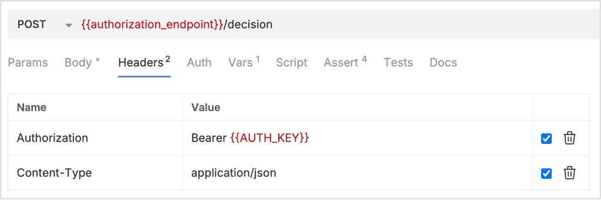
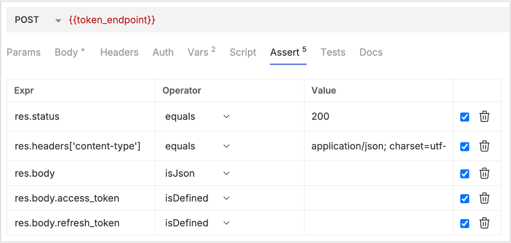

# Investigate OAuth

## About this task

Guides you into OAuth authentication to use Domino REST API using [Bruno](../../references/usertools.md).

## Before you begin

- You have installed **Bruno**.

    Bruno is available as a native desktop app for macOS, Windows, and Linux. For more information, see [Download Bruno's Desktop Application](https://docs.usebruno.com/get-started/bruno-basics/download "Opens a new tab"){: target="_blank" rel="noopener noreferrer"}&nbsp;{: style="height:15px;width:15px"}.

- Take note of the *Environment variables*.

    In the APIs used in the OAuth investigation, you will see fields surrounded by double brackets like `{{OAUTHHOST}}` or `{{AdminName}}`. These fields represent user inputs and should generally not be hard coded. You can use the following as reference:

    ```
    vars {
      AdminName: John Doe
      OAUTHHOST: http://localhost:8880
      state: someRandomValue
    }
    vars:secret [
      AdminPassword
    ] 
    ```

## Procedure

### Get OAuth endpoints

Use the following API to get the OAuth endpoints. Make sure to add the variables in the **Vars** tab and assertions in the **Assert** tab as shown in the following images.


### Log in to check the app

Use the following API to log in. Make sure to add the required details in the **Body** and the **Headers** tabs, and also add the variables in the **Vars** tab and assertions in the **Assert** tab as shown in the following images.


### Get the scopes

Use the following API to get the scopes. Make sure to add the required details in the **Headers** tab and add the assertions in the **Assert** tab as shown in the following images.


### Get the app

Use the following API to get the app. Make sure to add the required details in the **Headers** tab, and also add the variables in the **Vars** tab and assertions in the **Assert** tab as shown in the following images.


### Reset client secret

Use the following API to reset the client secret. Make sure to add the required details in the **Body** and the **Headers** tabs. Also add the parameters in the **Params** tab, the variables in the **Vars** tab, and the assertions in the **Assert** tab as shown in the following images.

!!! warning "Important!"

    Take extra caution when resetting the client secret. You have to update it where ever it's used. Otherwise, you won't be able to establish a connection to the app. Also, make sure to take note of the client secret you will be using.


### Send OAuth authorization request

Use the following API to send the OAuth authorization request. Make sure to add the parameters in the **Params** tab, the variables in the **Vars** tab, the script in the **Script** tab, and the assertions in the **Assert** tab as shown in the following images.


### Send OAuth authorization request after an HTTP 302 response 

Use the following API to send the OAuth authorization request after getting an HTTP 302 response. 


### Log in for OAuth acceptance

Use the following API to log in for OAuth acceptance. Make sure to add the required details in the **Body** and the **Headers** tabs. Also add the variables in the **Vars** tab and the assertions in the **Assert** tab as shown in the following images.


### Create authorization decision

Use the following API to create the authorization decision. Make sure to add the required details in the **Body** and the **Headers** tabs. Also add the variables in the **Vars** tab, and the assertions in the **Assert** tab as shown in the following images.





### Exchange authorization code for access token

Use the following API to post the authorization decision. Make sure to add the required details in the **Body** tab. Also add the variables in the **Vars** tab, and the assertions in the **Assert** tab as shown in the following images.


### Check if access token works

Use the following API to get the scopes to check if the access token works. Make sure to add the required details in the **Headers** tab and the assertions in the **Assert** tab as shown in the following images.


### Exchange refresh token for access token

Use the following API to exchange the refresh token for the access token. Make sure to add the required details in the **Body** tab. Also add the variables in the **Vars** tab, and the assertions in the **Assert** tab as shown in the following images.




### Check if the refresh token works

Use the following API to get the scopes to check if the refresh token works. Make sure to add the required details in the **Headers** tab and the assertions in the **Assert** tab as shown in the following images.


