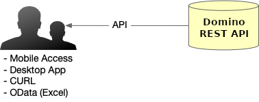
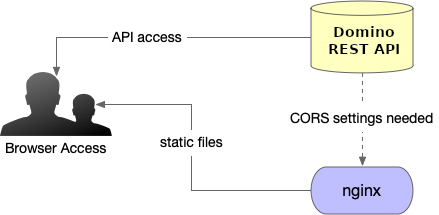
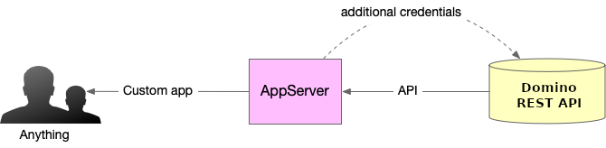
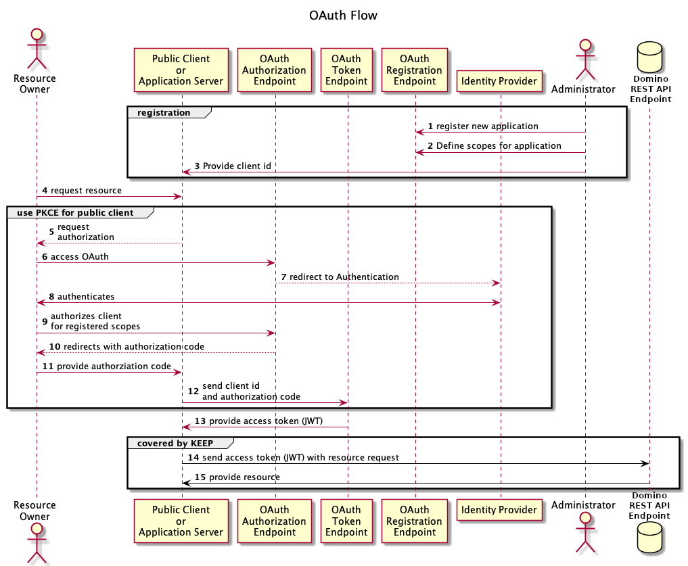
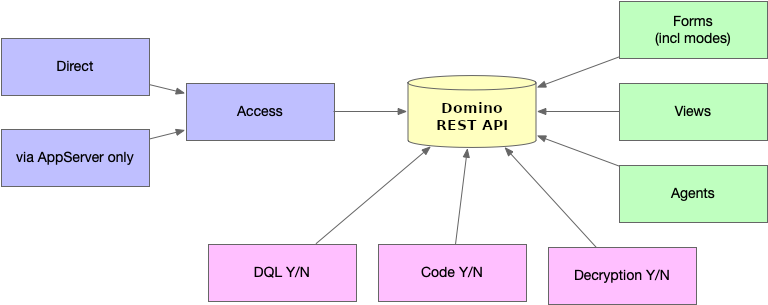

# Plan you application

The Domino REST API allows a flexible approach to utilizing Domino as a NoSQL data store. This flexibility requires that you plan well and consider several questions based on the properties of the Domino REST API.

## About this task

The procedure guides you on planning your application by considering the following key criteria:

- application type
- authentication
- access management

## Procedure

1. Determine the type of application you want to build. 

    - If your application is mobile, desktop, including Microsoft Excel[^1], or uses a command line with cURL, it requires direct access to the server.

        [^1]: Microsoft and Excel are registered trademarks or trademarks of Microsoft Corporation in the United States and/or other countries.

        

    - If your application is a web application built with frameworks like ReactJS or Angular, you can host the static files in the `keepweb.d` directory or on your chosen Domino server.

        

        

    - If you are building a server-based application using technologies like NodeJS, Ruby, Spring Boot, PHP, Rust, or Go, it can act as an intermediary between the Domino REST API and another application. Note that this type of application doesn't support open access and requires additional credentials.

        

2. Determine the authentication method you want to implement for your application.

    - You can use the Domino REST API, which offers an endpoint allowing you to exchange a Domino username and password for a JWT access token.

    - For a more robust and flexible authentication method, you can use an external identity provider (IdP) that generates the JWT access token as a result of an OAuth flow. Refer to the following diagram to better understand the OAuth flow.

        

3. Fine-tune your access permissions through the Domino REST API configuration. The Domino REST API allows you to:

    - execute DQL queries. Further access can be fine-tuned using an `@Formula`.
    - post code snippets (JS or Groovy) for execution.
    - decrypt encrypted items if the user has a suitable key.
    - specify which views to expose on the API.
    - specify which agents to expose on the API.

    - specify which forms to expose on the API. Here, [the Barbican's capabilities](../../references/extensibility/barbican.md) are used to tailor field access based on document data and current user, allowing for API-based data integrity.

    

<!--
# Planning your application

Domino REST API allows a very flexible approach to utilize Domino as your NoSQL data store. This flexibility requires that you plan well and consider a number of questions, based on Domino REST API's properties.

## Application type

Determine what type of application you want to build.

If the planned application is mobile, desktop (including Excel), or just uses a command line with curl, it would use direct access.

If the planned application is a web application, build using ReactJS, Angular, etc, you can host the static application files in `keepweb.d` directory or your Domino server of choice.

Finally, if the planned application is application-server-based, like NodeJS, Ruby, SpringBoot, PHP RUST or Go, it can sit between Domino REST API and the application. This type of application doesn't support open access and requires additional credentials.

## Authentication

Domino REST API provides an endpoint to exchange a Domino user name and password for a JWT Access Token. This is a great way to get started.

For more robust and flexible authentication, the use of an external identity provider (IdP) that generates the JWT access token as result of an OAuth flow is recommended.

## Detailed access management

The Domino REST API configuration allows you to fine tune access permissions. Domino REST API allows you to:

- Execute DQL queries. Further access can be fine tuned using an `@Formula`.
- Post code snippets (JS or Groovy) for execution.
- Decrypt encrypted items, if the user has a suitable key.
- Specify which views to expose on the API.
- Specify which agents to expose on the API.

- Specify which forms to expose on the API. Here, [the Barbican's capabilities](../references/extensibility/barbican.md) is used to tailor field access based on document data and current user, allowing for API-based data integrity.

-->