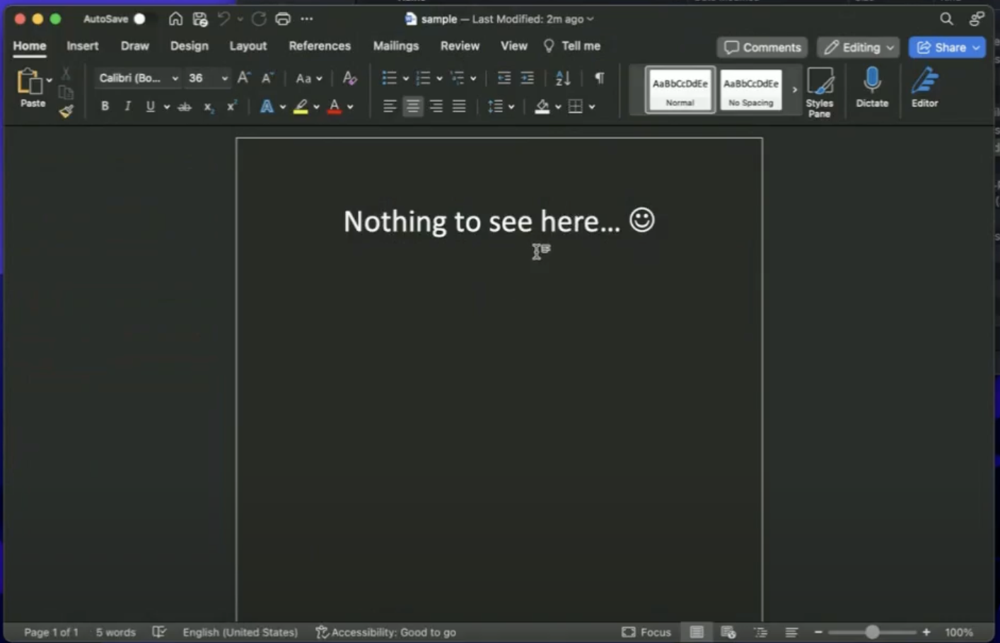
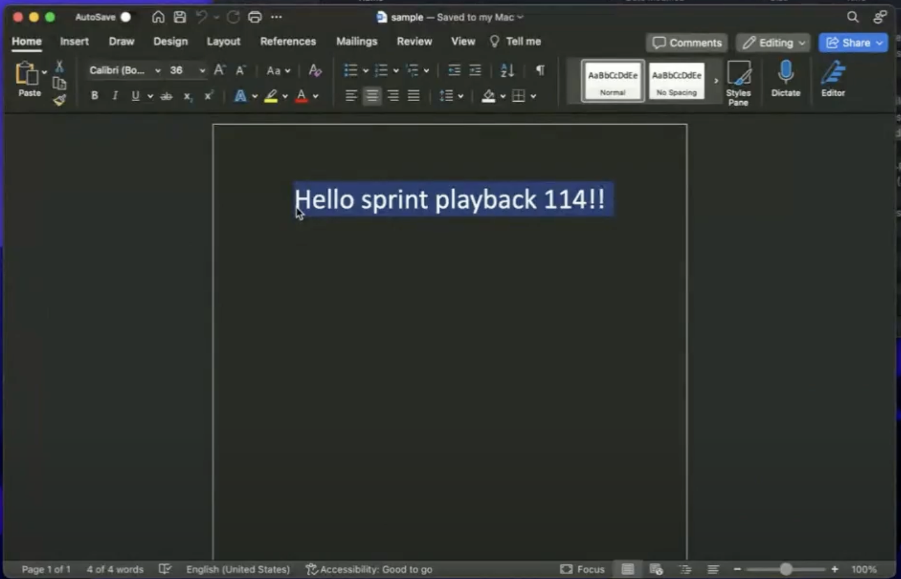

# Set up Office Round Trip Experience

Microsoft[^1] Office Round Trip Experience is a feature in Domino REST API that simplifies editing of a supported Microsoft Office file attached to a Domino document. This feature enables you to access, edit, and save the changes to the attached file using the applicable Microsoft Office application without downloading and re-attaching the file to the Domino document.

[^1]: Microsoft, Windows, Microsoft Office, Office 365, Microsoft Word, Microsoft PowerPoint, Microsoft Excel, Microsoft Visio, Microsoft Access, Microsoft Project, Microsoft Publisher, and Microsoft InfoPath are either registered trademarks or trademarks of Microsoft Corporation in the United States and/or other countries.

## About this task

The procedure guides you on how to set up and use the Microsoft Office Round Trip Experience in Domino REST API.

## Before you begin

- Make sure Microsoft Office is installed on your computer or you can access Office 365.
- Domino REST API must be running over HTTPS.

## Procedures

### Add an MS Office attachment and create a link

1. Add a Microsoft Office file as an attachment to a Domino document.

    !!! tip

        You can use the `POST /attachments/{unid}` endpoint in the [Swagger UI](../../tutorial/swagger.md) to add the file as attachment.

2. Create a link to access the attached file by either:

    - Manually creating the link using the following format:

        ```text
        <scheme name>:<command name>|u|<DRAPI HTTPS hostname>/api/webdav-v1/attachment/<dataSource>/<document UNID>/<filename>
        ```

        Where:

        |Property|Description|
        |:-----|:--------|
        |scheme name|Scheme name of Microsoft Office application</br></br>When Microsoft Office is installed, each scheme name is registered with the operating system to be handled by the Office product of the same name. Below is a list of scheme names:</br></br>ms-word</br>ms-powerpoint</br>ms-excel</br>ms-visio</br>ms-access</br>ms-project</br>ms-publisher</br>ms-infopath|
        |command name|Describes the action that the application should perform.</br></br>**ofv** - to view the file attachment</br>**ofe** - to edit the file attachment</br>|
        |DRAPI HTTPS hostname| Domino REST API HTTPS hostname|
        | dataSource | Domino database where your current document is uploaded or attached.|
        | document UNID| Universal ID of the Domino document.|
        | filename | Filename of the Microsoft Office file attached to the Domino document.|

        **Example link**:</br>
        `ms-word:ofv|u|whitepalace.keepproject.io:8880/api/webdav-v1/attachment/attachmentdb/2D88CDF9549379C700258A9F002797CA/sample.docx`

        !!! info

            The link format is based on the [Office URI Schemes](https://learn.microsoft.com/en-us/office/client-developer/office-uri-schemes).

    - Or using the `GET /attachmentnames/{unid}` endpoint to retrieve URLs to access the attached files.

        !!! caution "Important"

            Make sure to set the value of the `includeProtocolUrl` query parameter to `true` to include the attachment URLs in the query response.

        The query response shows the filenames of the attachments and the URLs of the attachments with supported file extensions. There are two URLs for each attachment, one for viewing as indicated by the `ofv` command name and one for editing as indicated by the `ofe` command name included in the URLs. Attachments with unsupported file extensions will have no URLs.

        The query response example below shows the attachment file named `document.docx` has two URLs, as the file extension `.docx` is supported. However, no URLs are available for the attachment file named `sample.png` as the file extension `.png` isn't yet supported.

        ```json
        {
        "Files": [
            {
            "filename": "document.docx",
            "urls": [
                "ms-word:ofv|u|http://localhost:8880/api/webdav-v1/attachment/dataSource/documentUNID/document.docx",
                "ms-word:ofe|u|http://localhost:8880/api/webdav-v1/attachment/dataSource/documentUNID/document.docx"
                    ]
            },
            {
            "filename": "sample.png",
            "urls": []
            }
                ]
        } 
        ```

### Access and edit the MS Office file attachment

??? tip "Recommendation for round-trip editing on Windows"

    For successfully performing round-trip editing on Windows, it's recommended to deactivate the protected view for files originating from the Internet before executing this procedure. To do this:

    1. Open the Microsoft application for round-trip editing.
    2. Go to **File** &rarr; **Options**.
    3. Select **Trust Center** &rarr; **Trust Center Settings** &rarr; **Protected View**.
    4. Clear the **Enable Protected View for files originating from the Internet** checkbox, and then click **OK**.


1. Open the created link to the MS Office file attachment in a web browser.
2. In the Open MS Office application dialog, click **Open**.

    The following image shows an example of the **Open Microsoft Word** dialog when trying to open a Microsoft Word attachment.

    {: style="height:50%;width:50%"}

3. In the login dialog, enter your Domino REST API login credentials and click **Login**.

    The authentication is based on the [Office Forms Based Authentication (OFBA)](https://learn.microsoft.com/en-us/openspecs/sharepoint_protocols/ms-ofba/30c7bbe9-b284-421f-b866-4e7ed4866027) protocol. This is necessary since browsers and office applications don't currently support cookie and header sharing.

    {: style="height:50%;width:50%"}

    !!! note

        You might see a different login dialog with less functionality for OFBA when doing this on **Windows**. It's because some Microsoft applications in **Windows** still use **Internet Explorer**, and many of the functionalities we use in the original login dialog are unsupported.

    The MS Office file attachment is now opened in the applicable MS Office application. In the following image, you see an opened MS Word document as an example.

    {: style="height:80%;width:80%"}

4. Edit the attachment as required.

    !!! note

        Editing is only possible if the specified command name in the created link is `ofe`.

    As an example, the content of the opened MS Word document is changed from *Nothing to see here* to *Hello Sprint playback 114!!*.

5. Save your changes, and close the application. You have now edited the attachment without downloading and reattaching it to the Domino document.

### Verify updates to the file attachment

1. Open the created link to the edited MS Office file attachment in a web browser.
2. In the Open MS Office application dialog, click Open.
3. In the login dialog, enter your Domino REST API login credentials and click **Login**. The attachment opens in the applicable MS Office application, enabling you to verify the updates.

    As an example, the following image shows that the content of the edited Microsoft Word attachment has been updated.  

    {: style="height:80%;width:80%"}

## Additional information

This section lists file extensions recognized by the Domino REST API for Office Forms Based Authentication.

|Application|File name extension|
|:---|:---|
|Microsoft Word|`.doc`, `.docm`, `.docx`, `.dot`, `.dotm`, `.dotx` |
|Microsoft PowerPoint|`.pot`, `.potm`, `.potx`, `.ppt`, `.pptm`, `.pptx`, `.pps`, `.ppsm`, `.ppsx`, `.sldm`, `.sldx`|
|Microsoft Excel|`.xla`, `.xla`, `.xlm`, `.xls`, `.xlsb`, `.xlsm`, `.xlsx`, `.xlt`, `.xltm`, `.xltx`, `.xlw`, `.csv`|
|Microsoft Visio|`.vdx`, `.vsd`, `.vsdx`, `.vss`, `.vst`, `.vsw`, `.vsx`, `.vtx`|
|Microsoft Access|`.accda`, `.accdb`, `.accdc`, `.accde`, `.accdp`, `.accdr`, `.accdt`, `.accdu`, `.mdb`|
|Microsoft Project|`.mpd`, `.mpp`, `.mpt`|
|Microsoft Publisher|`.pub`|
|Microsoft InfoPath|`.xsn`, `.xsf`|
