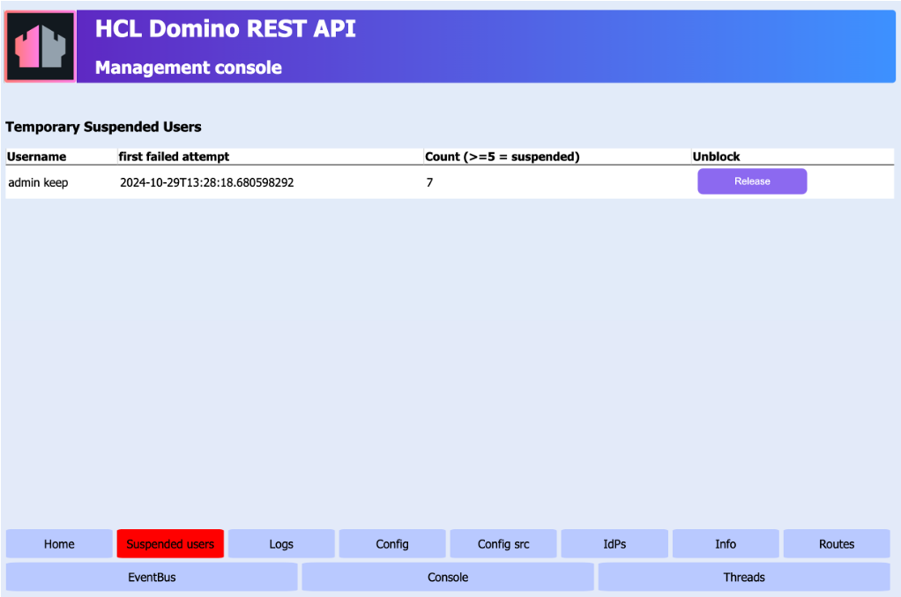

# Release suspended users

## About this task

Users who enter incorrect credentials more than a predetermined number of times (the default is five times) when accessing the **Admin UI** are locked out for 60 minutes. This procedure guides you in identifying those users and releasing them from lockout, so they can access the **Admin UI** without waiting for the 60 minutes to pass.

## Before you begin

You must have access to the **Management console**.

!!! note
     - Make sure the **Management console** is secure. For more information, see [Functional Accounts](../../references/functionalUsers.md).
     - Credentials for the **Management console** aren't managed by the configured IdP, but are derived from the [configuration of functional accounts](../../references/functionalUsers.md).

## Procedure

1. Log in to the **Management console** (Port 8889).

    

2. Click **Suspended users**. The **Temporary Suspended Users** page opens.

    The **Temporary Suspended Users** page shows the username of the suspended user, the date and time of the first failed attempt, and the number of failed attempts.

    

3. Click **Release** corresponding to the temporarily suspended user that you want to unban so that user can now access **Admin UI** without waiting for the lockout period to end. 