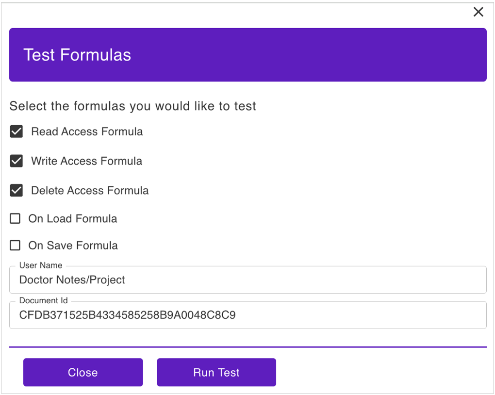
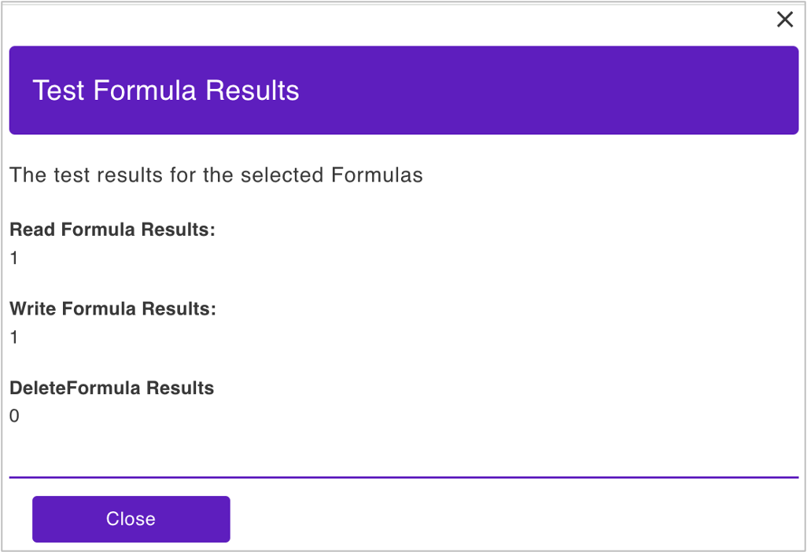

# Test formulas

## About this task

Guides you on testing if a user has read, write, and delete access to the database form based on the **Formula for Read Access**, **Formula for Write Access**, and **Formula for Delete Access** in the **Mode Settings** in the **Admin UI**.

## Before you begin

- You have the hierarchical or canonical name of the user whose access you want to test. 
- You have obtained the UNID of the database form for which you want to test the user's access.
- You are already in the database form **Access Mode** page. For more information, see [Change form configuration](../../references/usingwebui/schemaui.md#change-form-configuration).

## Procedure

1. Under **Mode Settings**, click **Test Formulas**. The **Test Formulas** pane opens. 
2. Select the checkbox corresponding to the formula you want to test.
3. Enter the name of the user, whose access you want to test, in either a hierarchical format or canonical format in the **User Name** text box.
4. Enter the UNID of the document or database form in the **Document Id** text box.
5. Click **Run Test**.

{: style="height:75%;width:75%"}

!!!note

    The test takes into account the assigned access level of the user with respect to the Domino database.

## Expected result

The default formula for read and write access is [`@True`](https://help.hcl-software.com/dom_designer/14.0.0/basic/H_TRUE.html), while the default formula for delete access is [`@False`](https://help.hcl-software.com/dom_designer/14.0.0/basic/H_FALSE.html). If the tested user has read and write access and doesn't have delete access to the database form, the test result should be as shown below:

{: style="height:75%;width:75%"}

## Additional information

You can also add a formula based on Formula Language to the **On Save Formula** and **On Load Formula** and have it tested using the same procedure. For more information, see [Formula Language](https://help.hcl-software.com/dom_designer/14.0.0/basic/H_NOTES_FORMULA_LANGUAGE.html). 