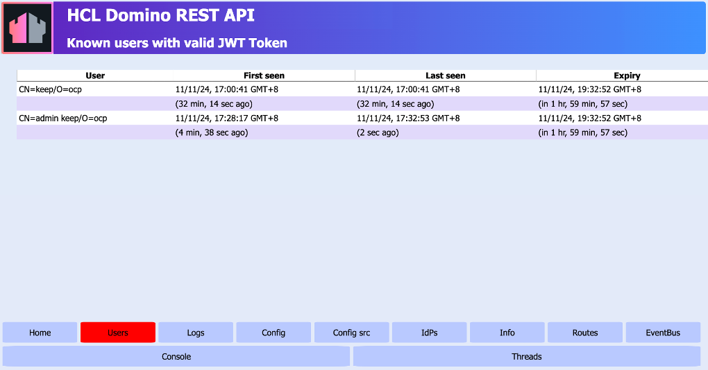

# Identify known users with valid JWT token

## About this task

Guides you on how to identify known users with valid JWT tokens. 

## Before you begin

You must have access to the **Management console**.

!!! note
     - Make sure the **Management console** is secure. For more information, see [Functional Accounts](../../references/functionalUsers.md).
     - Credentials for the **Management console** aren't managed by the configured IdP, but are derived from the [configuration of functional accounts](../../references/functionalUsers.md).

## Procedure

1. Log in to the **Management console** (Port 8889).
   
    

2. Click **Users**. The **Known users with valid JWT Token** page opens. 

    

    The **Known users with valid JWT Token** page includes the following columns:
    
    |Column name     |Description|
    |:---|:---|
    |User|It shows the usernames, in the canonical format, of known users who have or had valid JWT tokens.|
    |First seen|It shows the date and time when the known user has first logged in to Domino REST API.  The succeeding row indicates how long it has been since the known user first logged in to Domino REST API based on the server time after the **Users** tab is opened or refreshed.|
    |Last seen|It shows the date and time when the known user has logged out of the Domino REST API, or closed the Domino REST API.  The succeeding row indicates how long it has been since the known user logged out or closed the Domino REST API based on the server time after the **Users** tab is opened or refreshed.|
    |Expiry|It shows the date and time the validity of the user's JWT token starts.  The succeeding row indicates how long before the JWT token will expire or how long the JWT token has expired based on the server time after the **Users** tab is opened or refreshed.|

    !!!note
        If the user accesses Domino REST API after the token expires, the user must go through the login process.
