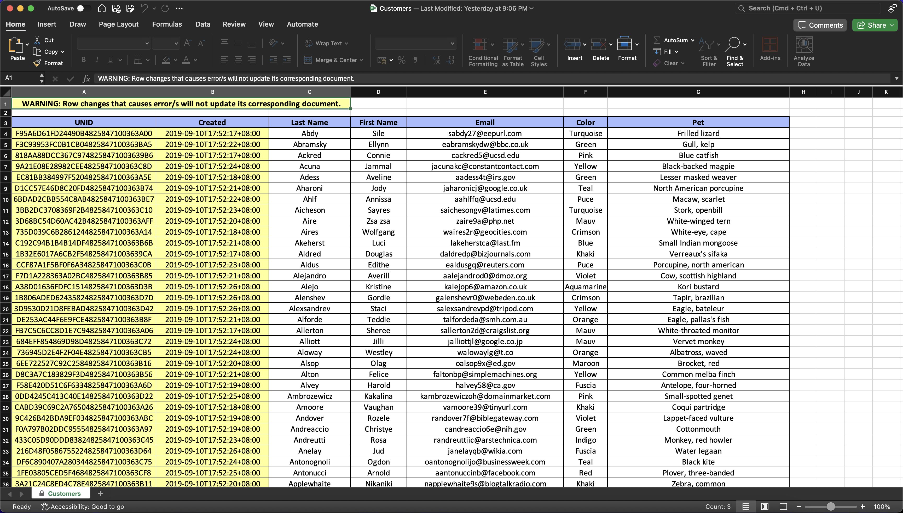

# Set up Virtual Spreadsheet

Virtual Spreadsheet enables you to open and edit view entries using Microsoft Excel[^1]. This feature uses the [round trip editing feature](roundtrip.md) of Domino REST API for Microsoft Office applications.

[^1]: Microsoft and Excel are registered trademarks or trademarks of Microsoft Corporation in the United States and/or other countries.

Coming from the word *virtual*, virtual spreadsheet doesn't exist as a spreadsheet file anywhere. It's only created on demand and returned as a spreadsheet file to the user. It's also not saved back as a whole spreadsheet file. Instead, Domino REST API reads each row and updates each document tied to its respective view entry.

Virtual spreadsheet is best used when viewing a list view using Microsoft Excel and performing bulk updates.

## About this task

The procedure guides you on how to set up and use the Virtual Spreadsheet feature.

## Prerequisite

- Make sure your computer has Microsoft Excel installed.
- You must run your Domino REST API in HTTPs.

## Procedure

1. Choose an active view that you want to open. 

    !!!tip
        - To get a list of your views from your target schema, see [List available database views](../../references/usingwebui/schemaui.md#list-available-database-views).
        - You can set up the view schema however you wish as Virtual Spreadsheet respects the configured view schema.

2. Based on your chosen view, set up a [`vsheet`](../../references/usingdominorestapi/modenames.md#vsheet) mode in the form that includes your chosen view. 

    You can use the `GET /design/{designType}` or `GET /design/{designType}/{designName}` endpoint to identify the form from the response. Make sure to set the value of the `designType` parameter to *views*. For example, if your view's `selectionFormula` states `Form = 'Customers'...` in the response, then you must add the `vsheet` mode to the `Customers` form.

    To set up the `vsheet` mode, follow the steps for [adding a mode](../../references/usingwebui/schemaui.md#add-a-mode).
    
    <!--To do this, you can go into the Admin UI and going in the **Database Forms** section. Find the form in there and click the edit icon. Inside the form configuration page, click the `Add Mode` button and save a mode named `vsheet`.-->

    Once `vsheet` mode is created, it's recommended to add all the fields from the form in the `vsheet` mode. This way, you can make sure that each field is available for update using the Virtual Spreadsheet.

3. Form the MS Office Excel URI scheme you need to open the virtual spreadsheet using the following format:

    `ms-excel:<command name>|u|<DRAPI HTTPs hostname>/api/webdav-v1/view/<dataSource>/<view name>.xlsx`

    | Property             | Description                                                                                                                             |
    |----------------------|-----------------------------------------------------------------------------------------------------------------------------------------|
    | command name         | Describes the action that the application should perform.  ofv - to view the file attachment ofe - to edit the file attachment |
    | DRAPI HTTPs hostname | Domino REST API HTTPS hostname.                                                                                                         |
    | dataSource           | Domino database where your view is in.                                                                                                  |
    | view name            | A URL encoded name of your view.                                                                                                        |

    **Example link**:
    `ms-excel:ofe|u|https://whitepalace.projectkeep.io:8880/api/webdav-v1/view/sales/Customers.xlsx`

4. Enter the URI in a browser and approve when prompted if you want to open Microsoft Excel.
5. In the login dialog, enter your Domino REST API login credentials and click **Login**.

    If successful, you can see a spreadsheet like the example image below:

    

    !!!note
        - Protected cells have colored backgrounds. These cells are formula columns or view entry metadata. Cell protection also applies to the cells outside the main table.
        - Editable cells are cells inside the main table and has a white background.

6. Implement updates as needed and save them using the Microsoft Excel save command. You should see a prompt indicating *Saving...*. If the prompt changes to *Saved.*, it means your updates have been saved.

!!!warning "Important"
    Changes that result into an error when updating the corresponding document of the view entry won't be saved.

    For example, if you edited 10 rows and 1 row encountered an error, Microsoft Excel would prompt a successful save, but in reality, that 1 row's changes wouldn't get reflected back in its corresponding document.

    This also includes trying to save the changes made with no `vsheet` mode, Microsoft Excel would show that it's saved, but in reality it's not.
