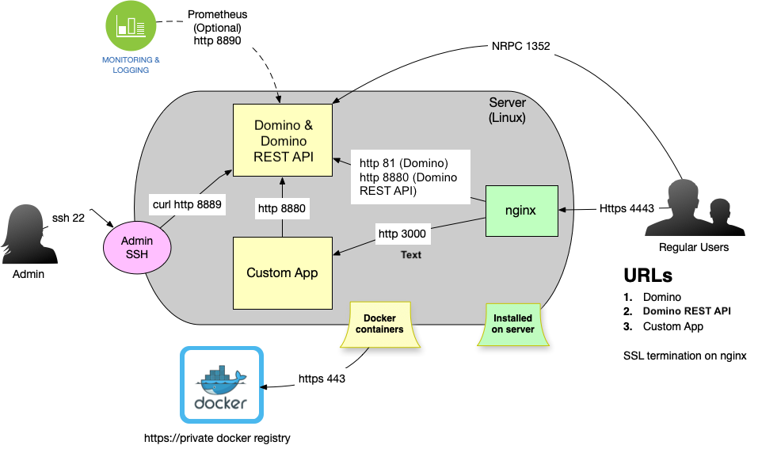

# Configure nginx as HTTPS proxy with subdomains

--8<-- "keepmngtURLcaution1.md"

## About this task

The provided information guides you in configuring nginx as an HTTPS proxy with subdomains.

!!!tip
    Know more about [Domino REST API and Proxy](../../topicguides/keepasproxy.md). 

## Configuring nginx as an HTTPS proxy with subdomains

A typical deployment using a proxy looks like this:


Domino's own http runs on Port 81 and HTTPS is handled by the nginx proxy. The proxy also handles the assignment of subdomains to the correct ports. We will use three domains:

- keep.someserver.keep - access to the API
- domino.someserver.keep - access to Domino
- quatto.someserver.keep - access to an application

Alternatively, the proxy can be configured to use a single Domain and [use location routing](./httpsproxy2.md) to achieve the same result.

We start with a Port 80 configuration and then let [CertBot](https://certbot.eff.org/) handle the SSL configuration thereafter.

This example is using [Nginx](https://www.nginx.com/) and [Let's Encrypt](https://letsencrypt.org/).

```bash
server {
 server_name domino.projectkeep.rocks projectkeep.rocks;

 root /usr/share/nginx/html;

        error_page 500 502 503 504 /50x.html;
            location = /50x.html {
        }

 location / {
     proxy_cache_bypass $http_upgrade;
     proxy_set_header Upgrade $http_upgrade;
     proxy_set_header Connection "upgrade";
     proxy_set_header X-Real-IP $remote_addr;
     proxy_set_header X-Forwarded-For $proxy_add_x_forwarded_for;
     proxy_set_header X-Forwarded-Proto $scheme;
     proxy_set_header X-Forwarded-Host $host;
     proxy_set_header X-Forwarded-Port $server_port;
     proxy_pass http://127.0.0.1:81/;
 }


    listen [::]:80;
    listen 80;

}

server {
 server_name keep.projectkeep.rocks;

 root /usr/share/nginx/html;

        error_page 500 502 503 504 /50x.html;
            location = /50x.html {
        }

 location / {
     proxy_cache_bypass $http_upgrade;
     proxy_set_header Upgrade $http_upgrade;
     proxy_set_header Connection "upgrade";
     proxy_set_header X-Real-IP $remote_addr;
     proxy_set_header X-Forwarded-For $proxy_add_x_forwarded_for;
     proxy_set_header X-Forwarded-Proto $scheme;
     proxy_set_header X-Forwarded-Host $host;
     proxy_set_header X-Forwarded-Port $server_port;
     proxy_pass http://127.0.0.1:8880/;
 }


    listen [::]:80;
    listen 80;

}

server {
 server_name jmap.projectkeep.rocks;

 root /usr/share/nginx/html;

        error_page 500 502 503 504 /50x.html;
            location = /50x.html {
        }

 location / {
     proxy_cache_bypass $http_upgrade;
     proxy_set_header Upgrade $http_upgrade;
     proxy_set_header Connection "upgrade";
     proxy_set_header X-Real-IP $remote_addr;
     proxy_set_header X-Forwarded-For $proxy_add_x_forwarded_for;
     proxy_set_header X-Forwarded-Proto $scheme;
     proxy_set_header X-Forwarded-Host $host;
     proxy_set_header X-Forwarded-Port $server_port;
     proxy_pass http://127.0.0.1:3001/;
 }


    listen [::]:80;
    listen 80;

}

server {
        server_name ews.projectkeep.rocks mail.projectkeep.rocks autodiscover.projectkeep.rocks;

        root /usr/share/nginx/html;

        error_page 500 502 503 504 /50x.html;
            location = /50x.html {
        }

 location / {
     proxy_cache_bypass $http_upgrade;
     proxy_set_header Upgrade $http_upgrade;
     proxy_set_header Connection "upgrade";
     proxy_set_header X-Real-IP $remote_addr;
     proxy_set_header X-Forwarded-For $proxy_add_x_forwarded_for;
     proxy_set_header X-Forwarded-Proto $scheme;
     proxy_set_header X-Forwarded-Host $host;
     proxy_set_header X-Forwarded-Port $server_port;
     proxy_pass http://127.0.0.1:3000/;
 }

    listen [::]:80;
    listen 80;

}
```

Once deployed, use [Certbot](https://certbot.eff.org/) to activate SSL. Remember to adjust your host name.

## Expected result

The resulting system layout looks as follows. Domino REST API can also be installed together with Domino directly on the server (or virtual machine), but the diagram is the same.



The flow is the same as [single domain flow](./httpsproxy2.md). The key is the nginx configuration.
