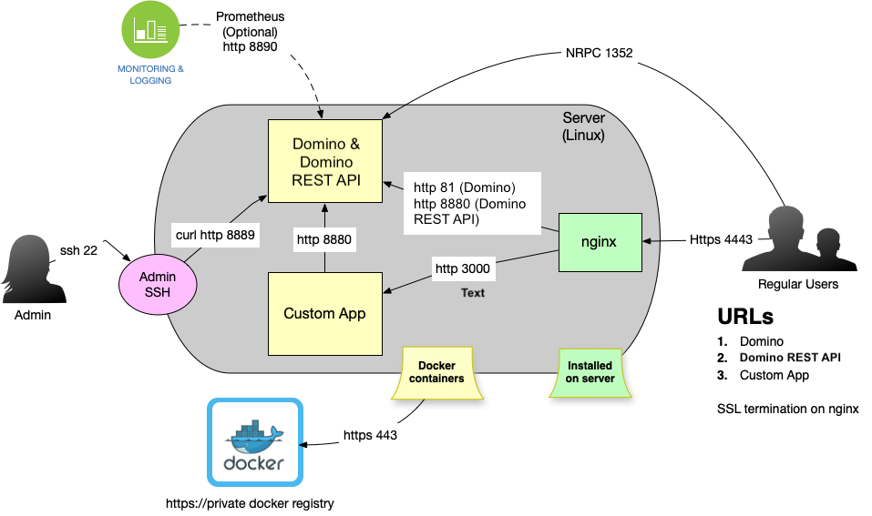

# Configure nginx as HTTPS proxy - single domain

--8<-- "keepmngtURLcaution1.md"

## About this task

The information in this section guides you in configuring nginx as an HTTPS proxy - single domain.

!!!tip
    Know more about [Domino REST API and Proxy](../../topicguides/keepasproxy.md). 

## Configuring nginx as an HTTPS proxy - single domain

When the installation requires limiting to a single Domain, routing needs to be configured on a path basis.
Again, Domino would run on port 81, but this version uses path settings instead of subdomains. When you prefer to use subdomains, check [these instructions](./httpsproxy.md) instead.

The path assignment looks like this:

- /api: Domino REST API on port 8880
- /admin/ui/: Domino REST API Admin UI on port 8880
- /keep: Domino REST API Homepage on port 8880
- /openapi: OpenAPI spec files and UI on port 8880
- /EWS: custom app on port 3000
- /autodiscover: custom app on port 3000
- /oab: custom app on port 3000
- /.wellknown/jmap: custom app on port 3001
- /jmap custom app on port 3001
- /jmapupload custom app on port 3001
- /jmapdownload custom app on port 3001
- All the rest: Domino on port 81

This example is using [Nginx](https://www.nginx.com/) and [Let's Encrypt](https://letsencrypt.org/). We start with a Port 80 configuration and then let [CertBot](https://certbot.eff.org/) handle the SSL configuration thereafter.

## Initial configuration

Depending on your platform, the following `keep.conf` in nginx's configuration directory, typical `conf.d` or `sites-enabled`:

```bash
server {
    server_name domino.projectkeep.rocks;

    listen [::]:80;
    listen 80;

    root /usr/share/nginx/html;

    error_page 500 502 503 504 /50x.html;
    location = /50x.html {
    }

     proxy_cache_bypass $http_upgrade;
     proxy_set_header Upgrade $http_upgrade;
     proxy_set_header Connection "upgrade";
     proxy_set_header X-Real-IP $remote_addr;
     proxy_set_header X-Forwarded-For $proxy_add_x_forwarded_for;
     proxy_set_header X-Forwarded-Proto $scheme;
     proxy_set_header X-Forwarded-Host $host;
     proxy_set_header X-Forwarded-Port $server_port;

    # /api: Domino REST API on port 8880
    location /api {
        proxy_pass http://127.0.0.1:8880/api;
    }

    # /admin: Domino REST API admin UI on port 8880
    location /admin/ui/ {
        proxy_pass http://127.0.0.1:8880/admin/ui/;
    }

    # /keep: Domino REST API Homepage on port 8880
    location /keep {
        proxy_pass http://127.0.0.1:8880/keep;
    }

    # /openapi: OpenAPI spec files and UI on port 8880
    location /openapi {
        proxy_pass http://127.0.0.1:8880/openapi;
    }

    # /EWS: ews app on port 3000
    location /EWS {
        proxy_pass http://127.0.0.1:3000/EWS;
    }

    # /autodiscover: ews app on port 3000
    location /autodiscover {
        proxy_pass http://127.0.0.1:3000/autodiscover;
    }

    # /oab: ews app on port 3000
    location /oab {
        proxy_pass http://127.0.0.1:3000/oab;
    }

    # /.wellknown/jmap: jmap app on port 3001
    location /.wellknown/jmap {
        proxy_pass http://127.0.0.1:3001/.wellknown/jmap;
    }

    # /jmap custom app on port 3001
    location /jmap {
        proxy_pass http://127.0.0.1:3001/jmap;
    }

    # /jmapupload jmap app on port 3001
    location /jmapupload {
        proxy_pass http://127.0.0.1:3001/jmapupload;
    }

    # /jmapdownload jmap app on port 3001
    location /jmapdownload {
        proxy_pass http://127.0.0.1:3001/jmapdownload;
    }

    # All the rest is Domino Port 81
    # Remember: index.html still gets served by nginx
    location / {
        proxy_pass http://127.0.0.1:81/;
    }

    location /metrics {
        auth_basic "You shall not pass to metrics";
        auth_basic_user_file /etc/nginx/.htpasswd;
        proxy_pass http://127.0.0.1:8890/metrics;
    }

}
```

Once deployed, use [Certbot](https://certbot.eff.org/) to activate SSL. Remember to adjust your host name.

## Expected result

The resulting system layout looks as follows. Domino REST API can also be installed together with Domino directly on the server (or virtual machine), but the diagram still applies.



As you can see, the flow is the same as [multi-subdomain flow](./httpsproxy.md). The key is the nginx configuration.
